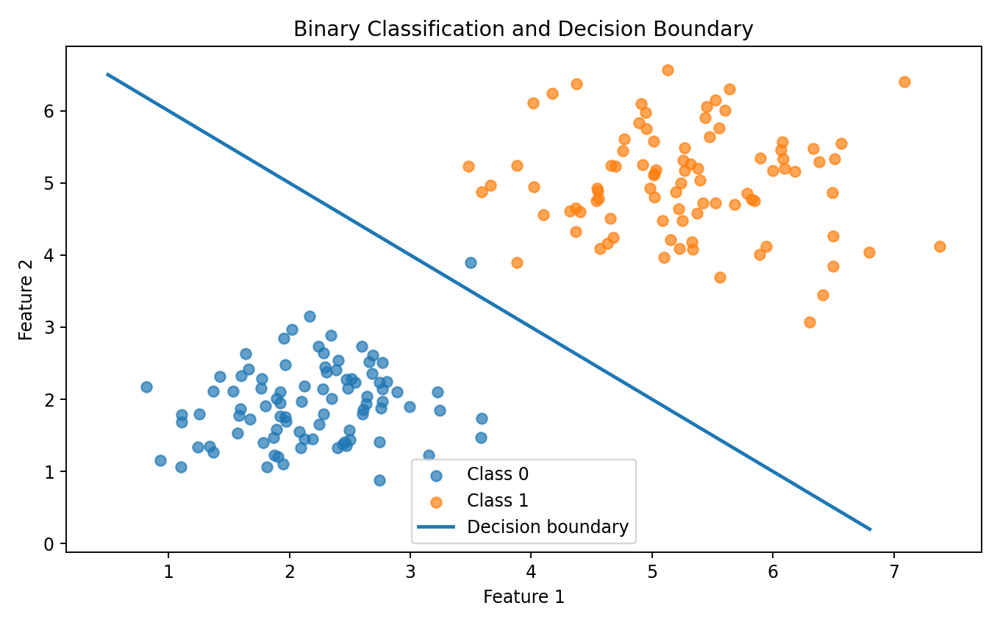
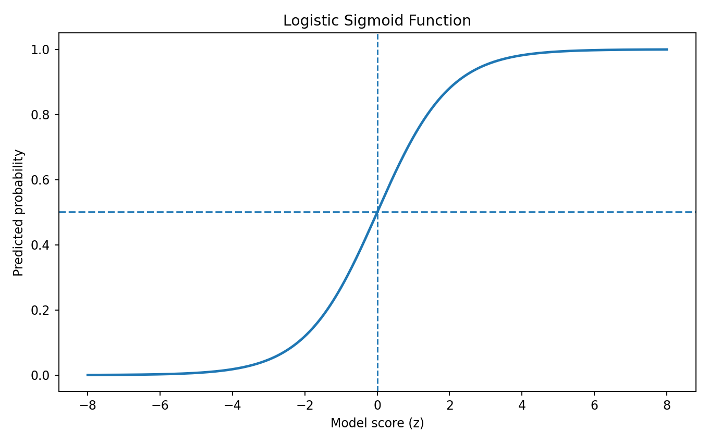
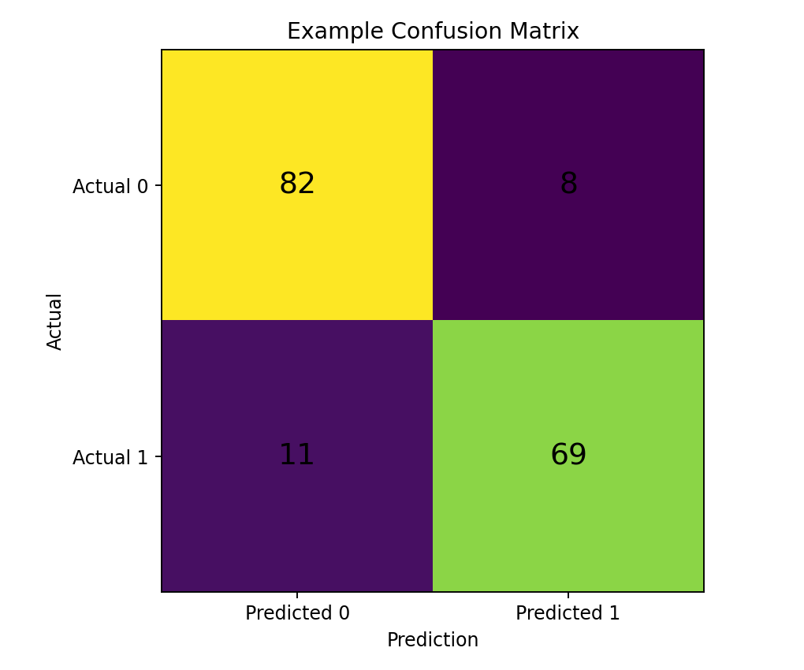
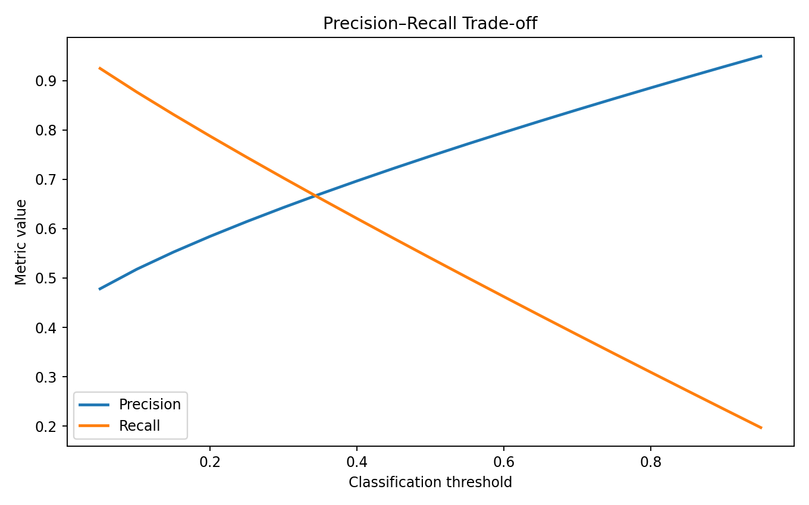
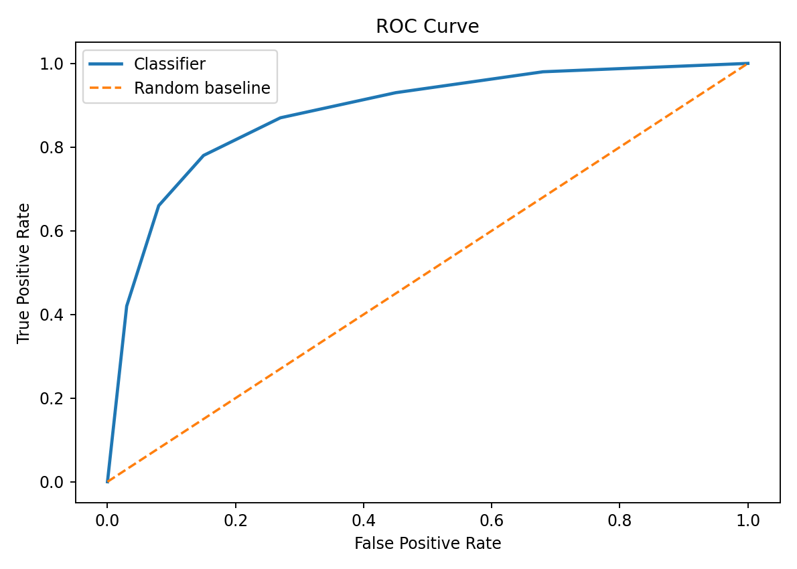
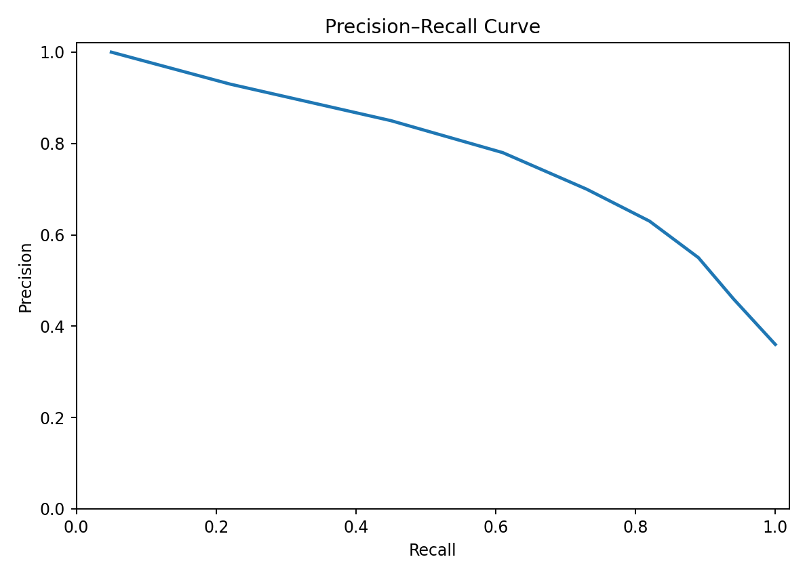
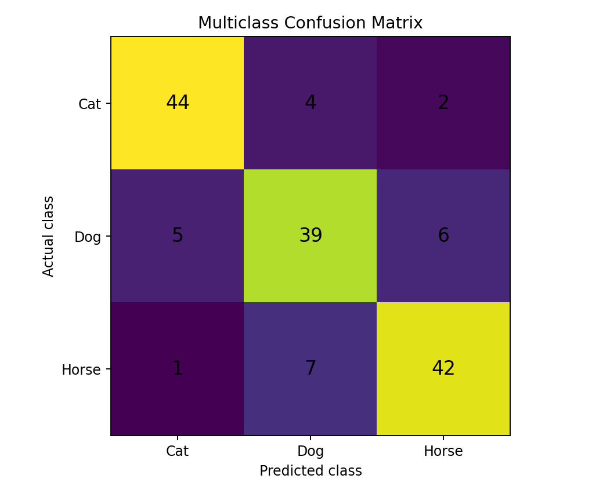

> **Classification predicts a category rather than a continuous numerical value.**

Classification is one of the most important supervised learning problems.

Examples:

```text
Email
  ↓
Spam / Not Spam

Medical image
  ↓
Disease / No Disease

Transaction
  ↓
Fraud / Legitimate

Customer
  ↓
Churn / Stay
```

The central idea is:

```text
INPUT FEATURES
      ↓
CLASSIFICATION MODEL
      ↓
SCORE / PROBABILITY
      ↓
DECISION
      ↓
PREDICTED CLASS
```

---

# What is Classification?

Classification is a supervised learning task where the target variable represents a class or category.

Examples:

```text
0 / 1
Yes / No
Cat / Dog
Low / Medium / High
```

Unlike regression, classification does not primarily predict an unrestricted continuous target.

---

# Regression vs Classification

The first question is:

> **What type of target are we predicting?**

### Regression

Predicts a continuous value.

```text
House Price
Salary
Temperature
Revenue
Demand
```

### Classification

Predicts a category.

```text
Spam
Fraud
Disease
Churn
Object Class
```

A useful rule:

```text
Continuous numerical target
        ↓
Regression

Categorical target
        ↓
Classification
```

---

# Types of Classification

## Binary Classification

There are two classes.

```text
Spam
Not Spam
```

or:

```text
0
1
```

---

## Multiclass Classification

There are more than two classes.

```text
Cat
Dog
Horse
```

The model selects one class from several possible classes.

---

## Multilabel Classification

One observation can belong to multiple classes simultaneously.

Example:

```text
Image
 ↓
Car
Road
Person
Tree
```

This is different from multiclass classification because multiple labels can be true at the same time.

---

# A Practical Example

Suppose we want to predict whether a customer will churn.

Dataset:

```text
Age
Tenure
MonthlyCharges
SupportTickets
ContractType
        ↓
Churn
```

Target:

```python
y = df["Churn"]
```

If:

```text
Churn = 0
```

the customer stays.

If:

```text
Churn = 1
```

the customer leaves.

This is a binary classification problem.

---

# Step 1: Inspect the Target

Always inspect the target before training.

```python
print(df["Churn"].value_counts())
```

For class proportions:

```python
print(
    df["Churn"].value_counts(
        normalize=True
    )
)
```

This matters because classification datasets can be imbalanced.

For example:

```text
Class 0 → 95%
Class 1 → 5%
```

A model that predicts class 0 for every observation could achieve 95% accuracy while being practically useless for detecting class 1.

---

# Decision Boundary

A classifier separates classes using a decision rule.

For two features, we can visualize this as a decision boundary.

## Visual Output



The model attempts to separate the feature space into regions associated with different classes.

### How to Read It

Points on one side of the boundary are predicted as one class.

Points on the other side are predicted as the other class.

### ML Meaning

The decision boundary represents the model's classification rule in feature space.

Different algorithms can produce very different boundaries.

---

# Logistic Regression

Despite its name, logistic regression is a **classification algorithm** when used to predict class probabilities.

For binary classification, it converts a model score into a probability using the sigmoid function.

```text
z = b₀ + b₁x₁ + b₂x₂ + ... + bₙxₙ
```

Then:

```text
P(y = 1) = 1 / (1 + e⁻ᶻ)
```

---

# Sigmoid Function

The sigmoid maps any real-valued score into a value between 0 and 1.

## Visual Output



### How to Read It

```text
z → very negative
        ↓
probability near 0

z → 0
        ↓
probability near 0.5

z → very positive
        ↓
probability near 1
```

A common decision rule is:

```python
probability >= 0.5
        ↓
Class 1

probability < 0.5
        ↓
Class 0
```

The threshold does not have to be 0.5. It should be chosen according to the problem and validation results.

---

# Training Logistic Regression

Using Scikit-learn:

```python
from sklearn.model_selection import train_test_split
from sklearn.linear_model import LogisticRegression

X = df[
    [
        "Age",
        "Tenure",
        "MonthlyCharges",
        "SupportTickets"
    ]
]

y = df["Churn"]

X_train, X_test, y_train, y_test = train_test_split(
    X,
    y,
    test_size=0.2,
    random_state=42,
    stratify=y
)

model = LogisticRegression(
    max_iter=1000
)

model.fit(
    X_train,
    y_train
)
```

---

# Predictions

Class predictions:

```python
y_pred = model.predict(X_test)
```

Predicted probabilities:

```python
y_prob = model.predict_proba(X_test)
```

For the positive class:

```python
positive_prob = model.predict_proba(
    X_test
)[:, 1]
```

This distinction is important:

```text
predict()
      ↓
class

predict_proba()
      ↓
probability
```

---

# Classification Threshold

Suppose the model predicts:

```text
P(churn) = 0.72
```

With a threshold of 0.5:

```text
0.72 >= 0.5
      ↓
Churn = 1
```

But we could choose:

```text
threshold = 0.30
```

if missing a potential churner is more costly than contacting some customers unnecessarily.

This introduces a fundamental classification trade-off.

---

# Confusion Matrix

A confusion matrix compares actual classes with predicted classes.

For binary classification:

```text
                    Predicted
                  0          1

Actual 0         TN         FP

Actual 1         FN         TP
```

Where:

```text
TP = True Positive
TN = True Negative
FP = False Positive
FN = False Negative
```

## Visual Output



### How to Read It

The diagonal entries represent correct predictions:

```text
Actual 0 → Predicted 0
Actual 1 → Predicted 1
```

The off-diagonal entries represent mistakes.

```text
Actual 0 → Predicted 1
        ↓
False Positive

Actual 1 → Predicted 0
        ↓
False Negative
```

---

# Accuracy

Accuracy measures the proportion of correct predictions.

```text
Accuracy =
(TP + TN)
----------------
(TP + TN + FP + FN)
```

Python:

```python
from sklearn.metrics import accuracy_score

accuracy = accuracy_score(
    y_test,
    y_pred
)

print(accuracy)
```

Accuracy is useful when classes are reasonably balanced and the costs of different errors are similar.

It can be misleading for heavily imbalanced datasets.

---

# Precision

Precision answers:

> **Of the observations predicted positive, how many were actually positive?**

```text
Precision =
TP
-----------
TP + FP
```

Python:

```python
from sklearn.metrics import precision_score

precision = precision_score(
    y_test,
    y_pred
)

print(precision)
```

High precision means relatively few false positives among positive predictions.

Example:

```text
Predicted fraud
      ↓
How many were actually fraud?
```

---

# Recall

Recall answers:

> **Of all actual positive observations, how many did the model find?**

```text
Recall =
TP
-----------
TP + FN
```

Python:

```python
from sklearn.metrics import recall_score

recall = recall_score(
    y_test,
    y_pred
)

print(recall)
```

Recall is especially important when missing a positive case is costly.

Example:

```text
Actual disease cases
        ↓
How many did the model detect?
```

---

# Precision vs Recall

These metrics focus on different errors.

```text
PRECISION
    ↓
Reduce false positives

RECALL
    ↓
Reduce false negatives
```

There is often a trade-off.

Changing the classification threshold can change both.

---

# F1-Score

F1 combines precision and recall using their harmonic mean.

```text
F1 =
2 × Precision × Recall
-----------------------
Precision + Recall
```

Python:

```python
from sklearn.metrics import f1_score

f1 = f1_score(
    y_test,
    y_pred
)

print(f1)
```

F1 can be useful when both precision and recall matter and a single summary metric is desirable.

---

# Precision–Recall Trade-off

As the classification threshold changes, precision and recall can change in opposite directions.

## Visual Output



### Example

Lowering the threshold can make the classifier more willing to predict the positive class.

This may:

```text
Increase recall
      +
Increase false positives
      ↓
Potentially lower precision
```

The right threshold depends on the application's costs and objectives.

---

# ROC Curve

The ROC curve shows the relationship between:

```text
True Positive Rate
        vs
False Positive Rate
```

where:

```text
TPR = Recall

FPR =
FP
---------
FP + TN
```

## Visual Output



The diagonal represents random ranking behavior.

A curve that stays well above the diagonal indicates stronger discrimination.

---

# ROC-AUC

AUC summarizes the ROC curve into a single value.

```python
from sklearn.metrics import roc_auc_score

auc = roc_auc_score(
    y_test,
    positive_prob
)

print(auc)
```

A higher ROC-AUC generally indicates better ability to rank positive examples above negative examples.

Important:

> **AUC is not the same thing as accuracy.**

A model can have good ranking ability while still requiring an appropriate decision threshold for the actual application.

---

# Precision–Recall Curve

The precision-recall curve is often particularly informative when the positive class is rare.

```python
from sklearn.metrics import (
    precision_recall_curve
)

precision, recall, thresholds = (
    precision_recall_curve(
        y_test,
        positive_prob
    )
)
```

## Visual Output



### How to Read It

The curve shows how precision changes as recall changes across thresholds.

For highly imbalanced problems, this view can be more useful than relying only on accuracy.

---

# Multiclass Classification

Suppose the target contains:

```text
Cat
Dog
Horse
```

The model must select one class.

Example:

```python
from sklearn.linear_model import LogisticRegression

model = LogisticRegression(
    max_iter=1000
)

model.fit(
    X_train,
    y_train
)
```

Prediction:

```python
y_pred = model.predict(
    X_test
)
```

---

# Multiclass Confusion Matrix

## Visual Output



The rows represent actual classes.

The columns represent predicted classes.

For example:

```text
Actual Dog
    ↓
Predicted Horse
    ↓
Dog → Horse confusion
```

This helps identify **which classes the model confuses with each other**.

---

# Class Imbalance

Consider:

```text
Normal transactions → 99%
Fraud transactions  → 1%
```

A model that predicts:

```text
Normal
Normal
Normal
...
```

could achieve very high accuracy.

But it may detect zero fraud cases.

This is why classification evaluation should consider:

```text
Precision
Recall
F1
Confusion Matrix
ROC-AUC
PR-AUC
```

and the actual business cost of errors.

---

# Handling Class Imbalance

Possible approaches include:

### Stratified splitting

```python
train_test_split(
    X,
    y,
    stratify=y,
    random_state=42
)
```

### Class weights

```python
model = LogisticRegression(
    class_weight="balanced",
    max_iter=1000
)
```

### Resampling

Examples:

```text
Oversampling
Undersampling
Synthetic sampling
```

These methods should be applied carefully and only within the appropriate training workflow to avoid data leakage.

---

# Decision Trees for Classification

Decision trees split the feature space using rules.

Example:

```text
Age < 30?
   │
   ├── Yes → Low risk
   │
   └── No
        │
        MonthlyCharges > 80?
             │
             ├── Yes → High risk
             └── No  → Medium risk
```

Python:

```python
from sklearn.tree import DecisionTreeClassifier

model = DecisionTreeClassifier(
    max_depth=4,
    random_state=42
)

model.fit(
    X_train,
    y_train
)
```

Decision trees can model nonlinear relationships and interactions.

---

# Random Forest Classification

Random Forest combines many decision trees.

```python
from sklearn.ensemble import RandomForestClassifier

model = RandomForestClassifier(
    n_estimators=200,
    random_state=42
)

model.fit(
    X_train,
    y_train
)
```

Conceptually:

```text
Dataset
   ↓
Tree 1
Tree 2
Tree 3
...
Tree N
   ↓
Combine predictions
   ↓
Final class
```

Random forests are often strong baseline models for tabular classification.

---

# Model Comparison

A useful experiment is to compare several classifiers:

```text
Logistic Regression
        ↓
Decision Tree
        ↓
Random Forest
        ↓
Gradient Boosting
```

Do not choose the model only because one metric is highest.

Consider:

- Validation performance
- Error types
- Interpretability
- Inference cost
- Training cost
- Calibration
- Dataset size
- Feature types
- Production constraints

---

# Probability Calibration

A classifier can produce probabilities that are poorly calibrated.

For example:

```text
Model says:
80% probability

But among many predictions near 0.80,
only 55% are actually positive.
```

The ranking may still be useful, but the probability itself is not well calibrated.

Calibration can matter when probabilities drive decisions.

---

# Classification Workflow

A practical workflow looks like:

```text
DATA
 ↓
TARGET INSPECTION
 ↓
CLASS DISTRIBUTION
 ↓
TRAIN / VALIDATION / TEST SPLIT
 ↓
PREPROCESSING
 ↓
BASELINE
 ↓
CLASSIFICATION MODEL
 ↓
PROBABILITIES
 ↓
THRESHOLD
 ↓
CONFUSION MATRIX
 ↓
PRECISION / RECALL / F1
 ↓
ROC-AUC / PR-AUC
 ↓
ERROR ANALYSIS
 ↓
FINAL TEST
 ↓
DEPLOYMENT
```

---

# Complete Scikit-learn Example

```python
import pandas as pd

from sklearn.model_selection import train_test_split
from sklearn.pipeline import Pipeline
from sklearn.preprocessing import StandardScaler
from sklearn.linear_model import LogisticRegression

from sklearn.metrics import (
    accuracy_score,
    precision_score,
    recall_score,
    f1_score,
    roc_auc_score,
    confusion_matrix
)

df = pd.read_csv(
    "dataset.csv"
)

X = df[
    [
        "Age",
        "Tenure",
        "MonthlyCharges",
        "SupportTickets"
    ]
]

y = df["Churn"]

X_train, X_test, y_train, y_test = (
    train_test_split(
        X,
        y,
        test_size=0.2,
        random_state=42,
        stratify=y
    )
)

model = Pipeline([
    (
        "scaler",
        StandardScaler()
    ),
    (
        "classifier",
        LogisticRegression(
            max_iter=1000
        )
    )
])

model.fit(
    X_train,
    y_train
)

y_pred = model.predict(
    X_test
)

y_prob = model.predict_proba(
    X_test
)[:, 1]

print(
    "Accuracy:",
    accuracy_score(
        y_test,
        y_pred
    )
)

print(
    "Precision:",
    precision_score(
        y_test,
        y_pred
    )
)

print(
    "Recall:",
    recall_score(
        y_test,
        y_pred
    )
)

print(
    "F1:",
    f1_score(
        y_test,
        y_pred
    )
)

print(
    "ROC-AUC:",
    roc_auc_score(
        y_test,
        y_prob
    )
)

print(
    "Confusion Matrix:"
)

print(
    confusion_matrix(
        y_test,
        y_pred
    )
)
```

---

# How to Choose the Metric

Think about the cost of mistakes.

### Medical screening

Missing a positive case can be very costly.

```text
Recall
  ↑
Often important
```

### Spam filtering

Marking a legitimate email as spam can be costly.

```text
Precision
  ↑
Often important
```

### Balanced classification

If class balance and error costs are reasonably similar:

```text
Accuracy
F1
ROC-AUC
```

may all be useful depending on the objective.

There is no universally "best" classification metric.

---

# Common Classification Mistakes

### 1. Looking only at accuracy

Especially dangerous with imbalanced datasets.

### 2. Ignoring the confusion matrix

Two models with identical accuracy can make very different types of mistakes.

### 3. Using the default 0.5 threshold automatically

The threshold should reflect the application.

### 4. Data leakage

Never allow information from the evaluation set to influence training or preprocessing.

### 5. Oversampling before the train/test split

This can contaminate the evaluation process.

### 6. Comparing models using the test set repeatedly

Use validation or cross-validation for model selection.

### 7. Ignoring probability calibration

Predicted probabilities may not represent real-world frequencies.

---

# Practical Experiments

## Experiment 1 — Logistic Regression

Train:

```text
Logistic Regression
```

Measure:

```text
Accuracy
Precision
Recall
F1
ROC-AUC
```

---

## Experiment 2 — Change the Threshold

Try:

```text
0.30
0.40
0.50
0.60
0.70
```

Observe how:

```text
Precision
Recall
F1
```

change.

---

## Experiment 3 — Decision Tree

Train:

```python
DecisionTreeClassifier()
```

Compare it with logistic regression.

---

## Experiment 4 — Random Forest

Train:

```python
RandomForestClassifier()
```

Compare:

```text
Logistic Regression
Decision Tree
Random Forest
```

---

## Experiment 5 — Class Imbalance

Create an imbalanced dataset.

Compare:

```text
Accuracy
Precision
Recall
F1
```

Question:

> Can a model have high accuracy while failing the actual business objective?

---

# Lab Checklist

```text
☐ Identify classification target
☐ Determine binary / multiclass / multilabel problem
☐ Inspect class distribution
☐ Split using stratification when appropriate
☐ Build a baseline
☐ Train a classifier
☐ Generate class predictions
☐ Generate probabilities
☐ Inspect confusion matrix
☐ Calculate precision
☐ Calculate recall
☐ Calculate F1
☐ Evaluate ROC-AUC when appropriate
☐ Inspect precision-recall behavior
☐ Test classification thresholds
☐ Analyze errors
☐ Check for leakage
☐ Evaluate on unseen data
```

---

# Key Takeaways

```text
CLASSIFICATION
      │
      ├── Binary
      │
      ├── Multiclass
      │
      ├── Multilabel
      │
      ├── Logistic Regression
      │
      ├── Decision Trees
      │
      ├── Random Forest
      │
      ├── Confusion Matrix
      │
      ├── Precision
      │
      ├── Recall
      │
      ├── F1
      │
      ├── ROC-AUC
      │
      └── Threshold Selection
```

The most important lesson is:

> **A classification model is not truly understood until you know what kinds of mistakes it makes.**

Accuracy tells you how often the model is correct.

The confusion matrix, precision, recall, F1, curves, probabilities, and threshold analysis tell you **how and why the model succeeds or fails**.

---

## Lab Takeaway

A strong classification workflow connects:

```text
DATA
 ↓
CLASS DISTRIBUTION
 ↓
MODEL
 ↓
PROBABILITY
 ↓
THRESHOLD
 ↓
PREDICTION
 ↓
CONFUSION MATRIX
 ↓
METRICS
 ↓
ERROR ANALYSIS
 ↓
GENERALIZATION
```

That is the foundation for building reliable classification systems.
