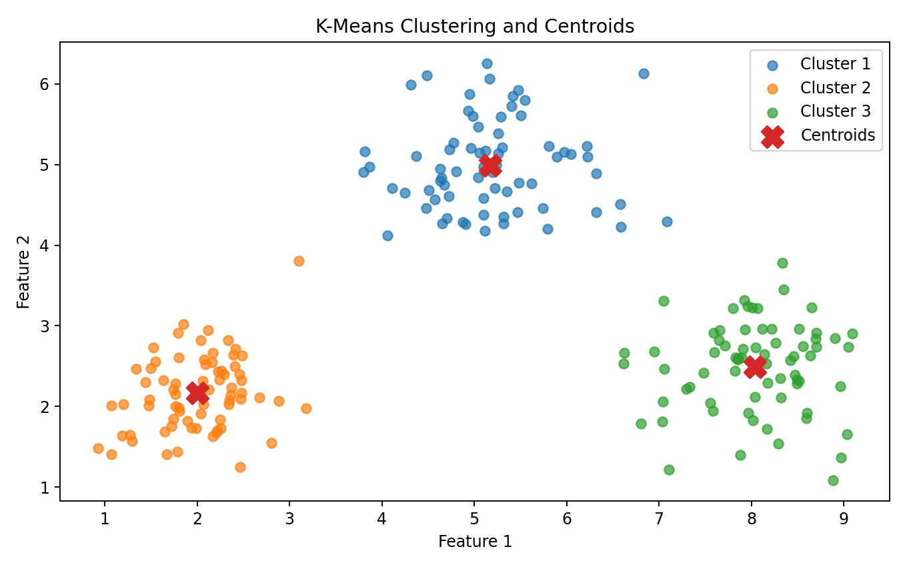
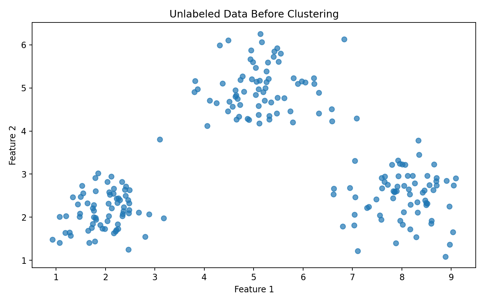
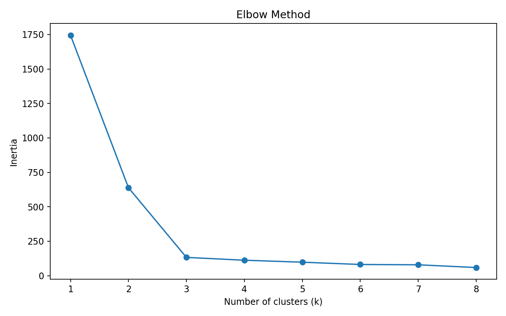
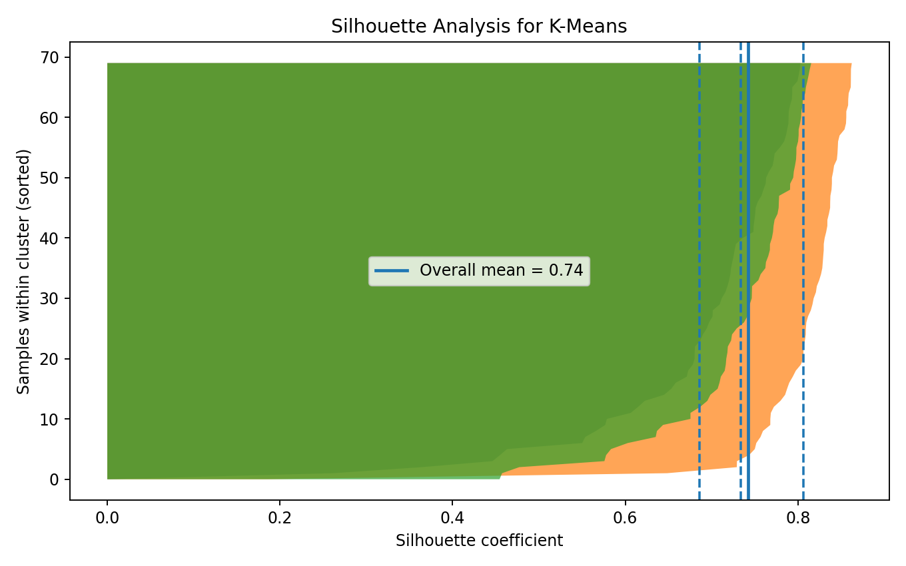
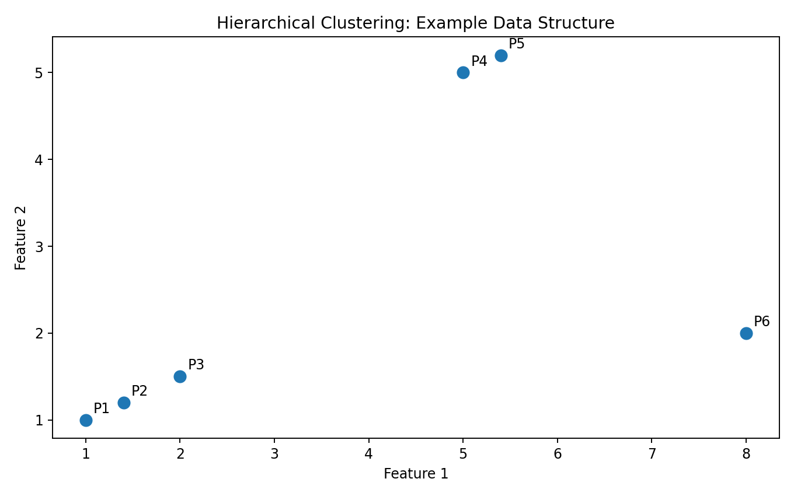
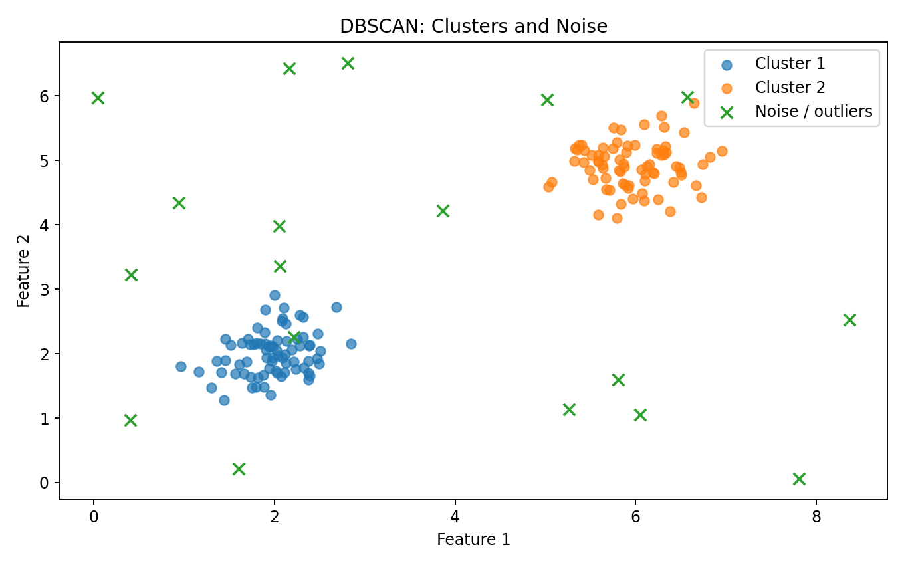

# Clustering

> **Clustering groups observations based on similarity without requiring predefined target labels.**

Clustering is an **unsupervised learning** problem.

Unlike classification, we do not start with a known target such as:

```text
Cat
Dog
Horse
```

Instead, we give the algorithm observations and ask it to discover structure.

```text
RAW DATA
   ↓
FEATURES
   ↓
SIMILARITY / DISTANCE
   ↓
CLUSTERING ALGORITHM
   ↓
GROUPS
   ↓
INTERPRETATION
```

---

# What is Clustering?

Suppose we have customer data:

```text
Age
Annual Income
Spending Score
Purchase Frequency
```

There is no predefined:

```text
Customer_Type
```

We may want to discover groups such as:

```text
High income + high spending
Low income + low spending
High income + low spending
```

The algorithm identifies groups according to the mathematical definition of similarity used by the method.

---

# Classification vs Clustering

This distinction is fundamental.

### Classification

```text
Known labels
     ↓
Learn mapping
     ↓
Predict label
```

Example:

```text
Features → Spam / Not Spam
```

### Clustering

```text
No labels
     ↓
Find structure
     ↓
Discover groups
```

Example:

```text
Customer features → discovered segments
```

---

# Why Distance Matters

Many clustering algorithms depend on a concept of distance or similarity.

For two points:

```text
A = (x₁, y₁)
B = (x₂, y₂)
```

Euclidean distance is:

```text
d(A,B) =
√[(x₂-x₁)² + (y₂-y₁)²]
```

Python:

```python
from sklearn.metrics import pairwise_distances

distance_matrix = pairwise_distances(
    X
)
```

The meaning of "similar" depends on the features and distance measure.

---

# Feature Scaling

Suppose:

```text
Age       → 20–80
Income    → 20,000–500,000
```

Income can dominate a distance calculation simply because its numerical scale is much larger.

A common preprocessing step is:

```python
from sklearn.preprocessing import StandardScaler

scaler = StandardScaler()

X_scaled = scaler.fit_transform(
    X
)
```

For a real workflow, fit the transformation on the appropriate training data rather than leaking information from evaluation data.

---

# K-Means Clustering

K-Means is one of the most commonly introduced clustering algorithms.

The basic idea:

```text
Choose K
  ↓
Initialize centroids
  ↓
Assign points to nearest centroid
  ↓
Recalculate centroids
  ↓
Repeat
  ↓
Stop when assignments/centroids stabilize
```

---

# K-Means Objective

K-Means attempts to minimize within-cluster squared distances.

Conceptually:

```text
Minimize:

Σ distance(point, cluster_centroid)²
```

This is commonly called **inertia** or within-cluster sum of squares in Scikit-learn.

---

# K-Means Visual Output



The colored groups represent discovered clusters.

The `X` markers represent cluster centroids.

### How to Read It

Each point is assigned to the nearest centroid under the algorithm's distance calculation.

The centroid represents the mean position of the observations assigned to that cluster.

### ML Meaning

K-Means is trying to create groups that are internally compact according to its objective.

It does **not** automatically know what a business-friendly cluster name means.

Humans still need to interpret the resulting groups.

---

# Before Clustering

Before clustering, the data has no model-generated labels.



The algorithm attempts to identify structure based on the selected features and clustering method.

---

# K-Means in Scikit-learn

```python
from sklearn.cluster import KMeans

model = KMeans(
    n_clusters=3,
    random_state=42,
    n_init="auto"
)

model.fit(
    X_scaled
)

labels = model.labels_

centroids = model.cluster_centers_
```

The cluster assignment for each observation is available through:

```python
model.labels_
```

---

# Choosing K

One of the biggest practical questions is:

> **How many clusters should we create?**

There is no universal value.

Two useful diagnostics are:

```text
Elbow Method
Silhouette Analysis
```

---

# Elbow Method

The elbow method evaluates K-Means inertia for different values of `k`.

```python
from sklearn.cluster import KMeans

inertias = []

for k in range(1, 9):

    model = KMeans(
        n_clusters=k,
        random_state=42,
        n_init="auto"
    )

    model.fit(
        X_scaled
    )

    inertias.append(
        model.inertia_
    )
```

Plot the values:

```python
import matplotlib.pyplot as plt

plt.plot(
    range(1, 9),
    inertias,
    marker="o"
)

plt.xlabel("Number of clusters")
plt.ylabel("Inertia")
plt.show()
```

## Visual Output



### How to Read It

As `k` increases, inertia generally decreases.

Why?

Because more clusters allow points to be represented by closer centroids.

The useful question is:

```text
Where does adding more clusters
start producing diminishing improvement?
```

That point is often called the **elbow**.

### Important

The elbow is a heuristic, not a guarantee that the selected K is objectively correct.

Business meaning and domain knowledge should also be considered.

---

# Silhouette Analysis

The silhouette coefficient measures how well an observation fits its own cluster compared with neighboring clusters.

Conceptually:

```text
a = average distance to own cluster

b = average distance to nearest other cluster

silhouette =
(b - a) / max(a, b)
```

Values are generally between:

```text
-1 and +1
```

Higher values can indicate better separation.

---

## Visual Output



### How to Read It

A strong clustering tends to have:

```text
Points close to their own cluster
+
Points far from neighboring clusters
```

A negative silhouette value can indicate that an observation may fit another cluster better.

### ML Meaning

Silhouette analysis provides a quantitative diagnostic for cluster compactness and separation.

It should not be treated as the only decision criterion.

---

# K-Means Limitations

K-Means works particularly naturally when clusters are approximately compact and separable under the chosen distance metric.

It can struggle with:

```text
Irregular shapes
Different densities
Strong outliers
Highly overlapping groups
Poorly scaled features
```

This is why other clustering algorithms exist.

---

# Hierarchical Clustering

Hierarchical clustering builds a hierarchy of groups.

Two common approaches are:

```text
Agglomerative
Divisive
```

Agglomerative clustering starts with individual observations:

```text
A   B   C   D   E
```

and progressively merges similar groups:

```text
A+B     C+D     E
   \     /
    A+B+C+D     E
          \
       A+B+C+D+E
```

---

# Agglomerative Clustering

Scikit-learn example:

```python
from sklearn.cluster import AgglomerativeClustering

model = AgglomerativeClustering(
    n_clusters=3
)

labels = model.fit_predict(
    X_scaled
)
```

---

## Visual Output



Hierarchical clustering is particularly useful when we want to understand nested relationships between observations.

A common visualization for hierarchical clustering is a **dendrogram**.

The dendrogram shows the sequence and distance at which groups are merged.

---

# DBSCAN

DBSCAN stands for:

```text
Density-Based Spatial Clustering
of Applications with Noise
```

Instead of requiring us to specify the number of clusters directly, DBSCAN groups observations based on density.

Important parameters:

```text
eps
min_samples
```

Example:

```python
from sklearn.cluster import DBSCAN

model = DBSCAN(
    eps=0.5,
    min_samples=5
)

labels = model.fit_predict(
    X_scaled
)
```

---

# DBSCAN Output



DBSCAN can identify:

```text
Dense regions
+
Noise / outliers
```

Observations assigned the label:

```text
-1
```

are treated as noise by Scikit-learn's DBSCAN implementation.

---

# K-Means vs Hierarchical vs DBSCAN

| Algorithm | Main idea | Need K? | Handles noise explicitly? |
|---|---|---:|---:|
| K-Means | Centroid-based | Yes | No |
| Hierarchical | Hierarchy of merges | Often choose a cut | Depends on method |
| DBSCAN | Density-based | No | Yes |

Choose the algorithm based on the structure of the problem.

---

# Cluster Interpretation

Finding clusters is only the beginning.

Suppose K-Means produces:

```text
Cluster 0
Cluster 1
Cluster 2
```

Those numbers have no inherent business meaning.

We need to profile them.

```python
df["cluster"] = labels

profile = (
    df.groupby("cluster")
      .mean(numeric_only=True)
)

print(profile)
```

You might discover:

```text
Cluster 0
High income
High spending

Cluster 1
Low income
Low spending

Cluster 2
High income
Low spending
```

Now the clusters become interpretable.

---

# Cluster Profiling

A good clustering analysis asks:

```text
Who is in this cluster?
        ↓
What features define it?
        ↓
How large is it?
        ↓
Is it stable?
        ↓
Does it have useful meaning?
```

Example:

```python
cluster_counts = df["cluster"].value_counts()

print(
    cluster_counts
)
```

Cluster size matters.

A cluster containing 0.5% of the observations may have a very different practical meaning from one containing 45%.

---

# Visualization of Clusters

For two-dimensional data:

```python
plt.scatter(
    X[:, 0],
    X[:, 1],
    c=labels
)

plt.xlabel("Feature 1")
plt.ylabel("Feature 2")
plt.show()
```

For higher-dimensional datasets, consider:

```text
PCA
t-SNE
UMAP
```

for visualization, while remembering that dimensionality-reduction plots are projections and can distort distances.

---

# PCA Before Clustering

PCA can sometimes be useful for reducing dimensionality or creating a lower-dimensional representation.

```python
from sklearn.decomposition import PCA

pca = PCA(
    n_components=2
)

X_pca = pca.fit_transform(
    X_scaled
)
```

Then visualize:

```python
plt.scatter(
    X_pca[:, 0],
    X_pca[:, 1],
    c=labels
)
```

Important:

> PCA is not itself a clustering algorithm.

It transforms the representation of the data.

---

# Clustering Evaluation

Because there may be no ground-truth labels, evaluating clustering is different from evaluating classification.

Useful internal diagnostics include:

```text
Inertia
Silhouette Score
Davies-Bouldin Index
Calinski-Harabasz Index
```

If true labels are available for an evaluation experiment, external measures can also be used, but the labels should not be used to train an unsupervised clustering model if the goal is genuinely unsupervised discovery.

---

# Silhouette Score in Python

```python
from sklearn.metrics import silhouette_score

score = silhouette_score(
    X_scaled,
    labels
)

print(
    "Silhouette Score:",
    score
)
```

A higher score can indicate better separation under the metric used.

But:

> **A numerically better clustering is not automatically a more useful business segmentation.**

---

# Outliers and Clustering

Outliers can strongly influence some clustering algorithms.

For example, K-Means uses centroids based on means.

An extreme point can pull a centroid away from the main group.

Possible approaches:

```text
Investigate outliers
        ↓
Determine whether they are errors
        ↓
Decide whether to transform, cap,
remove, or retain them
```

Do not automatically remove unusual observations.

---

# Feature Engineering for Clustering

Feature design can dramatically change the resulting clusters.

Example:

```text
Annual Income
```

could be transformed into:

```text
Monthly Income
Income per household member
Income percentile
Log Income
```

Likewise:

```text
Purchase Count
```

could become:

```text
Purchase Frequency
```

The features define what "similar" means.

---

# Scaling + K-Means Pipeline

A clean workflow:

```python
from sklearn.pipeline import Pipeline
from sklearn.preprocessing import StandardScaler
from sklearn.cluster import KMeans

pipeline = Pipeline([
    (
        "scaler",
        StandardScaler()
    ),
    (
        "cluster",
        KMeans(
            n_clusters=3,
            random_state=42,
            n_init="auto"
        )
    )
])

pipeline.fit(
    X
)

labels = pipeline[
    "cluster"
].labels_
```

The pipeline keeps preprocessing and modeling together.

---

# Complete Practical Example

```python
import pandas as pd

from sklearn.preprocessing import StandardScaler
from sklearn.cluster import KMeans
from sklearn.metrics import silhouette_score

df = pd.read_csv(
    "customers.csv"
)

features = [
    "Age",
    "AnnualIncome",
    "SpendingScore"
]

X = df[features]

scaler = StandardScaler()

X_scaled = scaler.fit_transform(
    X
)

model = KMeans(
    n_clusters=3,
    random_state=42,
    n_init="auto"
)

labels = model.fit_predict(
    X_scaled
)

df["cluster"] = labels

score = silhouette_score(
    X_scaled,
    labels
)

print(
    "Silhouette Score:",
    score
)

print(
    df.groupby(
        "cluster"
    )[features].mean()
)
```

---

# Clustering Workflow

A practical clustering workflow:

```text
RAW DATA
   ↓
EDA
   ↓
SELECT FEATURES
   ↓
HANDLE MISSING VALUES
   ↓
CHECK OUTLIERS
   ↓
SCALE FEATURES
   ↓
CHOOSE ALGORITHM
   ↓
TRY DIFFERENT PARAMETERS
   ↓
EVALUATE CLUSTER STRUCTURE
   ↓
VISUALIZE
   ↓
PROFILE CLUSTERS
   ↓
INTERPRET
   ↓
VALIDATE BUSINESS VALUE
```

---

# Common Clustering Mistakes

### 1. Assuming K is obvious

The number of clusters is usually a modeling decision, not a fact supplied by the algorithm.

### 2. Forgetting feature scaling

Distance-based methods can be heavily affected by feature scale.

### 3. Treating cluster IDs as meaningful

```text
Cluster 0
Cluster 1
Cluster 2
```

are arbitrary labels.

Cluster 2 is not "better" than Cluster 1.

### 4. Using K-Means for every problem

Irregular or density-based structures may require another method.

### 5. Ignoring outliers

Outliers can distort centroid-based clustering.

### 6. Optimizing only one metric

A slightly better silhouette score does not necessarily mean the segmentation is more useful.

### 7. Clustering without a purpose

A technically valid clustering result may have little practical value.

Always ask:

> **What decision will these clusters help us make?**

---

# Practical Experiments

## Experiment 1 — K-Means

Try:

```text
k = 2
k = 3
k = 4
k = 5
```

Compare:

```text
Inertia
Silhouette Score
Cluster sizes
Cluster profiles
```

---

## Experiment 2 — Feature Scaling

Run K-Means:

```text
Without scaling
        vs
With StandardScaler
```

Compare the resulting clusters.

Question:

> How much does feature scale change the grouping?

---

## Experiment 3 — DBSCAN

Experiment with:

```python
eps
min_samples
```

Observe:

```text
Number of clusters
Noise points
Cluster shape
```

---

## Experiment 4 — Algorithm Comparison

Compare:

```text
K-Means
Agglomerative Clustering
DBSCAN
```

Ask:

```text
Which algorithm finds the most meaningful structure?
```

---

# Lab Checklist

```text
☐ Understand supervised vs unsupervised learning
☐ Define the clustering objective
☐ Select meaningful features
☐ Handle missing values
☐ Investigate outliers
☐ Scale features when appropriate
☐ Understand distance
☐ Try K-Means
☐ Evaluate different K values
☐ Use the elbow method
☐ Calculate silhouette score
☐ Try another clustering algorithm
☐ Visualize clusters
☐ Profile cluster characteristics
☐ Interpret cluster meaning
☐ Validate practical usefulness
```

---

# Key Takeaways

```text
CLUSTERING
    │
    ├── Unsupervised Learning
    │
    ├── Similarity / Distance
    │
    ├── K-Means
    │
    ├── Centroids
    │
    ├── Elbow Method
    │
    ├── Silhouette Analysis
    │
    ├── Hierarchical Clustering
    │
    ├── DBSCAN
    │
    ├── Cluster Profiling
    │
    └── Interpretation
```

The most important lesson is:

> **Clustering does not discover "truth" automatically. It discovers structure according to the features, distance measure, algorithm, and parameters we choose.**

---

## Lab Takeaway

A strong clustering workflow connects:

```text
DATA
 ↓
FEATURES
 ↓
SIMILARITY
 ↓
ALGORITHM
 ↓
CLUSTERS
 ↓
EVALUATION
 ↓
VISUALIZATION
 ↓
PROFILE
 ↓
INTERPRET
 ↓
ACTION
```

The final goal is not merely to produce colored dots.

The goal is to determine whether the discovered groups represent **stable, interpretable, and useful structure in the data**.
