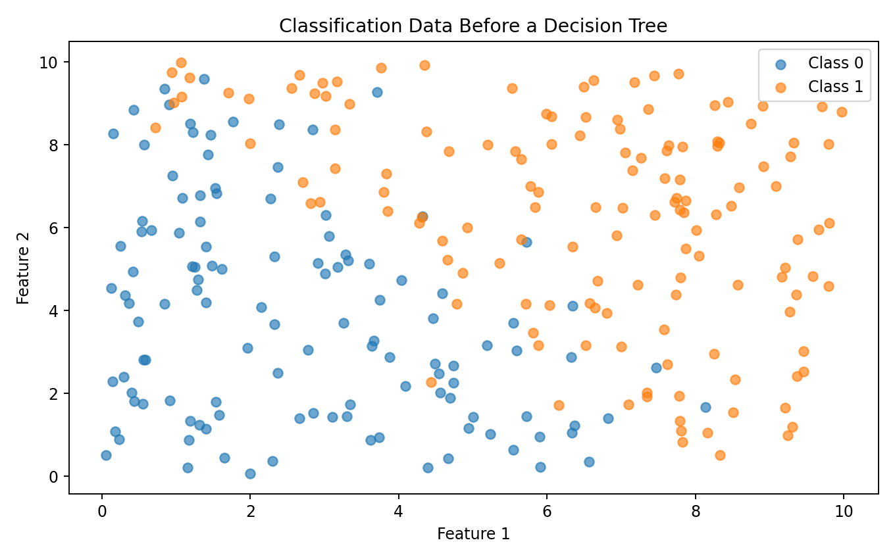
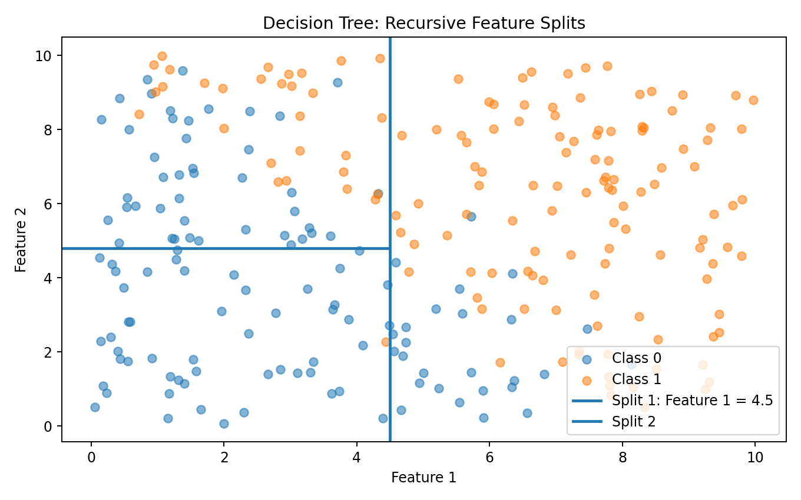
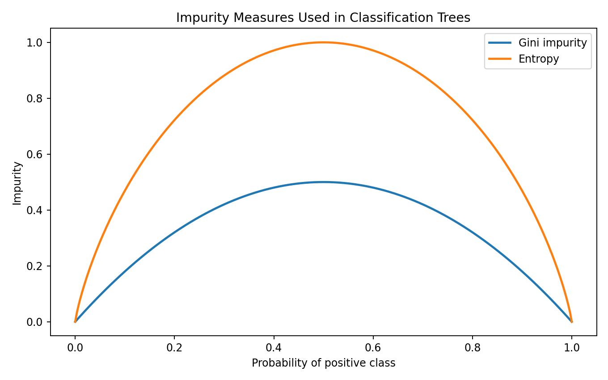
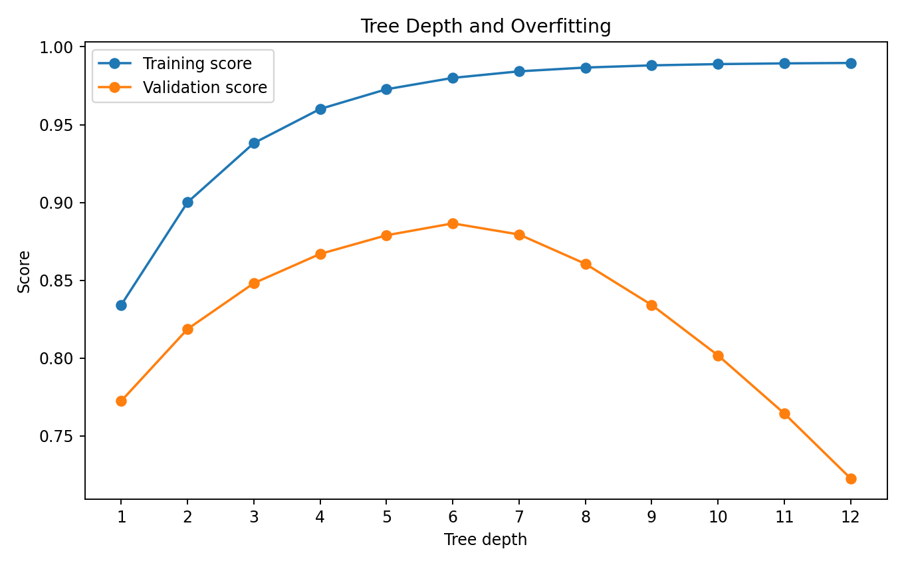
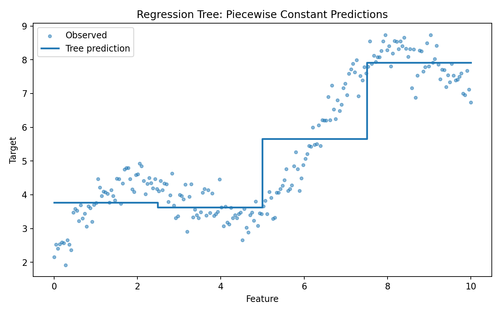
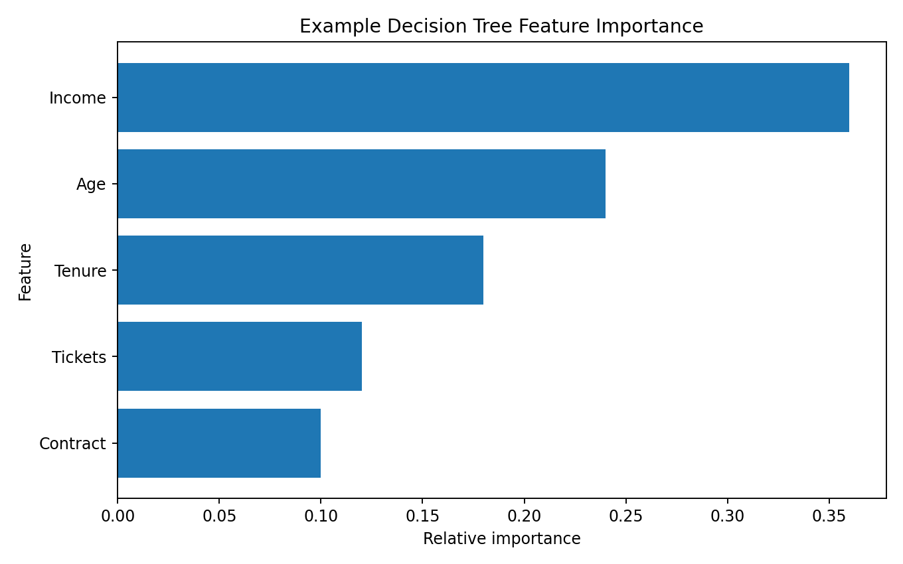
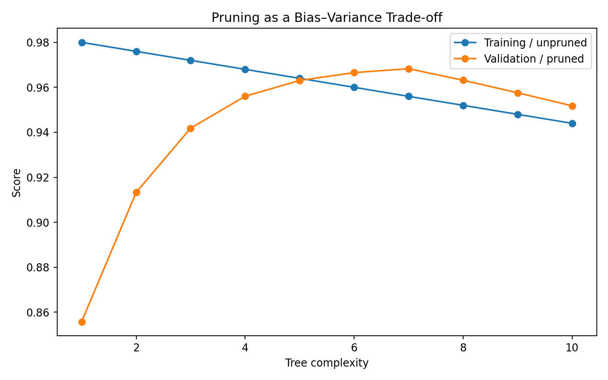

> **A decision tree learns a sequence of rules that recursively splits data into increasingly homogeneous groups.**

Decision trees are one of the most intuitive machine learning algorithms because their predictions can be represented as a series of questions.

Example:

```text
Is income > ₹60000?
        │
        ├── No
        │    ↓
        │  Low Risk
        │
        └── Yes
             ↓
        Is age > 40?
             │
             ├── No → Medium Risk
             │
             └── Yes → High Risk
```

The model converts data into a structure of:

```text
ROOT
 ↓
DECISION
 ↓
BRANCH
 ↓
DECISION
 ↓
LEAF
 ↓
PREDICTION
```

---

# What is a Decision Tree?

A decision tree is a supervised learning algorithm that can be used for:

```text
Classification
Regression
```

For classification:

```text
Features
   ↓
Tree
   ↓
Class
```

For regression:

```text
Features
   ↓
Tree
   ↓
Numerical value
```

---

# Why Decision Trees Are Important

Decision trees are useful because they can:

- model nonlinear relationships
- capture feature interactions
- work with numerical features
- work with categorical features after appropriate encoding
- require little mathematical preprocessing compared with distance-based models
- provide an interpretable rule-based structure
- serve as building blocks for ensemble methods

They are also a foundation for:

```text
Random Forest
Gradient Boosting
XGBoost
LightGBM
CatBoost
```

---

# Classification Example

Suppose we want to predict:

```text
Loan Approval
```

Features:

```text
Income
Age
Credit Score
Existing Debt
Employment Years
```

The tree may learn:

```text
Credit Score > 700?
       │
       ├── Yes
       │     ↓
       │   Income > ₹50000?
       │       │
       │       ├── Yes → Approve
       │       └── No  → Review
       │
       └── No
             ↓
           Reject
```

The exact rules are learned from the training data.

---

# Data Before the Tree



The dataset contains observations belonging to different classes.

A tree searches for feature thresholds that separate the classes effectively.

---

# Recursive Splitting

The tree starts with all training observations at the root.

It then searches for a useful split.

For example:

```text
Feature 1 < 4.5?
```

The dataset becomes:

```text
             ROOT
            /    \
           /      \
      Group A    Group B
```

Each child node can then be split again.

## Visual Output



### ML Meaning

A decision tree creates **piecewise regions of the feature space**.

Each additional split makes the regions more specific.

---

# What Makes a Good Split?

A good split should create child groups that are more homogeneous than the parent group.

For classification, common impurity measures include:

```text
Gini Impurity
Entropy
```

For regression, common criteria are based on reducing prediction error such as:

```text
Mean Squared Error
```

---

# Gini Impurity

For binary classification:

```text
Gini = 1 - (p₀² + p₁²)
```

where:

```text
p₀ = proportion of class 0
p₁ = proportion of class 1
```

If a node contains only one class:

```text
p₀ = 1
p₁ = 0
```

then:

```text
Gini = 0
```

The node is pure.

---

# Entropy

Entropy measures uncertainty.

```text
Entropy =
- Σ pᵢ log₂(pᵢ)
```

A pure node has:

```text
Entropy = 0
```

A node containing a balanced mixture of classes has higher entropy.

---

# Gini vs Entropy



Both measures quantify impurity.

Conceptually:

```text
Low impurity
     ↓
Mostly one class

High impurity
     ↓
Mixed classes
```

In practice, Gini and entropy often produce similar trees.

---

# Information Gain

A split can be evaluated using information gain.

Conceptually:

```text
Information Gain =
Parent impurity
-
Weighted child impurity
```

A good split produces a large reduction in impurity.

For example:

```text
Before split
70% Class A
30% Class B

        ↓ split

Child 1
95% Class A

Child 2
90% Class B
```

This is generally a useful separation.

---

# Decision Tree in Scikit-learn

Classification:

```python
from sklearn.tree import DecisionTreeClassifier

model = DecisionTreeClassifier(
    random_state=42
)

model.fit(
    X_train,
    y_train
)

y_pred = model.predict(
    X_test
)
```

---

# Controlling Tree Complexity

A completely unrestricted tree can keep splitting until it memorizes the training data.

Important hyperparameters include:

```text
max_depth
min_samples_split
min_samples_leaf
max_leaf_nodes
criterion
```

Example:

```python
model = DecisionTreeClassifier(
    max_depth=5,
    min_samples_split=10,
    min_samples_leaf=5,
    random_state=42
)
```

These parameters control the complexity of the tree.

---

# Tree Depth

Tree depth is approximately the number of decision levels from the root to a leaf.

Small depth:

```text
Simple model
↓
Higher bias
↓
May underfit
```

Very large depth:

```text
Complex model
↓
Lower training error
↓
Higher overfitting risk
```

---

# Overfitting



As tree depth increases:

```text
Training performance
        ↑
often improves
```

But validation performance may eventually:

```text
increase
   ↓
reach useful region
   ↓
decline
```

This is a classic bias-variance trade-off.

### ML Meaning

A tree that perfectly memorizes training observations is not necessarily a good model.

The objective is **generalization to unseen data**.

---

# Regression Trees

Decision trees can also predict continuous values.

Example:

```text
House Size
    ↓
Price
```

A regression tree recursively divides the feature space and predicts a value within each leaf.

```python
from sklearn.tree import DecisionTreeRegressor

model = DecisionTreeRegressor(
    max_depth=5,
    random_state=42
)

model.fit(
    X_train,
    y_train
)
```

---

# Regression Tree Output



Notice that the predictions form approximately piecewise-constant regions.

### Why?

A typical regression tree leaf predicts a value derived from the training observations that reach that leaf, commonly their mean under the standard squared-error criterion.

This makes tree regression naturally nonlinear.

---

# Classification vs Regression Trees

| Property | Classification Tree | Regression Tree |
|---|---|---|
| Target | Category | Continuous value |
| Example | Fraud / Not Fraud | House Price |
| Common criterion | Gini / Entropy | Squared error |
| Leaf output | Class / class probabilities | Numerical prediction |

The overall structure remains:

```text
Split
 ↓
Split
 ↓
Split
 ↓
Leaf
```

---

# Categorical Features

Decision trees conceptually work well with categorical variables.

However, in Scikit-learn's standard tree estimators, categorical values generally need to be encoded into a numerical representation before fitting.

For example:

```python
from sklearn.preprocessing import OneHotEncoder
```

combined with:

```python
ColumnTransformer
```

and:

```python
Pipeline
```

is a common approach.

Other tree libraries may provide native categorical handling.

---

# Missing Values

Missing values need an explicit strategy.

For example:

```text
Numerical
    ↓
Median imputation

Categorical
    ↓
Most frequent
or
Missing category
```

Using a pipeline:

```python
from sklearn.impute import SimpleImputer

imputer = SimpleImputer(
    strategy="median"
)
```

Do not assume that every tree implementation handles missing values identically.

---

# Feature Importance

Decision trees can provide feature importance values.

```python
importance = (
    model.feature_importances_
)
```

Example:



### How to Read It

If:

```text
Income → 0.36
Age    → 0.24
```

the model relied more heavily on income according to that importance calculation.

### Important

Feature importance does **not** mean:

```text
Income causes the prediction.
```

It describes the feature's contribution to the fitted tree according to the chosen importance method.

---

# Feature Importance Limitations

Impurity-based feature importance can be biased toward certain types of features, especially features with many possible split points or high cardinality.

For more robust interpretation, consider:

```text
Permutation Importance
SHAP
Partial Dependence
```

depending on the problem.

Example:

```python
from sklearn.inspection import permutation_importance

result = permutation_importance(
    model,
    X_test,
    y_test,
    random_state=42
)
```

---

# Pruning

Pruning reduces unnecessary tree complexity.

Conceptually:

```text
Very large tree
       ↓
Remove weak / unnecessary branches
       ↓
Smaller tree
       ↓
Potentially better generalization
```

There are different pruning strategies.

Scikit-learn provides cost-complexity pruning through:

```python
ccp_alpha
```

Example:

```python
model = DecisionTreeClassifier(
    ccp_alpha=0.01,
    random_state=42
)
```

---

# Pruning and Generalization



The objective is not simply to create the smallest tree.

It is to find a complexity level that generalizes well.

This should be selected using validation or cross-validation.

---

# Cost-Complexity Pruning

The idea can be expressed conceptually as:

```text
Objective =
Training impurity
+
α × Tree Complexity
```

where:

```text
α
```

controls how strongly complexity is penalized.

Higher `ccp_alpha` generally encourages simpler trees.

---

# Visualizing a Tree

Scikit-learn can export a tree representation.

```python
from sklearn.tree import plot_tree

import matplotlib.pyplot as plt

plt.figure(
    figsize=(20, 10)
)

plot_tree(
    model,
    feature_names=feature_names,
    class_names=class_names,
    filled=True
)

plt.show()
```

This is useful for understanding the learned rules.

---

# Decision Paths

A single observation follows one path through the tree.

For example:

```text
Root
 ↓
Income > 50000
 ↓
Age <= 40
 ↓
CreditScore > 700
 ↓
Leaf
 ↓
Approved
```

This makes decision trees particularly attractive when a human-readable rule structure is important.

---

# Probability Predictions

Classification trees can produce probabilities:

```python
probabilities = (
    model.predict_proba(
        X_test
    )
)
```

For example:

```text
Class 0 → 0.20
Class 1 → 0.80
```

The predicted class is usually the class with the highest estimated probability at the leaf.

Probability calibration can still be imperfect.

---

# Decision Trees and Feature Scaling

One major difference from algorithms such as K-Means or KNN:

> **Standard decision trees do not generally require feature scaling for their split decisions.**

For example:

```text
Income = 50000
Age = 40
```

can be used directly.

The tree searches for thresholds such as:

```text
Income < 60000
Age < 35
```

However, scaling may still be useful if the tree is part of a broader preprocessing pipeline containing other models.

---

# Decision Trees and Nonlinear Relationships

A linear model might struggle with:

```text
Target = nonlinear function(features)
```

A decision tree can represent nonlinear regions through successive splits.

Conceptually:

```text
Feature 1 < threshold
        ↓
Feature 2 < threshold
        ↓
Feature 1 > another threshold
```

This allows flexible decision boundaries.

---

# Interaction Effects

Trees naturally capture interactions.

Suppose:

```text
Income
Age
```

The model may learn:

```text
Income > 60000
        AND
Age > 40
```

without manually creating:

```text
Income × Age
```

This is one reason tree-based models can perform well on tabular data.

---

# Advantages

Decision trees provide:

```text
✓ Nonlinear modeling
✓ Feature interactions
✓ Easy-to-understand rules
✓ Little scaling requirement
✓ Classification and regression
✓ Fast inference for modest trees
✓ Foundation for powerful ensembles
```

---

# Limitations

Decision trees can suffer from:

```text
✗ Overfitting
✗ High variance
✗ Instability
✗ Large trees
✗ Greedy local splitting
✗ Impurity-based importance limitations
```

A small change in training data can sometimes produce a substantially different tree.

This is one motivation for ensemble methods.

---

# Decision Tree → Random Forest

Instead of building one tree:

```text
ONE TREE
```

Random Forest builds many trees:

```text
Tree 1
Tree 2
Tree 3
...
Tree N
      ↓
Combine predictions
```

The ensemble usually provides more stable predictions than a single unconstrained tree.

Random Forest is therefore a natural next step after learning decision trees.

---

# Decision Tree → Gradient Boosting

Another important family is boosting.

Instead of training many independent trees, boosting builds trees sequentially:

```text
Tree 1
  ↓
Errors / residuals
  ↓
Tree 2
  ↓
Errors
  ↓
Tree 3
  ↓
...
```

This leads to:

```text
Gradient Boosting
XGBoost
LightGBM
CatBoost
```

These will be explored separately in our ML Lab.

---

# Complete Classification Example

```python
import pandas as pd

from sklearn.model_selection import (
    train_test_split
)

from sklearn.tree import (
    DecisionTreeClassifier
)

from sklearn.metrics import (
    accuracy_score,
    precision_score,
    recall_score,
    f1_score
)

df = pd.read_csv(
    "dataset.csv"
)

X = df[
    [
        "Age",
        "Income",
        "CreditScore",
        "Tenure"
    ]
]

y = df["Churn"]

X_train, X_test, y_train, y_test = (
    train_test_split(
        X,
        y,
        test_size=0.2,
        random_state=42,
        stratify=y
    )
)

model = DecisionTreeClassifier(
    max_depth=5,
    min_samples_leaf=5,
    random_state=42
)

model.fit(
    X_train,
    y_train
)

y_pred = model.predict(
    X_test
)

print(
    "Accuracy:",
    accuracy_score(
        y_test,
        y_pred
    )
)

print(
    "Precision:",
    precision_score(
        y_test,
        y_pred
    )
)

print(
    "Recall:",
    recall_score(
        y_test,
        y_pred
    )
)

print(
    "F1:",
    f1_score(
        y_test,
        y_pred
    )
)
```

---

# Hyperparameters to Experiment With

Important parameters:

```text
max_depth
min_samples_split
min_samples_leaf
max_leaf_nodes
criterion
ccp_alpha
```

Example experiment:

```python
depths = [
    2,
    3,
    5,
    8,
    12
]
```

Train a model for each depth and compare validation performance.

---

# Practical Experiment 1 — Tree Depth

Compare:

```text
max_depth = 2
max_depth = 4
max_depth = 6
max_depth = 10
```

Record:

```text
Training score
Validation score
Tree size
```

Question:

> At what point does additional complexity stop improving generalization?

---

# Practical Experiment 2 — Minimum Leaf Size

Try:

```text
min_samples_leaf = 1
5
10
20
```

Larger values generally prevent the tree from creating very small leaves.

Observe the effect on:

```text
Training performance
Validation performance
Tree complexity
```

---

# Practical Experiment 3 — Pruning

Compare:

```text
ccp_alpha = 0
0.001
0.005
0.01
```

Determine whether pruning improves validation performance.

---

# Practical Experiment 4 — Classification vs Regression

Use:

```text
DecisionTreeClassifier
```

for a classification target.

Then use:

```text
DecisionTreeRegressor
```

for a numerical target.

Understand how the leaf predictions differ.

---

# Practical Experiment 5 — Feature Importance

Train a decision tree.

Inspect:

```python
model.feature_importances_
```

Then compare with:

```python
permutation_importance()
```

Ask:

> Do both methods identify the same important features?

---

# Decision Tree Workflow

```text
DATA
 ↓
EDA
 ↓
FEATURE ENGINEERING
 ↓
TRAIN / TEST SPLIT
 ↓
BUILD BASELINE TREE
 ↓
CONTROL TREE COMPLEXITY
 ↓
TRAIN
 ↓
VALIDATE
 ↓
ANALYZE ERRORS
 ↓
PRUNE / TUNE
 ↓
FINAL TEST
 ↓
INTERPRET
```

---

# Common Mistakes

### 1. Leaving the tree completely unrestricted

This can lead to severe overfitting.

### 2. Optimizing on the test set

Use validation or cross-validation for hyperparameter selection.

### 3. Assuming feature importance is causality

Importance describes model behavior, not causal relationships.

### 4. Ignoring class imbalance

A tree can still favor the majority class.

### 5. Creating unnecessarily deep trees

More complexity is not automatically better.

### 6. Assuming trees solve every preprocessing problem

Missing values, categorical representation, leakage, and data quality still need attention.

### 7. Assuming one tree is always stable

Trees can have high variance.

---

# Lab Checklist

```text
☐ Understand tree structure
☐ Understand root, node, branch and leaf
☐ Understand recursive splitting
☐ Understand Gini impurity
☐ Understand entropy
☐ Understand information gain
☐ Train a classification tree
☐ Train a regression tree
☐ Understand tree depth
☐ Detect overfitting
☐ Tune minimum leaf size
☐ Understand pruning
☐ Explore ccp_alpha
☐ Inspect feature importance
☐ Compare permutation importance
☐ Visualize a tree
☐ Validate on unseen data
```

---

# Key Takeaways

```text
DECISION TREES
       │
       ├── Recursive Splitting
       │
       ├── Gini
       │
       ├── Entropy
       │
       ├── Information Gain
       │
       ├── Classification
       │
       ├── Regression
       │
       ├── Tree Depth
       │
       ├── Overfitting
       │
       ├── Pruning
       │
       └── Feature Importance
```

The most important lesson is:

> **A decision tree learns a sequence of splits that turns a complex feature space into a set of simpler decision regions.**

The challenge is controlling the tree so that it learns useful structure rather than memorizing the training data.

---

## Lab Takeaway

The mental model is:

```text
DATA
 ↓
FIND BEST SPLIT
 ↓
CREATE CHILD NODES
 ↓
REPEAT
 ↓
LEAF PREDICTION
 ↓
CONTROL COMPLEXITY
 ↓
VALIDATE
```

A strong decision-tree workflow therefore combines:

```text
Good splits
+
Controlled complexity
+
Validation
+
Error analysis
+
Interpretation
```

And this naturally leads to our next major topic:

```text
Decision Tree
      ↓
Ensemble Learning
      ↓
Gradient Boosting
```
