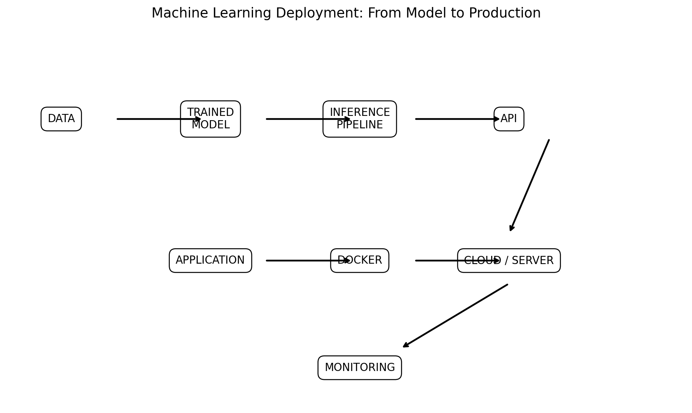
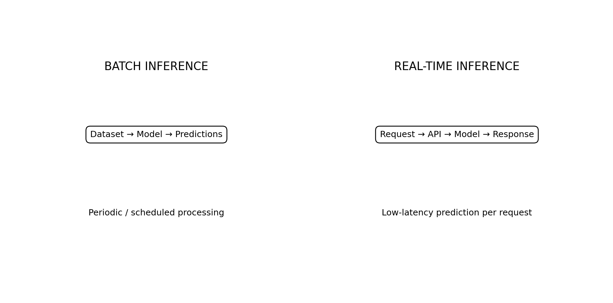
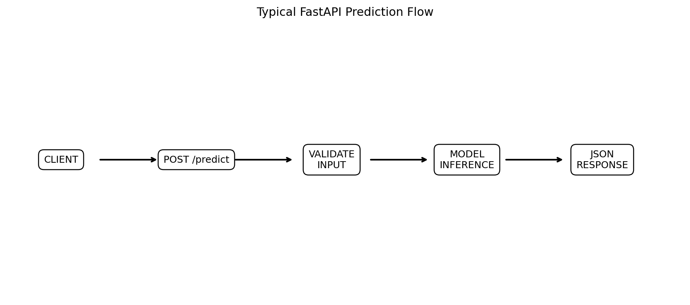
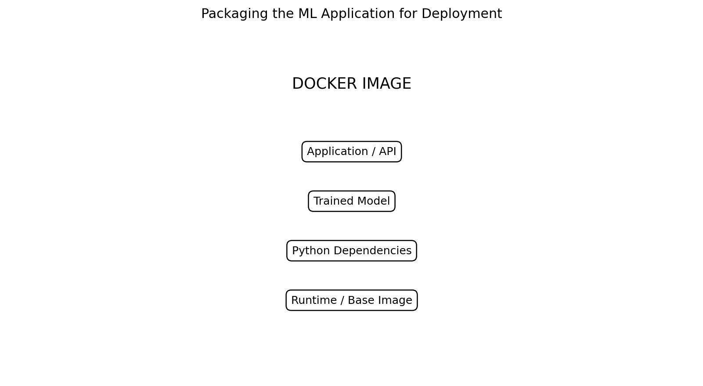
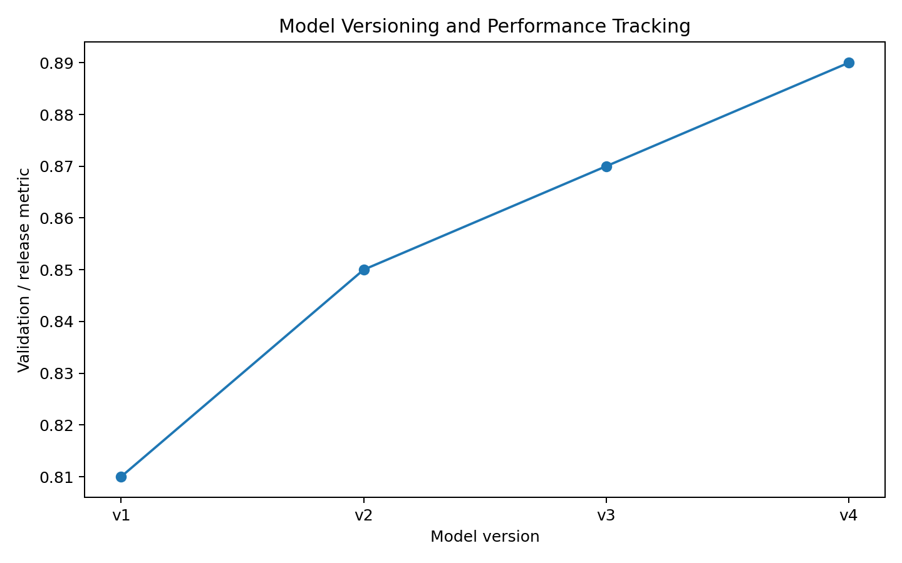
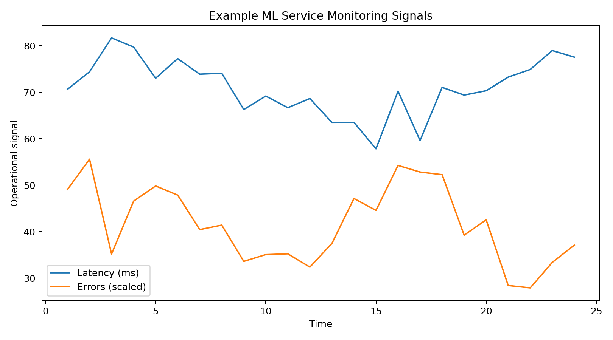
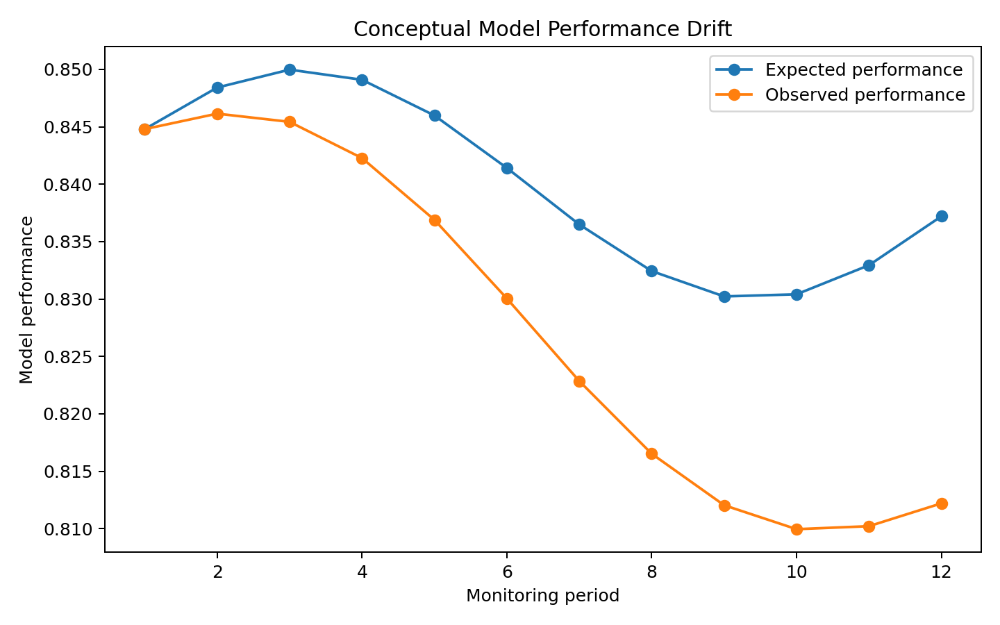
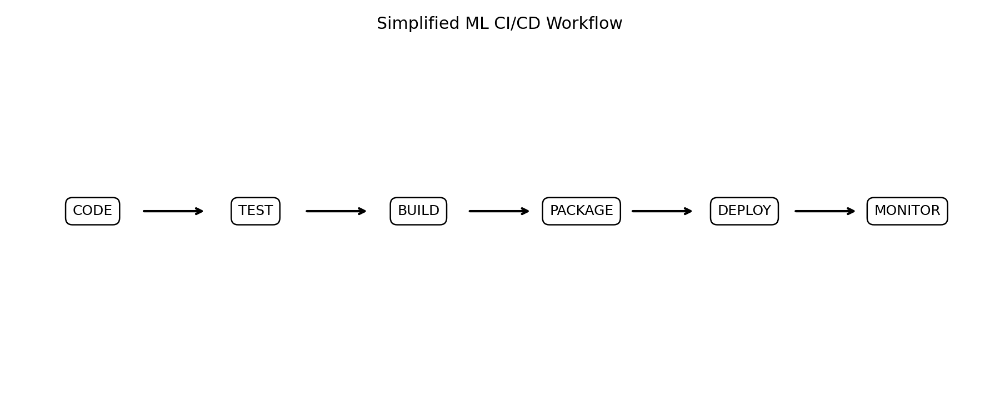

> **A trained model is not yet a machine-learning system. Deployment is the process of turning that model into something that can reliably serve predictions in the real world.**

A typical machine-learning project moves through:

```text
DATA
 ↓
TRAINING
 ↓
MODEL
 ↓
EVALUATION
 ↓
PACKAGING
 ↓
DEPLOYMENT
 ↓
INFERENCE
 ↓
MONITORING
 ↓
RETRAINING
```

This is where the ML Lab moves from:

```text
"I built a model."
```

to:

```text
"I built a system that uses the model."
```

---

# End-to-End Deployment Architecture



A production system commonly contains more than the model itself.

```text
User / Application
        ↓
API
        ↓
Input Validation
        ↓
Preprocessing
        ↓
Model
        ↓
Postprocessing
        ↓
Response
```

Around this prediction path we also need:

```text
Logging
Monitoring
Versioning
Security
Infrastructure
```

---

# What Is Model Deployment?

Model deployment means making a trained model available for inference.

Inference means:

```text
New data
   ↓
Preprocessing
   ↓
Model
   ↓
Prediction
```

Examples:

```text
Image → Cat / Dog

Customer data → Churn probability

Transaction → Fraud probability

House features → Predicted price
```

---

# Training vs Inference

Training:

```text
DATA
 ↓
FEATURES
 ↓
MODEL
 ↓
LEARN PARAMETERS
 ↓
TRAINED MODEL
```

Inference:

```text
NEW DATA
 ↓
SAME PREPROCESSING
 ↓
TRAINED MODEL
 ↓
PREDICTION
```

The model is generally not learning during normal inference.

---

# The Inference Pipeline

A reliable inference pipeline should preserve the same transformations used during training.

```text
RAW INPUT
   ↓
VALIDATION
   ↓
PREPROCESSING
   ↓
FEATURE ENGINEERING
   ↓
MODEL
   ↓
POSTPROCESSING
   ↓
PREDICTION
```

A common production mistake is to train using one preprocessing implementation and deploy a different one.

---

# Save the Trained Model

For many Scikit-learn workflows:

```python
import joblib

joblib.dump(
    model,
    "model.joblib"
)
```

Load it later:

```python
model = joblib.load(
    "model.joblib"
)
```

The exact serialization method depends on the framework and model.

---

# Save the Entire Pipeline

Prefer saving the preprocessing and model together when using Scikit-learn Pipelines.

```python
from sklearn.pipeline import Pipeline

pipeline = Pipeline([
    ("preprocessor", preprocessor),
    ("model", model)
])
```

Then:

```python
joblib.dump(
    pipeline,
    "model_pipeline.joblib"
)
```

During inference:

```python
pipeline = joblib.load(
    "model_pipeline.joblib"
)

prediction = pipeline.predict(
    new_data
)
```

This reduces the risk of preprocessing mismatch.

---

# Model Artifact

A deployable model artifact may include:

```text
model
+
preprocessing
+
feature definitions
+
metadata
+
version
```

Example:

```text
model_pipeline.joblib
metadata.json
requirements.txt
```

The exact structure depends on the application.

---

# Model Metadata

Useful metadata can include:

```text
Model name
Model version
Training date
Dataset version
Feature list
Training metrics
Validation metrics
Library versions
Python version
```

Example:

```json
{
  "model": "customer_churn",
  "version": "1.0",
  "framework": "scikit-learn"
}
```

Metadata makes experiments reproducible.

---

# Batch Inference

Batch inference processes many records together.



Example:

```text
Daily customer data
        ↓
Load dataset
        ↓
Model
        ↓
Predictions
        ↓
Database
```

Common use cases:

```text
Daily risk scoring
Recommendation generation
Report generation
Large-scale data processing
```

Batch inference does not require a prediction API for every individual record.

---

# Real-Time Inference

Real-time inference responds to individual requests.

```text
Client
  ↓
API
  ↓
Validation
  ↓
Model
  ↓
Prediction
  ↓
Response
```

Examples:

```text
Fraud detection
Recommendation API
Image classification
Chat / AI applications
```

The main concern is often:

```text
Latency
```

---

# API-Based Deployment

A common architecture is:

```text
Frontend
   ↓
HTTP Request
   ↓
REST API
   ↓
ML Model
   ↓
JSON Response
```

Example:

```text
POST /predict
```

Request:

```json
{
  "age": 42,
  "income": 75000,
  "tenure": 4
}
```

Response:

```json
{
  "prediction": 1,
  "probability": 0.87
}
```

---

# FastAPI

FastAPI is a popular Python framework for building APIs.

Basic structure:

```python
from fastapi import FastAPI

app = FastAPI()

@app.get("/")
def home():
    return {
        "status": "running"
    }
```

A prediction endpoint might look like:

```python
@app.post("/predict")
def predict(data: InputData):

    prediction = model.predict(
        [data.features]
    )

    return {
        "prediction": int(
            prediction[0]
        )
    }
```

The exact input schema should match the deployed model.

---

# FastAPI Inference Flow



A production API should typically perform:

```text
Request
 ↓
Validate
 ↓
Preprocess
 ↓
Predict
 ↓
Postprocess
 ↓
Return response
```

---

# Input Validation

Never assume incoming data is correct.

Validate:

```text
Required fields
Data types
Allowed ranges
Missing values
Categorical values
Input shape
```

Example:

```text
age = -500
```

should not silently reach the model.

---

# Error Handling

An API should handle:

```text
Invalid input
Missing fields
Model loading failure
Unexpected exceptions
Timeouts
Dependency errors
```

Instead of exposing internal stack traces to users, return useful API errors.

---

# Streamlit Deployment

Streamlit is useful when the goal is a simple interactive ML application.

Typical flow:

```text
User
 ↓
Streamlit UI
 ↓
Preprocessing
 ↓
Model
 ↓
Prediction
 ↓
Visualization
```

It is particularly useful for:

```text
Prototypes
Demos
Data science applications
Internal tools
Portfolio projects
```

---

# API vs Streamlit

| Requirement | FastAPI | Streamlit |
|---|---|---|
| REST API | Excellent | Limited |
| Interactive UI | Not primary goal | Excellent |
| Prototype | Good | Excellent |
| Backend service | Excellent | Not primary goal |
| ML demo | Good | Excellent |
| Production API | Strong choice | Usually not the main choice |

They can also be combined:

```text
Streamlit
    ↓
FastAPI
    ↓
Model
```

---

# Docker

Docker packages an application and its dependencies into a container image.



A typical ML container includes:

```text
Base image
+
Python
+
Dependencies
+
Application
+
Model
```

This makes deployment environments more reproducible.

---

# Example Dockerfile

```dockerfile
FROM python:3.11-slim

WORKDIR /app

COPY requirements.txt .

RUN pip install --no-cache-dir \
    -r requirements.txt

COPY . .

CMD [
    "uvicorn",
    "app:app",
    "--host",
    "0.0.0.0",
    "--port",
    "8000"
]
```

The exact base image and dependencies depend on the application.

---

# Build the Container

```bash
docker build \
    -t ml-api:1.0 .
```

Run it:

```bash
docker run \
    -p 8000:8000 \
    ml-api:1.0
```

The API can then be accessed through the mapped port.

---

# Why Docker?

Without containerization:

```text
"My machine works."
```

But another machine may have:

```text
Different Python
Different packages
Different OS
Different library versions
```

Docker helps standardize the runtime environment.

---

# Dependency Management

Create:

```text
requirements.txt
```

Example:

```text
fastapi
uvicorn
scikit-learn
pandas
numpy
joblib
```

Pin versions when reproducibility matters:

```text
scikit-learn==...
pandas==...
numpy==...
```

Do not blindly install the newest version in production.

---

# CPU vs GPU Deployment

Not every model requires a GPU.

CPU is often sufficient for:

```text
Small tabular models
Classical ML
Low-volume APIs
Small inference workloads
```

GPU becomes more useful for:

```text
Deep learning
Computer vision
Large language models
High-throughput inference
```

The deployment architecture should match the model's computational requirements.

---

# Local Deployment

A practical first deployment:

```text
Laptop
 ↓
Virtual environment
 ↓
FastAPI
 ↓
Model
```

Test locally before moving to a server.

For example:

```bash
uvicorn app:app --reload
```

Then test the endpoint.

---

# Cloud Deployment

A cloud deployment commonly looks like:

```text
Internet
   ↓
Load Balancer / Gateway
   ↓
Application Server
   ↓
ML API
   ↓
Model
```

Cloud providers may offer:

```text
Virtual machines
Containers
Managed application services
Serverless functions
Managed Kubernetes
GPU instances
```

Choose based on:

```text
Traffic
Latency
Cost
Model size
GPU requirement
Operational complexity
```

---

# Deployment Cost

A production system has more costs than the model.

Consider:

```text
Compute
Storage
Network
Database
Logging
Monitoring
GPU
Backups
Domain
Security
```

A small model may be inexpensive to serve on CPU.

A large GPU model can be significantly more expensive.

---

# Model Versioning

Never casually overwrite a production model.

Use versions:

```text
model-v1
model-v2
model-v3
```



Track:

```text
Model version
Dataset version
Code version
Metrics
Deployment date
```

---

# Model Registry Concept

A model registry can organize:

```text
Development
      ↓
Validation
      ↓
Staging
      ↓
Production
```

Example:

```text
model-v3
    ↓
Staging
    ↓
Validation
    ↓
Production
```

The registry implementation depends on the platform.

---

# Blue-Green Deployment

One approach is:

```text
BLUE
Current production

GREEN
New version
```

Test the green version before switching traffic.

```text
Users
 ↓
Traffic Router
 ├── Blue
 └── Green
```

Then switch traffic when the new version is ready.

---

# Canary Deployment

Canary deployment sends a small percentage of traffic to the new model.

```text
Users
 ↓
90% → v1
10% → v2
```

Monitor:

```text
Latency
Errors
Business metrics
Prediction quality
```

If the new version performs well:

```text
10%
 ↓
25%
 ↓
50%
 ↓
100%
```

---

# Monitoring

Deployment is not the end.

A production model should be monitored.

Important signals include:

```text
Latency
Throughput
Error rate
CPU
Memory
GPU
Request volume
Prediction distribution
```



---

# Model Performance Monitoring

Operational metrics are not enough.

If ground-truth labels become available later, monitor:

```text
Accuracy
Precision
Recall
F1
MAE
RMSE
Business KPIs
```

This helps identify model degradation.

---

# Data Drift

Data drift occurs when the distribution of incoming data changes.

Example:

Training:

```text
Average customer age = 35
```

Production:

```text
Average customer age = 52
```

This does not automatically mean the model is broken, but it is a signal that should be investigated.

---

# Concept Drift

Concept drift is different.

The relationship between input and target changes.

Example:

```text
Old behavior:
Feature X strongly predicts outcome Y

New behavior:
Feature X no longer predicts Y
```

The data may look similar, but the underlying relationship has changed.

---

# Model Drift

Model performance can degrade over time.



Possible causes:

```text
Data drift
Concept drift
Changing user behavior
New environments
Seasonality
Economic changes
Data pipeline changes
```

---

# Retraining

A production model may need periodic or event-driven retraining.

```text
Production
    ↓
Monitor
    ↓
Detect degradation
    ↓
Collect new data
    ↓
Retrain
    ↓
Evaluate
    ↓
Deploy new version
```

This creates a feedback loop.

---

# Complete ML Lifecycle

```text
DATA
 ↓
TRAIN
 ↓
EVALUATE
 ↓
PACKAGE
 ↓
DEPLOY
 ↓
MONITOR
 ↓
DRIFT DETECTION
 ↓
RETRAIN
 ↓
EVALUATE
 ↓
DEPLOY NEW VERSION
```

This is much closer to real-world ML engineering than:

```text
Notebook → Accuracy → Done
```

---

# Logging

Log useful information such as:

```text
Request ID
Timestamp
Model version
Inference latency
Prediction
Error status
```

Avoid logging sensitive information unnecessarily.

---

# Latency

Latency measures how long a prediction request takes.

Example:

```text
Request
   ↓
50 ms
   ↓
Response
```

For real-time applications, latency may be a critical requirement.

Consider:

```text
Model inference
+
Preprocessing
+
Network
+
Serialization
```

Total response time is more important than model inference time alone.

---

# Throughput

Throughput measures how many requests can be handled in a given period.

Example:

```text
500 requests / second
```

A system can have:

```text
Low latency
```

but poor throughput, or:

```text
High throughput
```

but high latency.

The required balance depends on the application.

---

# Health Checks

A deployed service should expose a simple health endpoint.

Example:

```python
@app.get("/health")
def health():
    return {
        "status": "healthy"
    }
```

This can be used by:

```text
Load balancer
Container orchestrator
Monitoring system
Deployment platform
```

---

# CI/CD for ML

A simplified ML delivery pipeline is:



```text
CODE
 ↓
TEST
 ↓
BUILD
 ↓
PACKAGE
 ↓
DEPLOY
 ↓
MONITOR
```

ML systems may additionally include:

```text
Data validation
Model validation
Metric checks
Model registry
Approval gates
```

---

# Automated Model Validation

Before deployment, check:

```text
Does the model load?
Are required features present?
Are metrics above minimum thresholds?
Does inference work?
Does the API respond?
Are dependencies compatible?
```

Example release rule:

```text
If F1 >= 0.85
    ↓
Allow deployment

Else
    ↓
Reject release
```

The exact threshold is application-specific.

---

# Security Basics

A deployed ML API should consider:

```text
Authentication
Authorization
HTTPS
Input validation
Rate limiting
Secrets management
Dependency security
Container security
Logging
```

Never hard-code:

```text
API keys
Passwords
Cloud credentials
Database credentials
```

into source code.

---

# Environment Variables

Instead of:

```python
API_KEY = "my-secret-key"
```

use an environment variable:

```python
import os

API_KEY = os.environ[
    "API_KEY"
]
```

This keeps secrets outside the codebase.

---

# Batch vs Real-Time Decision

Ask:

```text
Does the prediction need to happen immediately?
```

If no:

```text
Batch inference
```

may be simpler and cheaper.

If yes:

```text
Real-time API
```

may be appropriate.

Do not build a real-time service when a daily batch job is sufficient.

---

# Deployment Architecture for a Portfolio Project

For a practical portfolio ML project:

```text
Dataset
   ↓
Training Notebook / Script
   ↓
Saved Pipeline
   ↓
FastAPI
   ↓
Docker
   ↓
Cloud / Local Server
   ↓
Frontend / Streamlit
```

This demonstrates substantially more than a notebook-only project.

---

# Example Project Structure

```text
ml-project/
│
├── app/
│   ├── main.py
│   ├── schemas.py
│   └── inference.py
│
├── model/
│   └── model_pipeline.joblib
│
├── training/
│   └── train.py
│
├── tests/
│   └── test_api.py
│
├── requirements.txt
├── Dockerfile
├── README.md
└── .env.example
```

The exact structure can change according to project size.

---

# Testing the Deployed Model

Test:

```text
Valid input
Invalid input
Missing fields
Boundary values
Unexpected values
Large requests
Model loading
API response
Error handling
```

Example:

```bash
curl -X POST \
  http://localhost:8000/predict \
  -H "Content-Type: application/json" \
  -d '{"age":42,"income":75000}'
```

---

# Production Readiness Checklist

```text
☐ Model artifact created
☐ Preprocessing included
☐ Dependencies documented
☐ Model version recorded
☐ API created
☐ Input validation implemented
☐ Error handling implemented
☐ Health check implemented
☐ Tests written
☐ Docker image built
☐ Local inference tested
☐ Deployment environment selected
☐ Logging configured
☐ Monitoring configured
☐ Security reviewed
☐ Model versioning established
☐ Retraining strategy considered
```

---

# Practical Experiment 1 — Save and Load

Train a Scikit-learn model.

```python
joblib.dump(
    model,
    "model.joblib"
)
```

Then load it in a separate Python process.

Verify:

```text
Same input
      ↓
Same prediction
```

---

# Practical Experiment 2 — Build a FastAPI Model Server

Create:

```text
GET /health
POST /predict
```

Test both endpoints.

Document:

```text
Input schema
Output schema
Error responses
```

---

# Practical Experiment 3 — Dockerize

Create:

```text
Dockerfile
requirements.txt
```

Build:

```bash
docker build -t ml-api:1.0 .
```

Run:

```bash
docker run -p 8000:8000 ml-api:1.0
```

Test the API from outside the container.

---

# Practical Experiment 4 — Batch vs Real-Time

Implement:

```text
batch_predict.py
```

and:

```text
FastAPI /predict
```

Compare:

```text
Latency
Throughput
Complexity
```

---

# Practical Experiment 5 — Model Versioning

Create:

```text
model-v1
model-v2
```

Record:

```text
Training data
Metrics
Hyperparameters
Date
```

Deploy one version.

Then simulate an upgrade.

---

# Practical Experiment 6 — Monitoring

Track:

```text
Request count
Latency
Error count
Model version
Prediction distribution
```

Create a simple dashboard or log report.

---

# Practical Experiment 7 — Drift Simulation

Modify the incoming data distribution.

For example:

```text
Training age:
20–50

Production age:
40–80
```

Measure the change.

Ask:

> Should the model be retrained?

Do not assume every distribution shift automatically requires retraining.

---

# Practical Experiment 8 — Complete Deployment

Build:

```text
Model
 ↓
Pipeline
 ↓
FastAPI
 ↓
Docker
 ↓
Client
 ↓
Monitoring
```

This becomes a complete portfolio-ready ML deployment project.

---

# Common Mistakes

### 1. Deploying the model without preprocessing

The production input must undergo the same transformations used during training.

### 2. Saving only the estimator

If preprocessing is separate, it can easily become inconsistent.

### 3. No input validation

Bad input can produce meaningless predictions or crashes.

### 4. No model versioning

You need to know exactly which model is serving predictions.

### 5. No monitoring

A deployed model can degrade silently.

### 6. Hard-coded secrets

Never store credentials in source code.

### 7. Deploying without testing

Test the complete inference path.

### 8. Using a GPU unnecessarily

Choose infrastructure based on actual workload requirements.

### 9. Ignoring drift

Production data is not guaranteed to remain like training data.

---

# Lab Checklist

```text
☐ Understand training vs inference
☐ Save a model
☐ Save preprocessing + model pipeline
☐ Understand model artifacts
☐ Build FastAPI inference API
☐ Validate API inputs
☐ Handle API errors
☐ Build Streamlit application
☐ Understand batch inference
☐ Understand real-time inference
☐ Dockerize ML application
☐ Manage dependencies
☐ Deploy locally
☐ Understand cloud deployment
☐ Understand CPU vs GPU deployment
☐ Implement model versioning
☐ Understand monitoring
☐ Monitor latency and errors
☐ Understand data drift
☐ Understand concept drift
☐ Understand retraining
☐ Understand CI/CD
☐ Apply basic security practices
☐ Test production inference
```

---

# Key Takeaways

```text
MACHINE LEARNING DEPLOYMENT
        │
        ├── MODEL
        │
        ├── PIPELINE
        │
        ├── API
        │
        ├── APPLICATION
        │
        ├── CONTAINER
        │
        ├── INFRASTRUCTURE
        │
        ├── MONITORING
        │
        ├── VERSIONING
        │
        └── RETRAINING
```

The most important lesson is:

> **Deployment is not simply putting a model on a server. It is building a reliable inference system around the model.**

---

# Complete Machine Learning Lifecycle

The entire ML Lab now connects together:

```text
                 MACHINE LEARNING
                       │
                       ↓
                    DATA
                       │
                       ↓
               DATA PREPARATION
                       │
                       ↓
                     EDA
                       │
                       ↓
              FEATURE ENGINEERING
                       │
                       ↓
                   MODELING
                       │
          ┌────────────┼────────────┐
          ↓            ↓            ↓
      Regression   Classification  Clustering
          │            │            │
          └────────────┼────────────┘
                       ↓
                 TREE MODELS
                       │
                ┌──────┴──────┐
                ↓             ↓
          Decision Tree   Random Forest
                │             │
                └──────┬──────┘
                       ↓
               Gradient Boosting
                       │
                       ↓
             HYPERPARAMETER TUNING
                       │
                       ↓
                MODEL EVALUATION
                       │
                       ↓
                   DEPLOYMENT
                       │
                       ↓
                  MONITORING
                       │
                       ↓
                    DRIFT
                       │
                       ↓
                  RETRAINING
```

---

# From Notebook to Production

The transformation is:

```text
NOTEBOOK
   ↓
EXPERIMENT
   ↓
TRAINED MODEL
   ↓
REPRODUCIBLE PIPELINE
   ↓
API
   ↓
DOCKER
   ↓
DEPLOYMENT
   ↓
MONITORING
```

This is the key transition from:

```text
Data Science
```

toward:

```text
Machine Learning Engineering
```

---

## Lab Takeaway

The final deployment mental model is:

```text
TRAIN
  ↓
EVALUATE
  ↓
PACKAGE
  ↓
SERVE
  ↓
MONITOR
  ↓
IMPROVE
  ↓
RETRAIN
  ↓
REDEPLOY
```

A production ML system is therefore a **lifecycle**, not a one-time model-training exercise.

With this page, the **Machine Learning Lab learning path is complete**:

```text
Fundamentals
 ↓
Data Preparation
 ↓
Regression
 ↓
Classification
 ↓
Clustering
 ↓
EDA
 ↓
Feature Engineering
 ↓
Dimensionality Reduction
 ↓
Decision Trees
 ↓
Random Forest
 ↓
Gradient Boosting
 ↓
Hyperparameter Tuning
 ↓
Model Evaluation
 ↓
Machine Learning Deployment
```

This gives the lab a complete journey from **raw data to a deployed and monitored machine-learning system**.
