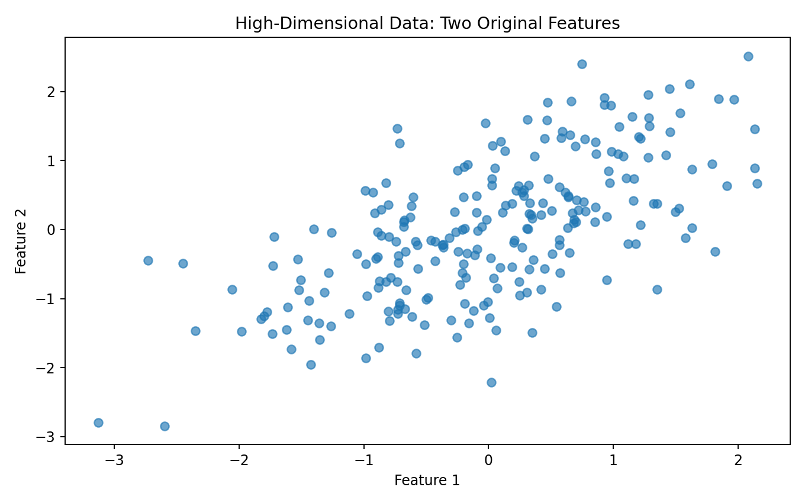
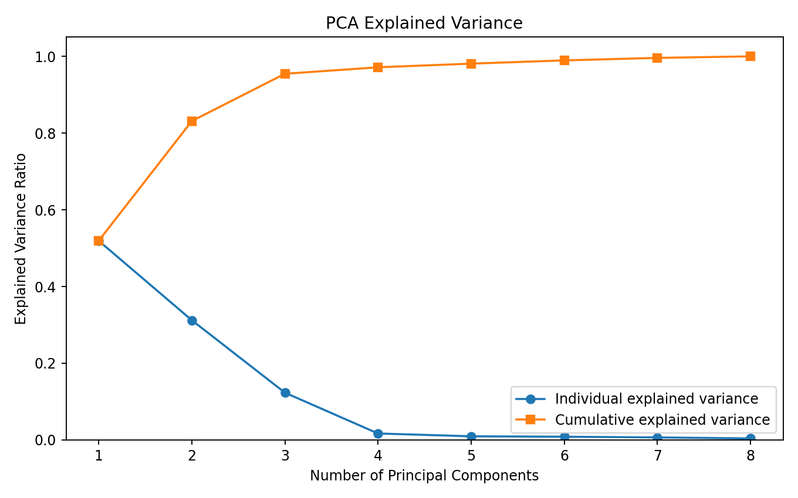
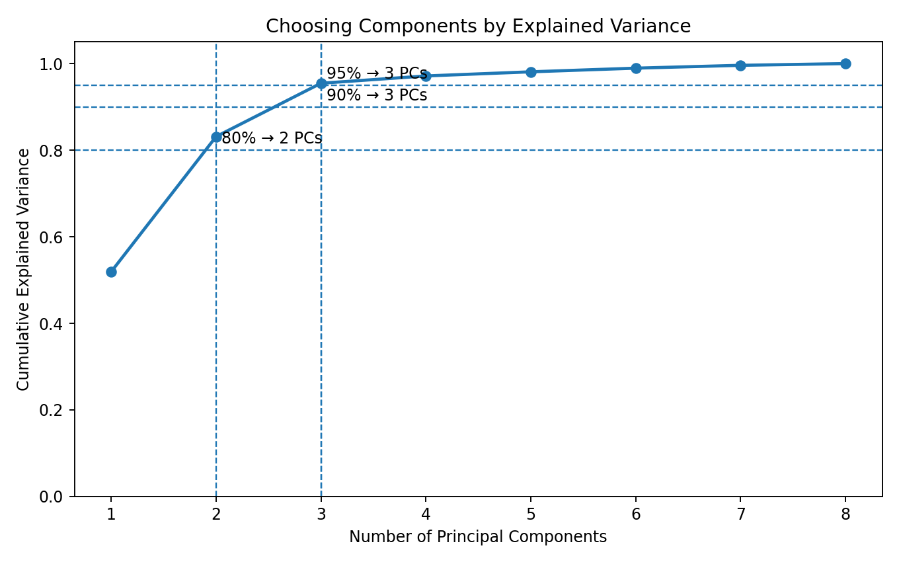
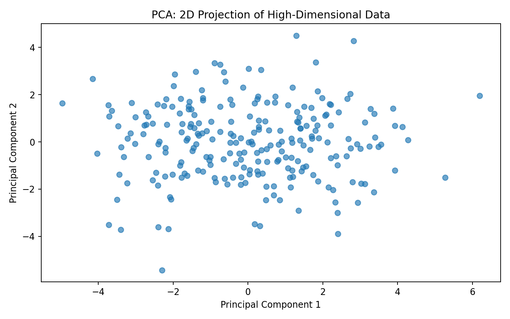
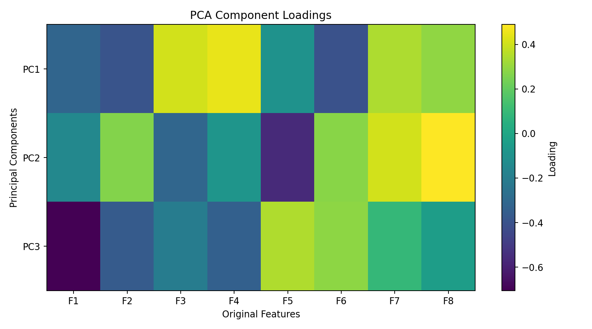
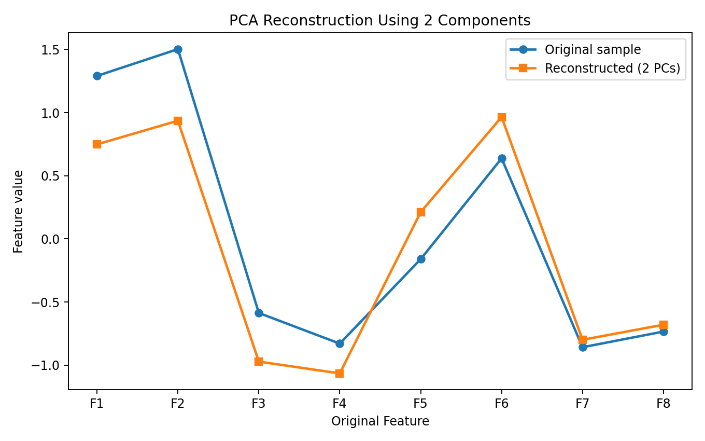
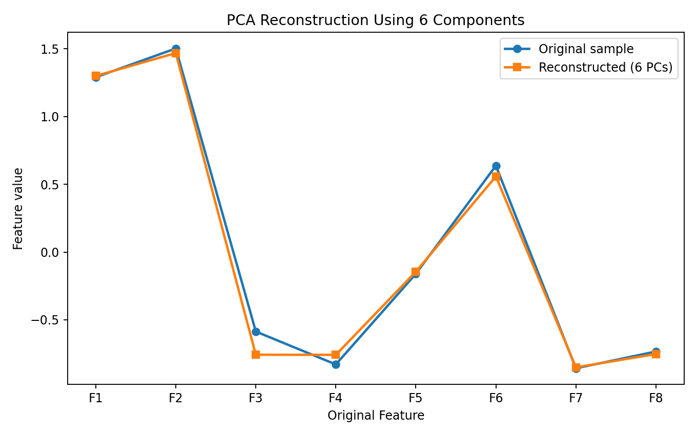
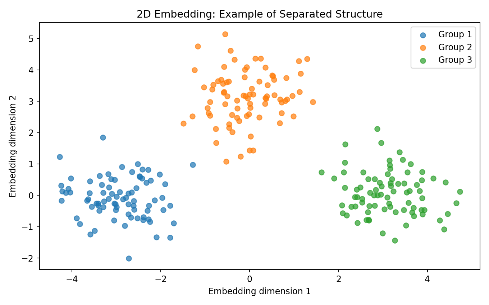

> **Dimensionality reduction transforms high-dimensional data into a smaller representation while attempting to preserve useful information or structure.**

Modern datasets can contain:

```text
10 features
100 features
1,000 features
10,000+ features
```

High dimensionality can make data harder to:

- visualize
- store
- process
- model
- interpret
- analyze

Dimensionality reduction gives us tools to work with a more compact representation.

```text
HIGH-DIMENSIONAL DATA
        ↓
TRANSFORMATION
        ↓
LOWER-DIMENSIONAL REPRESENTATION
        ↓
VISUALIZATION / MODELING / ANALYSIS
```

---

# Why Reduce Dimensions?

Suppose a dataset contains:

```text
Age
Income
Experience
Education
Spending
CreditScore
Transactions
...
```

with hundreds of additional features.

We may want to reduce:

```text
100 features
     ↓
20 components
```

or:

```text
100 features
     ↓
2 dimensions
```

for visualization.

The goal depends on the application.

---

# The Curse of Dimensionality

As the number of dimensions increases, data becomes increasingly sparse relative to the volume of the feature space.

This can create challenges for:

```text
Distance calculations
Nearest-neighbor methods
Clustering
Visualization
Model training
Storage
Computation
```

A key idea:

> **Adding features does not automatically add useful information.**

Some features may be redundant, noisy, or strongly correlated.

---

# Feature Selection vs Feature Extraction

These concepts are related but different.

## Feature Selection

Select a subset of the original features.

Example:

```text
Original:
Age
Income
Education
Experience
Height
Weight

Selected:
Age
Income
Experience
```

The selected features retain their original meaning.

---

## Feature Extraction

Create new features from combinations or transformations of the original features.

PCA is an example.

```text
Original features
       ↓
Mathematical transformation
       ↓
Principal Components
```

The new components may not have a direct real-world interpretation like the original variables.

---

# Principal Component Analysis — PCA

PCA is one of the most widely used dimensionality-reduction techniques.

The basic idea:

> **Find directions in the data that capture large amounts of variance.**

Instead of representing observations using the original coordinate system:

```text
Feature 1
Feature 2
Feature 3
...
Feature N
```

PCA creates:

```text
PC1
PC2
PC3
...
```

where the principal components are ordered by explained variance.

---

# PCA Intuition

Imagine a cloud of points that is elongated along one direction.

PCA tries to find the direction that captures the greatest variation.

Conceptually:

```text
        •
      •
    •
  •
•──────────────→ PC1
```

The first principal component captures the largest amount of variance.

The second component captures the largest remaining variance subject to being orthogonal to the first.

---

# Standardization Before PCA

PCA is sensitive to feature scale.

Suppose:

```text
Age
20–80

Income
20,000–500,000
```

Income could dominate the variance simply because of its numerical scale.

A common workflow is:

```python
from sklearn.preprocessing import StandardScaler

scaler = StandardScaler()

X_scaled = scaler.fit_transform(
    X
)
```

Then apply PCA:

```python
from sklearn.decomposition import PCA

pca = PCA(
    n_components=2
)

X_pca = pca.fit_transform(
    X_scaled
)
```

### Important

Scaling is not an automatic requirement for every dataset, but it is often appropriate when features are measured on substantially different scales and PCA is intended to reflect standardized variance.

---

# Original Feature Space

Before dimensionality reduction, we might visualize only two of many features.



The problem is that a two-dimensional plot cannot directly show all dimensions of a high-dimensional dataset.

PCA provides a principled way to create a lower-dimensional representation.

---

# PCA Explained Variance

One of the most important questions is:

> **How much information is retained by the components?**

Scikit-learn provides:

```python
pca.explained_variance_ratio_
```

Example:

```python
pca = PCA()

X_pca = pca.fit_transform(
    X_scaled
)

print(
    pca.explained_variance_ratio_
)
```

If the output is:

```text
[0.42, 0.25, 0.12, ...]
```

then:

```text
PC1 → 42%
PC2 → 25%
PC3 → 12%
```

of the variance is explained by those components.

---

# PCA Explained Variance Visual



### How to Read It

The individual component curve tells us how much variance each component explains.

The cumulative curve tells us how much variance is retained as components are added.

For example:

```text
PC1
 ↓
42%

PC1 + PC2
 ↓
67%

PC1 + PC2 + PC3
 ↓
79%
```

### ML Meaning

If the first few components explain most of the variance, we may be able to work with a much smaller representation.

---

# Choosing the Number of Components

One common approach is to select enough components to retain a chosen amount of variance.

For example:

```text
90%
95%
99%
```

Python:

```python
pca = PCA(
    n_components=0.95
)

X_reduced = pca.fit_transform(
    X_scaled
)
```

Scikit-learn chooses the number of components needed to preserve approximately the requested fraction of variance.

---

# Cumulative Explained Variance



This plot helps answer:

```text
How many components are needed
to retain approximately 80%, 90%,
or 95% of the variance?
```

There is no universal threshold.

The right choice depends on:

- model performance
- computational cost
- interpretability
- visualization goals
- downstream task

---

# PCA to 2 Dimensions

For visualization:

```python
pca = PCA(
    n_components=2
)

X_2d = pca.fit_transform(
    X_scaled
)
```

Then:

```python
import matplotlib.pyplot as plt

plt.scatter(
    X_2d[:, 0],
    X_2d[:, 1]
)

plt.xlabel("PC1")
plt.ylabel("PC2")
plt.show()
```

## Visual Output



### How to Read It

Each point is an observation.

The axes are no longer original features.

They are:

```text
PC1
PC2
```

If groups appear separated in the projection, this can reveal structure that was difficult to see in the original high-dimensional space.

### Important

A 2D PCA plot is a projection.

Points that appear close or far apart in 2D may not represent their full high-dimensional relationship perfectly.

---

# PCA Components and Loadings

PCA creates components from weighted combinations of original features.

Conceptually:

```text
PC1 =
w₁F₁ + w₂F₂ + w₃F₃ + ... + wₙFₙ
```

The weights are often called **loadings** in interpretive discussions.

In Scikit-learn:

```python
pca.components_
```

contains the component directions.

---

# Loading Visualization



### How to Read It

Large positive or negative loadings indicate stronger contribution of an original feature to that component direction.

For example:

```text
PC1:
Income      +0.52
Experience  +0.49
Age         +0.44
```

might suggest that PC1 represents a latent direction associated with these features.

But the interpretation must consider:

- feature scaling
- signs
- correlations
- domain context

---

# PCA Reconstruction

Dimensionality reduction discards some information when fewer components are retained.

The reduced representation can be approximately transformed back into the original feature space.

Conceptually:

```text
Original X
   ↓
PCA
   ↓
Reduced representation
   ↓
Inverse PCA
   ↓
Approximate reconstruction
```

Python:

```python
pca = PCA(
    n_components=2
)

X_reduced = pca.fit_transform(
    X_scaled
)

X_reconstructed = (
    pca.inverse_transform(
        X_reduced
    )
)
```

---

# Reconstruction with Different Numbers of Components





The reconstruction generally becomes closer to the original data as more components are retained.

This illustrates the trade-off:

```text
Fewer components
     ↓
More compression
     ↓
More information discarded

More components
     ↓
Less compression
     ↓
More information retained
```

---

# PCA for Machine Learning

PCA can be used as part of an ML pipeline.

Example:

```python
from sklearn.pipeline import Pipeline
from sklearn.preprocessing import StandardScaler
from sklearn.decomposition import PCA
from sklearn.linear_model import LogisticRegression

pipeline = Pipeline([
    (
        "scaler",
        StandardScaler()
    ),
    (
        "pca",
        PCA(n_components=0.95)
    ),
    (
        "model",
        LogisticRegression(
            max_iter=1000
        )
    )
])
```

The number of components should be selected using validation rather than by looking at the final test-set performance.

---

# PCA and Multicollinearity

PCA can transform correlated features into orthogonal components.

For example:

```text
Feature A
Feature B
Feature C
```

may contain overlapping information.

PCA can represent much of this shared variance using fewer components.

This can sometimes help models that are sensitive to correlated predictors.

However:

> **PCA trades feature-level interpretability for a transformed representation.**

---

# t-SNE

t-SNE stands for:

```text
t-distributed Stochastic Neighbor Embedding
```

It is primarily used for visualization of high-dimensional data.

Its objective focuses heavily on preserving local neighborhood relationships in a low-dimensional embedding.

Typical use:

```text
High-dimensional embeddings
        ↓
t-SNE
        ↓
2D visualization
```

Example:

```python
from sklearn.manifold import TSNE

embedding = TSNE(
    n_components=2,
    random_state=42
).fit_transform(
    X_scaled
)
```

---

# t-SNE Interpretation

t-SNE can reveal local structure that may not be obvious using linear PCA.

But t-SNE has important caveats:

- distances between distant clusters may not be globally meaningful
- results can depend on parameters
- different runs can produce different layouts
- it is primarily a visualization method rather than a general-purpose feature engineering step

Therefore:

> **Do not interpret every visual gap in a t-SNE plot as proof of a real cluster.**

---

# Embedding Visualization



This type of visualization helps us think about how high-dimensional observations can be represented in two dimensions.

The important distinction is:

```text
Visualization
     ≠
Ground truth
```

---

# UMAP

UMAP stands for:

```text
Uniform Manifold Approximation and Projection
```

UMAP is another nonlinear dimensionality-reduction technique commonly used for visualization and embedding.

Conceptually:

```text
High-dimensional data
        ↓
UMAP
        ↓
Low-dimensional embedding
```

UMAP often attempts to preserve local structure while also maintaining useful aspects of broader structure.

A typical Python implementation uses the `umap-learn` package:

```python
import umap

reducer = umap.UMAP(
    n_components=2,
    random_state=42
)

embedding = reducer.fit_transform(
    X_scaled
)
```

---

# PCA vs t-SNE vs UMAP

| Method | Main purpose | Linear? | Typical use |
|---|---|---:|---|
| PCA | Variance-preserving transformation | Yes | Compression, preprocessing, visualization |
| t-SNE | Local-neighborhood visualization | No | Exploratory visualization |
| UMAP | Nonlinear embedding | No | Visualization and representation learning |

### Important distinction

PCA is often suitable as a reproducible preprocessing transformation.

t-SNE is usually better treated as an exploratory visualization technique.

UMAP can be used for visualization and embeddings, but parameter choices and downstream validation still matter.

---

# Dimensionality Reduction Is Not Feature Selection

Consider:

```text
Feature Selection
        ↓
Keep original features
```

versus:

```text
PCA
        ↓
Create new components
```

If a model uses:

```text
Income
Age
Experience
```

the features retain their original meanings.

If it uses:

```text
PC1
PC2
PC3
```

those components represent combinations of original variables.

---

# Data Leakage and Dimensionality Reduction

This is an important ML engineering issue.

Incorrect:

```python
X_scaled = scaler.fit_transform(
    X
)

X_pca = pca.fit_transform(
    X_scaled
)

X_train, X_test = train_test_split(
    X_pca
)
```

Here the transformations were fitted using the entire dataset.

Better:

```python
X_train, X_test, y_train, y_test = (
    train_test_split(
        X,
        y,
        test_size=0.2,
        random_state=42
    )
)

pipeline = Pipeline([
    (
        "scaler",
        StandardScaler()
    ),
    (
        "pca",
        PCA(n_components=0.95)
    )
])

X_train_reduced = pipeline.fit_transform(
    X_train
)

X_test_reduced = pipeline.transform(
    X_test
)
```

Best practice:

> **Fit preprocessing and dimensionality-reduction transformations only on training data when evaluating supervised models.**

---

# When Dimensionality Reduction Helps

Potential benefits:

```text
Fewer dimensions
      ↓
Lower computation
      ↓
Potentially faster training
```

It can also help:

- visualization
- noise reduction
- compression
- handling redundant features
- reducing storage
- making some algorithms easier to run

---

# When Dimensionality Reduction Can Hurt

Reducing dimensions can also remove information that matters to the downstream task.

For example:

```text
High-dimensional data
        ↓
PCA
        ↓
Keep 90% variance
```

does **not** guarantee that the discarded 10% is irrelevant to the prediction target.

PCA is unsupervised.

It maximizes variance, not predictive usefulness.

Therefore:

> **Always validate dimensionality reduction against the actual downstream task.**

---

# Practical Experiment 1 — PCA Compression

Take a dataset with many numerical features.

Try:

```text
No PCA
      vs
PCA 95%
      vs
PCA 90%
      vs
PCA 80%
```

Compare:

```text
Training time
Memory
Model performance
Number of features/components
```

---

# Practical Experiment 2 — 2D Visualization

Reduce the dataset to:

```python
PCA(
    n_components=2
)
```

Plot:

```text
PC1
vs
PC2
```

If labels are available, use them only for visualization:

```python
plt.scatter(
    X_2d[:, 0],
    X_2d[:, 1],
    c=y
)
```

Ask:

> Does the projection reveal useful separation?

---

# Practical Experiment 3 — Compare PCA and t-SNE

Generate:

```text
PCA embedding
t-SNE embedding
```

Compare the visual structure.

Ask:

```text
Which shows local neighborhoods better?

Which is more stable?

Which is easier to interpret?

Which is appropriate for production preprocessing?
```

---

# Practical Experiment 4 — Reconstruction

Try:

```text
2 components
4 components
6 components
8 components
```

Compare reconstructed data against the original.

Question:

> How much information is lost as the number of components decreases?

---

# Practical Experiment 5 — PCA + Classification

Build two models:

```text
Model A
Raw features
     ↓
Classifier

Model B
Scaled features
     ↓
PCA
     ↓
Classifier
```

Compare validation performance.

Question:

> Did dimensionality reduction actually improve the downstream model?

---

# Dimensionality Reduction Workflow

A practical workflow:

```text
RAW DATA
   ↓
EDA
   ↓
FEATURE SELECTION
   ↓
HANDLE MISSING VALUES
   ↓
SCALE FEATURES
   ↓
CHOOSE REDUCTION METHOD
   ↓
PCA / t-SNE / UMAP
   ↓
VISUALIZE
   ↓
CHECK INFORMATION RETENTION
   ↓
VALIDATE DOWNSTREAM TASK
   ↓
SELECT FINAL REPRESENTATION
```

---

# Common Mistakes

### 1. Assuming PCA always improves performance

PCA is not guaranteed to improve a model.

### 2. Skipping scaling without considering feature units

PCA depends on variance and can be dominated by large-scale features.

### 3. Using test data to fit PCA

This creates leakage.

### 4. Treating PCA components as original features

PC1 is a combination of original variables.

### 5. Interpreting t-SNE distances literally

The geometry of a t-SNE plot has important limitations.

### 6. Choosing components only by variance

High variance does not necessarily mean high predictive value.

### 7. Using dimensionality reduction just because the dataset has many columns

First determine whether the dimensions are redundant, noisy, or genuinely informative.

---

# Lab Checklist

```text
☐ Understand dimensionality reduction
☐ Understand the curse of dimensionality
☐ Distinguish feature selection from feature extraction
☐ Understand PCA intuition
☐ Scale features appropriately
☐ Calculate explained variance
☐ Plot cumulative explained variance
☐ Select components
☐ Visualize PCA projections
☐ Understand PCA loadings
☐ Understand reconstruction
☐ Understand t-SNE
☐ Understand UMAP
☐ Compare reduction techniques
☐ Prevent preprocessing leakage
☐ Validate downstream model performance
```

---

# Key Takeaways

```text
DIMENSIONALITY REDUCTION
        │
        ├── Curse of Dimensionality
        │
        ├── Feature Selection
        │
        ├── Feature Extraction
        │
        ├── PCA
        │
        ├── Explained Variance
        │
        ├── Components
        │
        ├── Loadings
        │
        ├── Reconstruction
        │
        ├── t-SNE
        │
        └── UMAP
```

The most important lesson is:

> **Dimensionality reduction is a trade-off between compactness and information.**

Fewer dimensions can make a dataset easier to visualize and process, but the transformation can also discard information.

The correct number of dimensions should therefore be determined by **the purpose of the analysis and validated against the downstream task**.

---

## Lab Takeaway

The complete mental model is:

```text
HIGH-DIMENSIONAL DATA
        ↓
UNDERSTAND FEATURES
        ↓
SCALE / PREPROCESS
        ↓
REDUCE DIMENSIONS
        ↓
VISUALIZE
        ↓
MEASURE INFORMATION RETENTION
        ↓
VALIDATE DOWNSTREAM MODEL
        ↓
DECIDE
```

The goal is not simply to make the dataset smaller.

The goal is to create a **useful lower-dimensional representation without losing information that matters for the task**.
