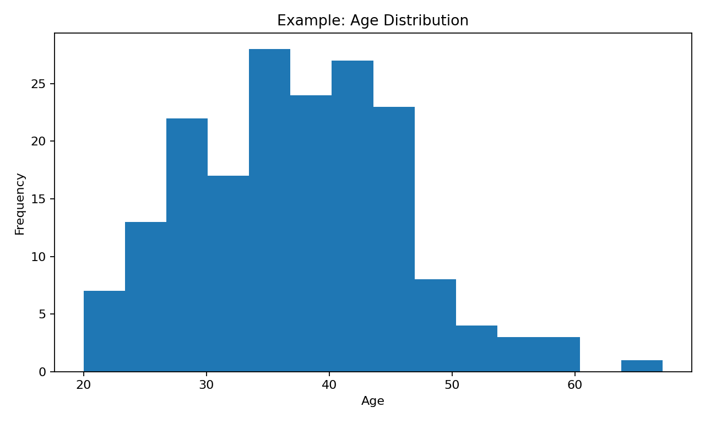
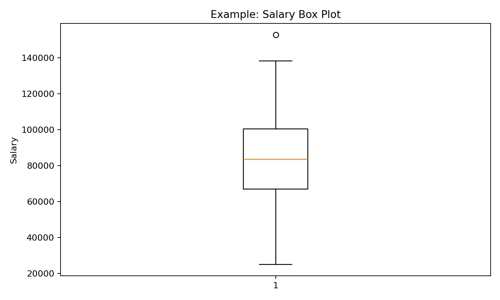
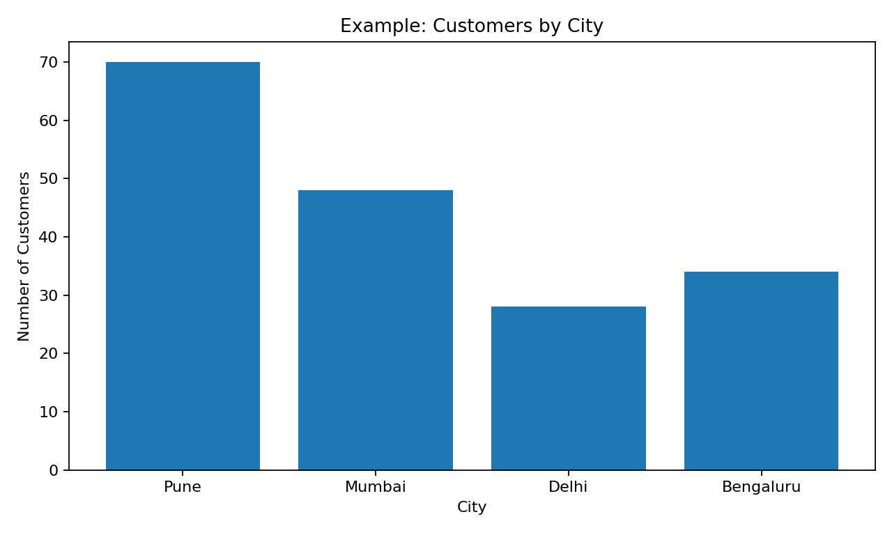
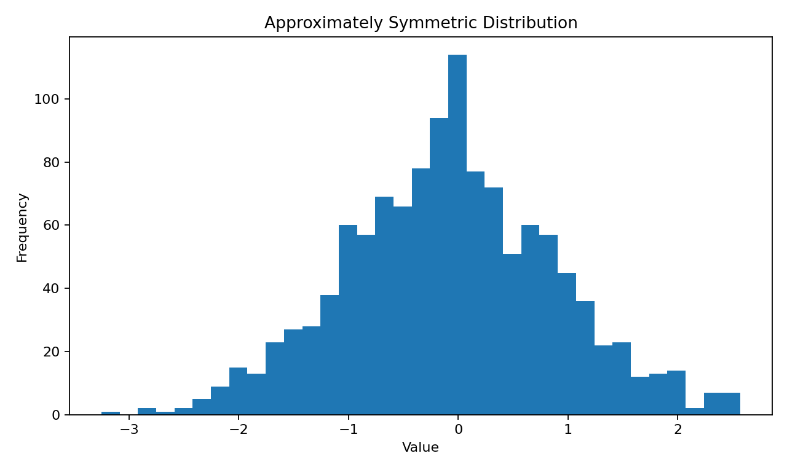
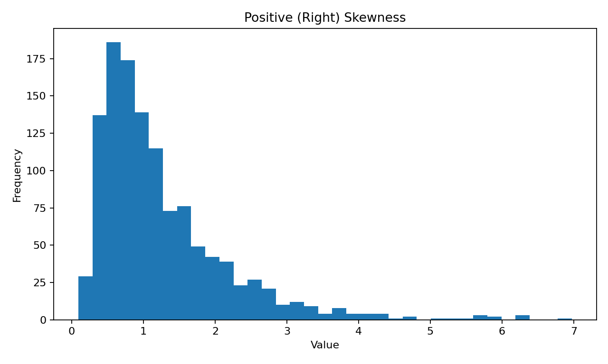
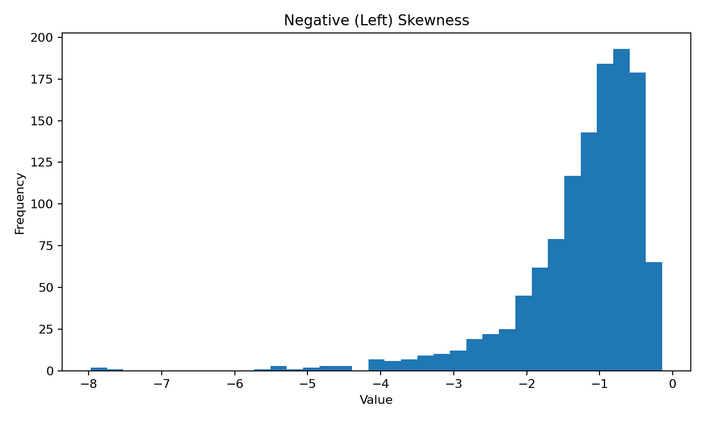
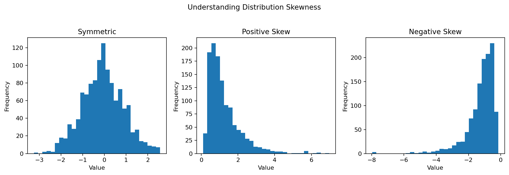
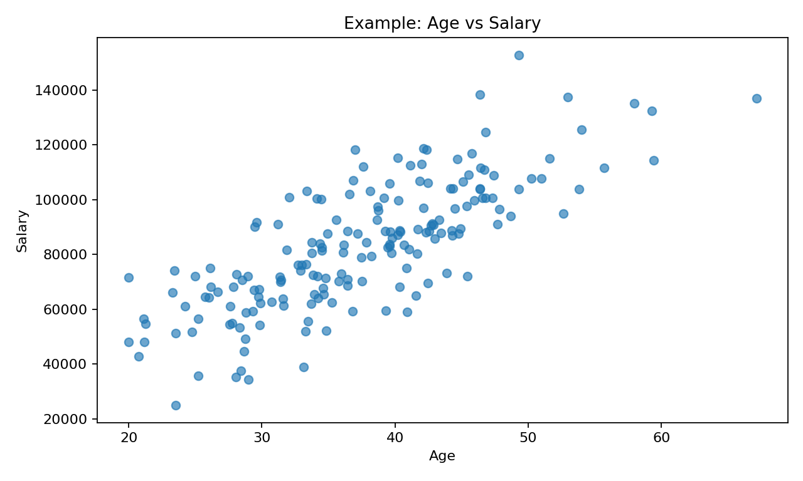
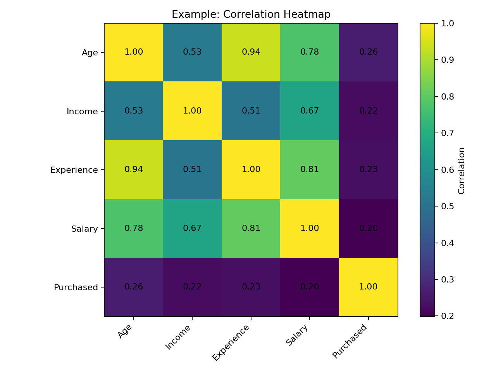
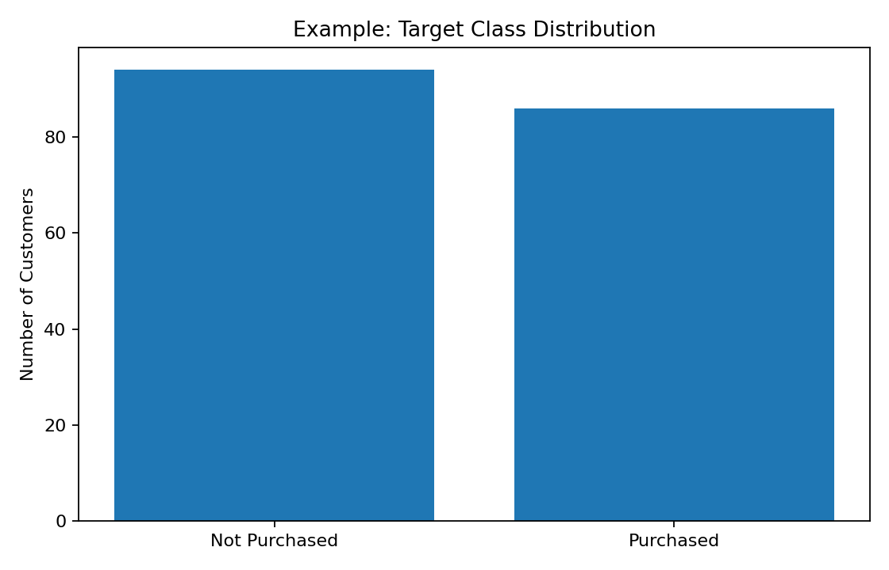

> **Before building a model, understand the data.**
>
> Exploratory Data Analysis (EDA) is the process of investigating a dataset to discover patterns, relationships, anomalies, distributions, and potential problems before machine learning begins.

---

## What is EDA?

Exploratory Data Analysis is a systematic approach to understanding a dataset using:

- Statistical summaries
- Data inspection
- Visualizations
- Distribution analysis
- Correlation analysis
- Outlier detection
- Missing-value analysis
- Domain knowledge

A typical EDA workflow looks like:

```text
DATASET
   ↓
UNDERSTAND STRUCTURE
   ↓
CHECK QUALITY
   ↓
STATISTICAL SUMMARY
   ↓
UNIVARIATE ANALYSIS
   ↓
BIVARIATE ANALYSIS
   ↓
MULTIVARIATE ANALYSIS
   ↓
DISCOVER PATTERNS
   ↓
PREPARE FOR MODELING
```

---

## Why EDA Matters

A machine learning algorithm cannot tell you whether the dataset itself makes sense.

EDA can reveal:

- Missing values
- Duplicate records
- Incorrect data types
- Outliers
- Skewed distributions
- Imbalanced classes
- Unexpected relationships
- Highly correlated features
- Data-entry errors
- Potential leakage
- Features that may not be useful

The important learning pattern throughout this page is:

```text
METHOD
   ↓
VISUAL / STATISTICAL OUTPUT
   ↓
WHAT DO WE SEE?
   ↓
WHAT DOES IT MEAN?
   ↓
WHAT SHOULD WE DO?
```

The images in this page are **illustrative outputs generated from a small synthetic customer dataset**. They are intended to show what the method actually looks like and how to interpret it.

---

# A Small Example Dataset

To make the visualizations easier to relate to one another, imagine a customer dataset containing:

```text
Age
Income
Experience
Salary
City
Purchased
```

Example observations:

| Age | Income | Experience | Salary | City | Purchased |
|---:|---:|---:|---:|---|---|
| 28 | 42000 | 5 | 51000 | Pune | No |
| 35 | 68000 | 10 | 76000 | Mumbai | Yes |
| 42 | 91000 | 17 | 102000 | Pune | Yes |
| 31 | 52000 | 7 | 62000 | Delhi | No |
| 48 | 115000 | 23 | 128000 | Bengaluru | Yes |

The exact values are illustrative. The important point is that we will use the same concepts throughout the analysis.

---

# Step 1: Load the Dataset

A common starting point is Pandas.

```python
import pandas as pd

df = pd.read_csv("dataset.csv")
```

Inspect the first rows:

```python
print(df.head())
```

Inspect the last rows:

```python
print(df.tail())
```

Random samples:

```python
print(df.sample(5))
```

---

# Step 2: Understand Dataset Dimensions

Check the number of rows and columns:

```python
print(df.shape)
```

Example:

```text
(10000, 12)
```

This means:

```text
10000 rows
12 columns
```

You can also inspect the column names:

```python
print(df.columns)
```

---

# Step 3: Inspect Data Types

Use:

```python
print(df.info())
```

This provides:

- Column names
- Number of non-null values
- Data types
- Memory usage

Example:

```text
Age          int64
Income       float64
City         object
Purchased    int64
```

Correct data types are important because they affect how the data is processed.

---

# Step 4: Statistical Summary

For numerical columns:

```python
print(df.describe())
```

You will typically see:

```text
count
mean
std
min
25%
50%
75%
max
```

| Statistic | Meaning |
|---|---|
| count | Number of observations |
| mean | Average |
| std | Standard deviation |
| min | Minimum |
| 25% | First quartile |
| 50% | Median |
| 75% | Third quartile |
| max | Maximum |

---

## Mean

```python
mean_age = df["Age"].mean()
```

The mean is:

```text
sum of values / number of values
```

---

## Median

```python
median_age = df["Age"].median()
```

The median is the middle value after sorting the observations.

Median is often more robust than mean when extreme values exist.

---

## Standard Deviation

```python
std_age = df["Age"].std()
```

Standard deviation measures how spread out values are around the mean.

---

# Step 5: Missing-Value Analysis

Check missing values:

```python
print(df.isnull().sum())
```

Calculate percentages:

```python
missing = df.isnull().mean() * 100

print(missing)
```

A simple visualization:

```python
missing_counts = df.isnull().sum()

missing_counts[missing_counts > 0].plot(
    kind="bar"
)
```

### What should we look for?

```text
How many values are missing?
        ↓
Which columns contain them?
        ↓
Is the missingness random?
        ↓
Could it affect the target?
```

Missing-value analysis should lead to a decision, such as imputation, removal, or further investigation.

---

# Step 6: Duplicate Analysis

Check duplicate rows:

```python
print(df.duplicated().sum())
```

View them:

```python
duplicates = df[df.duplicated()]

print(duplicates)
```

Duplicates may indicate:

- Repeated records
- Data ingestion problems
- Legitimate repeated events

Do not automatically remove them without understanding the dataset.

---

# Univariate Analysis

Univariate analysis studies **one variable at a time**.

Examples:

```text
Age
Income
Salary
City
Gender
```

The goal is to understand:

- Distribution
- Central tendency
- Spread
- Frequency
- Outliers

---

# Histogram

A histogram shows how numerical observations are distributed across ranges.

## Method

```python
import matplotlib.pyplot as plt

plt.hist(
    df["Age"],
    bins=20
)

plt.xlabel("Age")
plt.ylabel("Frequency")
plt.title("Age Distribution")
plt.show()
```

## Visual Output




## How to Read It

Look at:

- Where most observations are concentrated
- Whether the distribution is symmetric
- Whether it is skewed
- Whether there are multiple peaks
- Whether there are unusual gaps

### Example interpretation

```text
Most observations
        ↓
concentrated around the middle age range
        ↓
smaller number of older observations
        ↓
possible right-side tail
```

### ML Meaning

A strongly skewed feature may benefit from transformation depending on the algorithm and modeling objective.

The important point is:

> **The histogram is not the conclusion. The interpretation of the histogram is the conclusion.**

---

# Box Plot

A box plot summarizes the distribution of a numerical feature.

## Method

```python
plt.boxplot(
    df["Salary"].dropna()
)

plt.ylabel("Salary")
plt.title("Salary Distribution")
plt.show()
```

## Visual Output



## What Does It Show?

A box plot helps identify:

```text
Minimum
   │
Q1
   │
Median
   │
Q3
   │
Maximum
```

Points outside the whiskers may be potential outliers.

### Example interpretation

If most salaries are concentrated in a narrow range but a few observations appear far away:

```text
Main distribution
        +
Extreme observations
        ↓
Investigate outliers
```

### ML Meaning

Do not automatically delete the extreme values.

Ask:

```text
Is it an error?
Is it a legitimate observation?
Is it important to the business problem?
Does the selected model handle it well?
```

---

# Categorical Analysis

For categorical variables, use:

```python
print(
    df["City"].value_counts()
)
```

Percentage distribution:

```python
print(
    df["City"].value_counts(
        normalize=True
    ) * 100
)
```

---

## Bar Chart Output

```python
df["City"].value_counts().plot(
    kind="bar"
)

plt.title("Customers by City")
plt.xlabel("City")
plt.ylabel("Count")
plt.show()
```



### How to Read It

The height of each bar represents the number of observations in that category.

For example:

```text
Pune
████████████████

Mumbai
███████████

Delhi
████████

Bengaluru
██████
```

### ML Meaning

A highly dominant category may indicate an uneven dataset.

This does not automatically mean the data is bad, but it tells us to investigate representation before modeling.

---

# Skewness

Skewness describes asymmetry in a distribution.

Calculate it:

```python
print(
    df["Income"].skew()
)
```

A positively skewed distribution has a longer right tail.

A negatively skewed distribution has a longer left tail.

### Why It Matters

Some algorithms are sensitive to feature distributions.

Depending on the model, we may consider:

- Log transformation
- Power transformation
- Robust scaling
- Alternative algorithms

The correct choice depends on the data and model.

---

# Understanding Skewness Visually

Skewness describes the **asymmetry of a distribution**.

The important idea is not simply to calculate a skewness number. We should look at the distribution and understand where its tail extends.

---

## Symmetric Distribution



A roughly symmetric distribution has a similar shape on both sides of its center.

Conceptually:

```text
          █
        ████
      ███████
    ███████████
  ███████████████
        ↑
      center
```

The mean and median are often relatively close.

---

## Positive (Right) Skewness



A positively skewed distribution has a **longer tail toward larger values**.

```text
████████████
████████
█████
███
██
 █
  █
    █
       █
          █
              █
```

Typical relationship:

```text
Mean > Median
```

### Example

Income is often a useful real-world example because a relatively small number of very high-income observations can extend the right tail.

### ML Meaning

A heavily right-skewed feature may sometimes benefit from a transformation such as:

```python
import numpy as np

df["Income_log"] = np.log1p(df["Income"])
```

Whether transformation is useful depends on the model and the problem.

---

## Negative (Left) Skewness



A negatively skewed distribution has a **longer tail toward smaller values**.

```text
              ████████████
             █████████
            ██████
           ████
          ██
         █
       █
     █
   █
 █
```

Typical relationship:

```text
Mean < Median
```

---

## Compare the Three Shapes



The visual comparison is often more useful than memorizing definitions:

```text
SYMMETRIC
    ↓
Similar tails on both sides

POSITIVE SKEW
    ↓
Long tail → right

NEGATIVE SKEW
    ↓
Long tail ← left
```

---

## Calculate Skewness in Python

```python
skewness = df["Income"].skew()

print(skewness)
```

The value gives a numerical indication of asymmetry, but the histogram should still be inspected.

A good EDA habit is:

```text
Calculate
   ↓
Visualize
   ↓
Interpret
   ↓
Decide
```

> **Do not decide how to transform a feature from the skewness number alone. Look at the distribution and understand the domain.**

---

# Bivariate Analysis

Bivariate analysis studies the relationship between **two variables**.

Examples:

```text
Age ↔ Salary
Income ↔ Purchase
City ↔ Purchase
Experience ↔ Salary
```

---

# Scatter Plot

A scatter plot is useful for examining relationships between two numerical variables.

## Method

```python
plt.scatter(
    df["Age"],
    df["Salary"]
)

plt.xlabel("Age")
plt.ylabel("Salary")
plt.title("Age vs Salary")
plt.show()
```

## Visual Output



## How to Read It

Look for:

```text
Upward pattern
    ↓
Positive relationship

Downward pattern
    ↓
Negative relationship

Random cloud
    ↓
Weak linear relationship

Separate groups
    ↓
Possible clusters

Extreme points
    ↓
Potential outliers
```

### ML Meaning

If age and salary show a strong relationship, age may contain useful predictive information.

However:

> **A relationship does not automatically mean that one variable causes the other.**

---

# Correlation Analysis

Correlation measures the strength and direction of association between numerical variables.

A common correlation coefficient ranges from:

```text
-1 to +1
```

Interpretation:

```text
+1  → Strong positive linear relationship
 0  → Little or no linear relationship
-1  → Strong negative linear relationship
```

Calculate correlations:

```python
correlation = df.corr(
    numeric_only=True
)

print(correlation)
```

---

# Correlation Heatmap

A heatmap provides a visual representation of the correlation matrix.

## Method

```python
correlation = df.corr(
    numeric_only=True
)

plt.imshow(
    correlation,
    interpolation="nearest"
)

plt.colorbar()

plt.xticks(
    range(len(correlation.columns)),
    correlation.columns,
    rotation=90
)

plt.yticks(
    range(len(correlation.columns)),
    correlation.columns
)

plt.title("Correlation Matrix")
plt.show()
```

## Actual Visual Example



### How to Read a Heatmap

The matrix compares every numerical feature with every other numerical feature.

Look for:

```text
Value close to +1
        ↓
Strong positive relationship

Value close to -1
        ↓
Strong negative relationship

Value close to 0
        ↓
Weak linear relationship
```

For example, if:

```text
Age ↔ Salary = +0.75
```

we can say that these variables have a relatively strong positive linear association in this illustrative dataset.

If:

```text
Age ↔ Purchased = +0.30
```

the association is weaker.

### ML Meaning

Strongly correlated features can sometimes provide overlapping information.

This may matter for:

- Linear models
- Feature selection
- Multicollinearity
- Model interpretability

But correlation should **not** be used blindly to remove features.

---

# Correlation Does Not Mean Causation

Suppose:

```text
Ice Cream Sales ↑
Swimming Pool Accidents ↑
```

Both may be correlated.

That does not mean:

```text
Ice cream causes swimming accidents.
```

A third factor such as temperature may influence both.

Therefore:

> **Correlation indicates association, not necessarily causation.**

---

# Multivariate Analysis

Multivariate analysis studies multiple variables together.

Example:

```text
Age
Income
Experience
Education
Salary
```

Questions might include:

- How does salary change with age and experience?
- Does education affect salary?
- Are income and experience strongly related?
- Which variables move together?

Example:

```python
pd.plotting.scatter_matrix(
    df[
        [
            "Age",
            "Income",
            "Experience",
            "Salary"
        ]
    ]
)

plt.show()
```

This provides a broad visual overview of multiple numerical relationships.

---

# Grouped Analysis

Grouping allows us to compare statistics across categories.

```python
df.groupby(
    "City"
)["Salary"].mean()
```

Multiple statistics:

```python
df.groupby(
    "City"
)["Salary"].agg(
    [
        "mean",
        "median",
        "min",
        "max"
    ]
)
```

This can reveal differences between groups.

---

# Target Variable Analysis

In supervised learning, EDA should pay special attention to the target.

For classification:

```python
print(
    df["Purchased"].value_counts()
)
```

For regression:

```python
print(
    df["Salary"].describe()
)
```

The target distribution can affect:

- Model selection
- Evaluation metrics
- Sampling strategy
- Feature engineering

---

# Class Imbalance

Suppose a classification dataset contains:

```text
Class 0 → 9500 samples
Class 1 → 500 samples
```

The classes are highly imbalanced.

A model that predicts only Class 0 could achieve:

```text
95% accuracy
```

but still be useless for detecting Class 1.

---

## Visual Output



### What Does It Mean?

If one class is much larger than the other:

```text
Majority class
████████████████████

Minority class
██
```

accuracy alone may not tell the full story.

### ML Meaning

Consider metrics such as:

- Precision
- Recall
- F1-score
- ROC-AUC
- PR-AUC

depending on the problem.

---

# Outlier Analysis

Outliers can be detected using several methods.

### Visual methods

- Box plot
- Histogram
- Scatter plot

### Statistical methods

- IQR
- Z-score

### Domain knowledge

Sometimes the best method is understanding what the values actually mean.

For example:

```text
Age = 250
```

is likely a data-quality problem.

But:

```text
Transaction = ₹10,000,000
```

might be legitimate in a financial dataset.

---

# IQR-Based Outlier Detection

```python
Q1 = df["Salary"].quantile(0.25)

Q3 = df["Salary"].quantile(0.75)

IQR = Q3 - Q1

lower = Q1 - 1.5 * IQR

upper = Q3 + 1.5 * IQR

outliers = df[
    (df["Salary"] < lower) |
    (df["Salary"] > upper)
]

print(outliers)
```

Again:

> **Detection does not automatically mean removal.**

---

# Data Quality Checks

A useful EDA checklist includes:

```text
☐ Dataset dimensions
☐ Column names
☐ Data types
☐ Missing values
☐ Duplicate rows
☐ Unique values
☐ Numerical statistics
☐ Categorical frequencies
☐ Distributions
☐ Outliers
☐ Correlations
☐ Target distribution
☐ Class imbalance
☐ Suspicious values
☐ Potential leakage
```

---

# Detecting Suspicious Values

EDA can identify values that violate domain expectations.

For example:

```python
df[
    df["Age"] < 0
]
```

or:

```python
df[
    df["Salary"] < 0
]
```

You can also inspect categories:

```python
print(
    df["Gender"].unique()
)
```

You may discover inconsistent values:

```text
Male
male
M
MALE
```

These may represent the same category but need normalization.

---

# Example: Cleaning a Category

```python
df["Gender"] = (
    df["Gender"]
    .str.strip()
    .str.lower()
)
```

Now values such as:

```text
Male
 male
MALE
```

can be normalized to:

```text
male
```

---

# EDA with Pandas

A compact first-pass workflow:

```python
import pandas as pd

df = pd.read_csv("dataset.csv")

print("Shape:")
print(df.shape)

print("\nColumns:")
print(df.columns)

print("\nData Types:")
print(df.dtypes)

print("\nMissing Values:")
print(df.isnull().sum())

print("\nDuplicates:")
print(df.duplicated().sum())

print("\nStatistics:")
print(df.describe())
```

This gives a quick initial understanding of the dataset.

---

# Complete EDA Workflow

A practical EDA process can be organized into stages.

## Stage 1 — Dataset Overview

```text
Load
 ↓
Shape
 ↓
Columns
 ↓
Data Types
```

## Stage 2 — Data Quality

```text
Missing Values
 ↓
Duplicates
 ↓
Invalid Values
 ↓
Inconsistent Categories
```

## Stage 3 — Univariate Analysis

```text
Numerical Distributions
 ↓
Categorical Frequencies
 ↓
Outliers
```

## Stage 4 — Relationship Analysis

```text
Scatter Plots
 ↓
Grouped Statistics
 ↓
Correlation
 ↓
Heatmaps
```

## Stage 5 — Target Analysis

```text
Target Distribution
 ↓
Class Balance
 ↓
Feature vs Target
```

## Stage 6 — Modeling Preparation

```text
Insights
 ↓
Feature Selection
 ↓
Transformation
 ↓
Model Strategy
```

---

# Example EDA Notebook Structure

A professional notebook can be organized like this:

```text
01. Problem Definition
02. Import Libraries
03. Load Dataset
04. Dataset Overview
05. Data Quality Checks
06. Missing Value Analysis
07. Duplicate Analysis
08. Univariate Analysis
09. Bivariate Analysis
10. Multivariate Analysis
11. Outlier Analysis
12. Correlation Analysis
13. Target Analysis
14. Key Findings
15. Modeling Recommendations
```

This structure makes the analysis easier to understand and reproduce.

---

# What Should You Look For?

During EDA, ask questions rather than simply generating charts.

### Dataset questions

```text
How large is the dataset?
What does each column represent?
Which columns are numerical?
Which are categorical?
```

### Quality questions

```text
Are values missing?
Are rows duplicated?
Are there invalid values?
Are categories inconsistent?
```

### Distribution questions

```text
Is the feature normally distributed?
Is it skewed?
Are there outliers?
Are there multiple groups?
```

### Relationship questions

```text
Which features are related?
Which features correlate with the target?
Are there strong dependencies?
```

### Modeling questions

```text
Is the target balanced?
Which features appear useful?
Which features may need transformation?
Could leakage exist?
```

---

# EDA Is Not Just Visualization

EDA is sometimes incorrectly treated as:

```text
Make some plots
↓
Done
```

A better approach is:

```text
QUESTION
   ↓
STATISTICAL ANALYSIS
   ↓
VISUALIZATION
   ↓
INTERPRETATION
   ↓
DECISION
```

For example:

```text
Question:
Why is model performance poor?

        ↓

EDA:
Check target balance

        ↓

Finding:
95% class 0
5% class 1

        ↓

Decision:
Accuracy alone is insufficient
```

EDA should lead to decisions.

---

# Common EDA Mistakes

### 1. Plotting without interpretation

A graph is useful only if it helps answer a question.

### 2. Ignoring missing values

Missing data can significantly affect analysis and modeling.

### 3. Ignoring class imbalance

Accuracy can become misleading on imbalanced datasets.

### 4. Removing outliers automatically

An unusual observation may be legitimate.

### 5. Confusing correlation with causation

Correlation alone does not prove a causal relationship.

### 6. Looking only at averages

The mean can hide skewness, groups, and outliers.

### 7. Ignoring categorical variables

Categorical distributions can reveal important dataset problems.

### 8. Performing EDA after using the test set incorrectly

EDA should be designed carefully when it informs model-building decisions so that information from held-out evaluation data does not leak into the modeling process.

---

# Interview Questions

### What is EDA?

Exploratory Data Analysis is the process of investigating and understanding a dataset using statistical analysis and visualization before modeling.

### Why is EDA important?

EDA helps identify data-quality issues, distributions, relationships, outliers, missing values, class imbalance, and potential modeling problems.

### What is the difference between univariate and bivariate analysis?

Univariate analysis studies one variable, while bivariate analysis studies the relationship between two variables.

### What is a histogram?

A histogram displays the frequency distribution of a numerical variable.

### What is a box plot used for?

A box plot summarizes the distribution of a numerical variable and can help identify potential outliers.

### What does correlation measure?

Correlation measures the strength and direction of association between variables, commonly for linear relationships when using Pearson correlation.

### Does correlation imply causation?

No. Correlation indicates association, not necessarily a causal relationship.

### How do you detect class imbalance?

Use class counts or normalized class frequencies:

```python
df["Target"].value_counts(
    normalize=True
)
```

### How do you detect outliers?

Common approaches include box plots, IQR, Z-scores, scatter plots, and domain knowledge.

### What should you do after EDA?

Use the findings to guide data preparation, feature engineering, model selection, evaluation strategy, and further experimentation.

---

# Key Takeaways

```text
EXPLORATORY DATA ANALYSIS
          │
          ├── Understand Structure
          ├── Check Data Quality
          ├── Analyze Distributions
          ├── Study Relationships
          ├── Detect Outliers
          ├── Analyze Target
          └── Generate Modeling Insights
```

The central idea is:

> **EDA turns a dataset from a collection of columns into something you actually understand.**

---

## Lab Takeaway

**Don't start with the model. Start with questions about the data.**

A strong EDA process helps you answer:

```text
What data do I have?
        ↓
Can I trust it?
        ↓
What patterns exist?
        ↓
What problems exist?
        ↓
Which features matter?
        ↓
How should I build the model?
```

EDA is the bridge between **raw data** and **machine learning**.

```text
RAW DATA
   ↓
EDA
   ↓
UNDERSTANDING
   ↓
FEATURE ENGINEERING
   ↓
MODEL
```

The next step is **Feature Engineering**, where the insights discovered during EDA are converted into features that machine learning models can use effectively.
