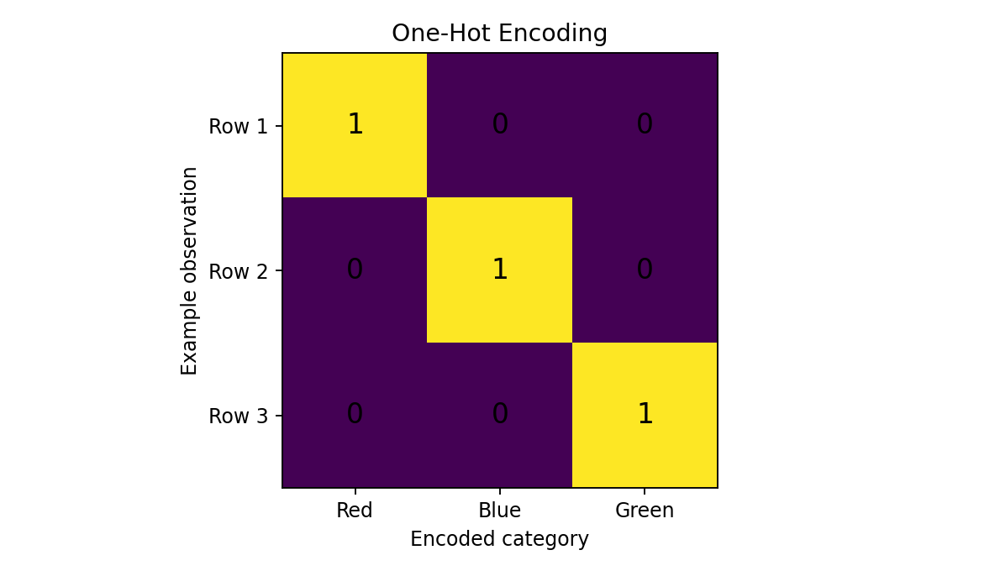
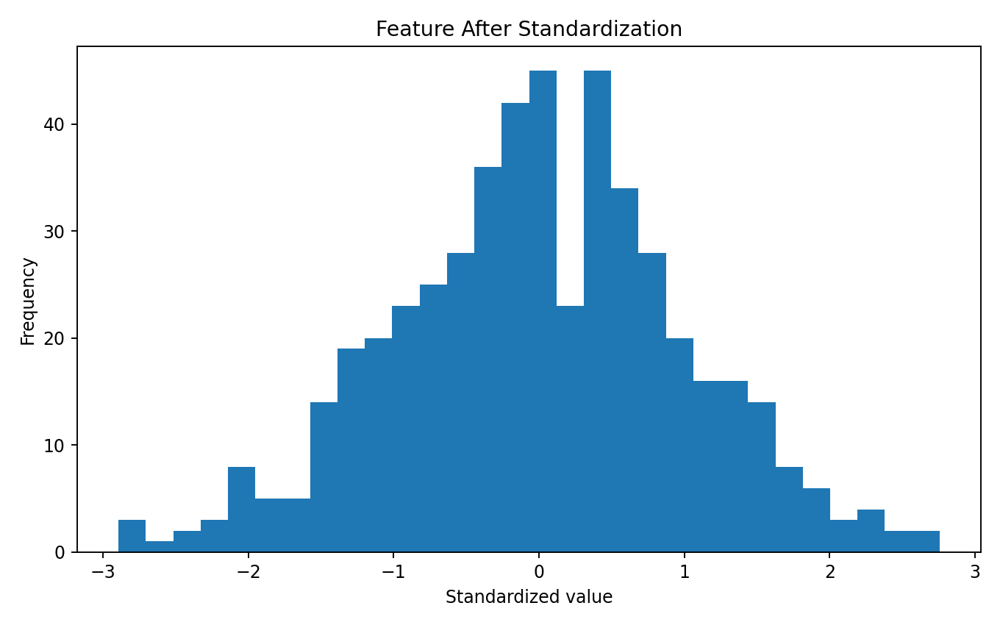
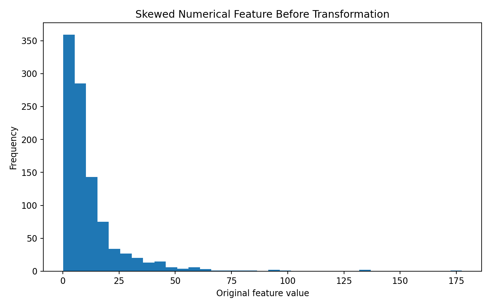
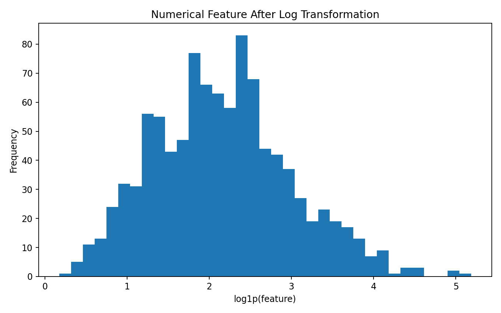
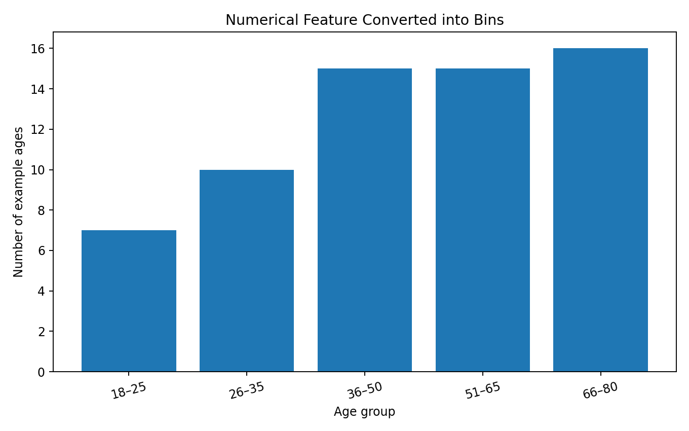
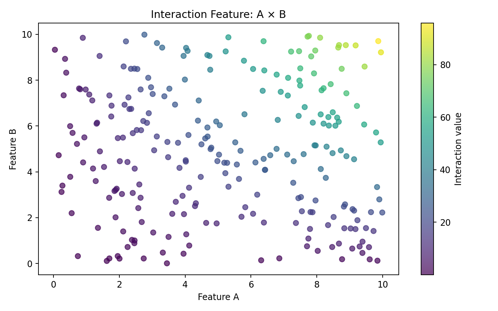
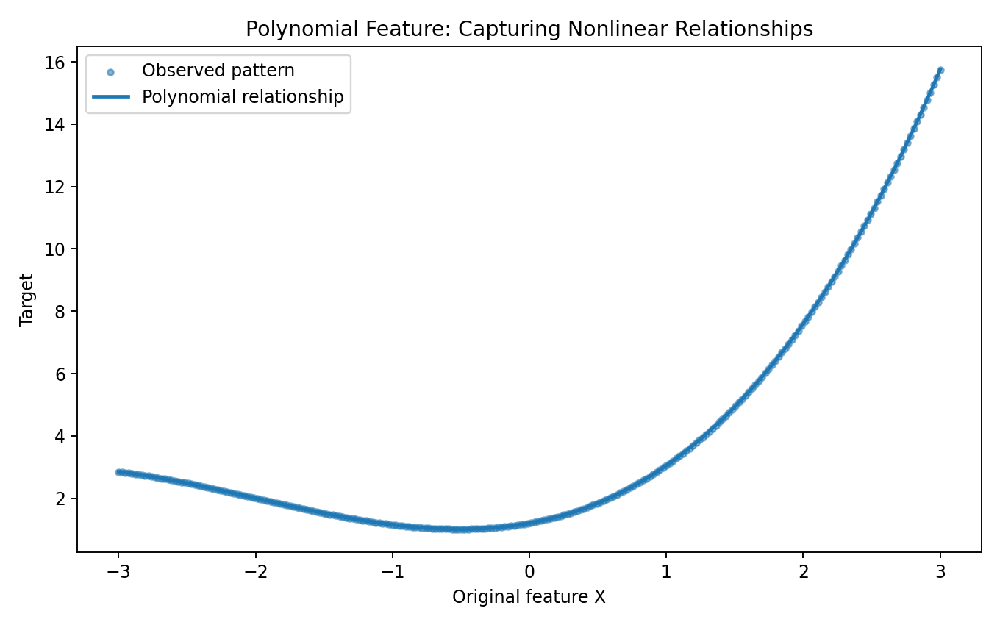
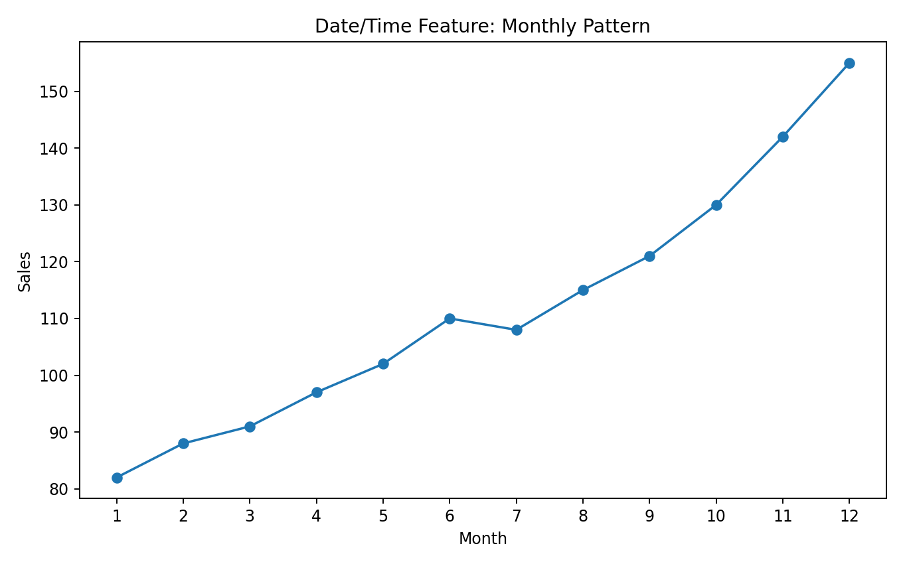
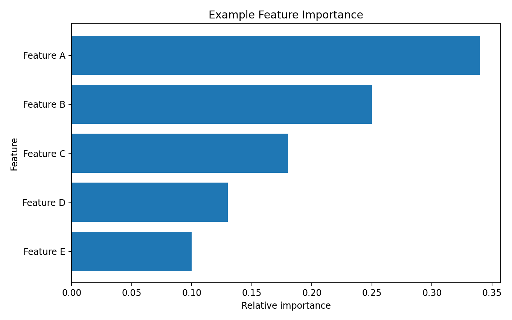

> **Feature engineering is the process of transforming raw data into representations that help a machine learning model learn useful patterns.**

A model does not understand a business concept directly.

It receives numerical or otherwise machine-readable representations.

```text
RAW DATA
   ↓
UNDERSTANDING
   ↓
FEATURE ENGINEERING
   ↓
MODEL-READY FEATURES
   ↓
MACHINE LEARNING MODEL
   ↓
PREDICTION
```

This makes feature engineering one of the most important parts of a practical ML workflow.

---

# Why Feature Engineering Matters

Suppose we have:

```text
Date of Birth
Annual Salary
City
Number of Purchases
Account Created Date
```

A model may perform better if we transform these into:

```text
Age
Monthly Salary
Encoded City
Purchase Frequency
Account Age
```

The information was already present.

Feature engineering changes the **representation** so that the model can use it more effectively.

---

# Raw Data vs Model Features

Consider a customer record:

```text
Date of Birth:
1985-04-17

Annual Income:
₹720000

City:
Pune

Purchases:
36

Account Created:
2023-01-01
```

Potential engineered features:

```text
Age = 41

Monthly Income = ₹60000

City_Pune = 1

Purchase Frequency = purchases / account_age

Account Age = approximately 3.6 years
```

The model now receives structured numerical features.

---

# Feature Engineering Workflow

```text
RAW DATA
   ↓
EDA
   ↓
UNDERSTAND FEATURES
   ↓
HANDLE MISSING VALUES
   ↓
TRANSFORM FEATURES
   ↓
ENCODE CATEGORICAL DATA
   ↓
SCALE WHEN APPROPRIATE
   ↓
CREATE NEW FEATURES
   ↓
SELECT USEFUL FEATURES
   ↓
VALIDATE
   ↓
MODEL
```

Notice that **EDA comes before feature engineering**.

We need to understand the data before deciding how to transform it.

---

# Feature Types

Common feature types include:

```text
Numerical
Categorical
Ordinal
Binary
Date / Time
Text
Geographical
Aggregated
Derived
```

Each type may require a different engineering strategy.

---

# Numerical Features

Examples:

```text
Age
Salary
Height
Weight
Revenue
Temperature
Transaction Amount
```

Possible transformations include:

```text
Scaling
Log transformation
Power transformation
Binning
Polynomial features
Ratios
Interactions
```

---

# Categorical Features

Examples:

```text
City
Gender
Product Type
Department
Payment Method
```

Models usually need these converted into numerical representations.

Common approaches:

```text
One-Hot Encoding
Ordinal Encoding
Target Encoding
Frequency Encoding
```

The correct method depends on the meaning of the category and the model.

---

# One-Hot Encoding

Suppose:

```text
Color

Red
Blue
Green
```

One-hot encoding creates separate binary features.

```text
Color_Red
Color_Blue
Color_Green
```

Example:

```text
Red
→
1 0 0
```

## Visual Output



Python:

```python
import pandas as pd

encoded = pd.get_dummies(
    df["Color"],
    prefix="Color"
)
```

Using Scikit-learn:

```python
from sklearn.preprocessing import OneHotEncoder

encoder = OneHotEncoder(
    handle_unknown="ignore"
)

X_encoded = encoder.fit_transform(
    df[["Color"]]
)
```

---

# Why `handle_unknown` Matters

Imagine training data contains:

```text
Pune
Mumbai
Delhi
```

but production data later contains:

```text
Bangalore
```

A robust encoder should handle unseen categories appropriately.

```python
OneHotEncoder(
    handle_unknown="ignore"
)
```

This is especially important in production pipelines.

---

# Ordinal Encoding

Some categorical variables have a natural order.

Example:

```text
Low
Medium
High
```

An ordinal representation can be:

```text
Low    → 0
Medium → 1
High   → 2
```

This makes sense because the categories have an order.

But applying numeric codes to unordered categories can create a false sense of numerical relationship.

For example:

```text
Pune   → 0
Mumbai → 1
Delhi  → 2
```

does not mean Delhi is "twice" Mumbai.

---

# Scaling

Scaling changes the numerical range or distribution of features.

A common approach is standardization:

```text
z = (x - mean) / standard deviation
```

Python:

```python
from sklearn.preprocessing import StandardScaler

scaler = StandardScaler()

X_scaled = scaler.fit_transform(
    X
)
```

---

# Before Scaling


The feature is centered around its original numerical scale.

---

# After Scaling



The standardized feature has approximately:

```text
Mean ≈ 0
Standard deviation ≈ 1
```

### ML Meaning

Scaling can be particularly important for algorithms that depend on:

```text
Distance
Gradient optimization
Feature magnitude
Regularization
```

Examples:

```text
K-Means
KNN
SVM
Logistic Regression
Neural Networks
PCA
```

Tree-based models are generally much less sensitive to feature scaling.

---

# Normalization vs Standardization

These terms are sometimes used interchangeably, but they describe different transformations.

### Standardization

Typically:

```text
mean → 0
std   → 1
```

### Min-Max Scaling

Maps values into a range such as:

```text
0 to 1
```

Python:

```python
from sklearn.preprocessing import MinMaxScaler

scaler = MinMaxScaler()

X_scaled = scaler.fit_transform(
    X
)
```

Choose the transformation based on the algorithm and data characteristics.

---

# Log Transformation

Some numerical variables are strongly right-skewed.

Examples:

```text
Income
Transaction Amount
Population
Revenue
```

A log transformation can compress very large values.

```python
import numpy as np

df["income_log"] = np.log1p(
    df["income"]
)
```

---

# Before Log Transformation



The distribution has a long right tail.

Large values are much farther from the center than most observations.

---

# After Log Transformation



The log transformation compresses large values and can make a heavily skewed distribution more manageable for some models.

### ML Meaning

The goal is not to make every distribution perfectly normal.

The goal is to create a representation that is more useful for the downstream model and analysis.

---

# Binning

Binning converts a continuous numerical feature into groups.

Example:

```text
Age

18–25
26–35
36–50
51–65
66–80
```

## Visual Output



Python:

```python
bins = [
    0,
    25,
    35,
    50,
    65,
    100
]

labels = [
    "18-25",
    "26-35",
    "36-50",
    "51-65",
    "66+"
]

df["age_group"] = pd.cut(
    df["Age"],
    bins=bins,
    labels=labels
)
```

### When Binning Helps

Binning can help when the relationship with the target is naturally group-based or nonlinear.

### Risk

Binning can discard information.

For example:

```text
Age 35
Age 36
```

could end up in different groups despite being very similar.

Use it intentionally.

---

# Interaction Features

Sometimes the effect of one feature depends on another.

Example:

```text
Income
+
Spending
```

can be transformed into:

```text
Income × Spending
```

Python:

```python
df["income_spending"] = (
    df["income"] *
    df["spending"]
)
```

## Visual Output



### ML Meaning

Interaction features allow some models to represent relationships that are difficult to capture using individual features alone.

---

# Ratio Features

Ratios can represent meaningful relationships.

Examples:

```text
Revenue / Customer Count

Debt / Income

Purchases / Account Age

Distance / Time
```

Example:

```python
df["debt_to_income"] = (
    df["debt"] /
    df["income"]
)
```

Always protect against division by zero:

```python
df["debt_to_income"] = (
    df["debt"] /
    df["income"].replace(
        0,
        np.nan
    )
)
```

---

# Polynomial Features

A linear model can be extended to represent nonlinear relationships by adding polynomial terms.

Original:

```text
X
```

Polynomial expansion:

```text
X
X²
X³
```

For two features:

```text
X1
X2
X1²
X1X2
X2²
```

Python:

```python
from sklearn.preprocessing import PolynomialFeatures

poly = PolynomialFeatures(
    degree=2,
    include_bias=False
)

X_poly = poly.fit_transform(
    X
)
```

---

# Polynomial Feature Visualization



### ML Meaning

Polynomial features allow a linear model to fit nonlinear relationships in the original feature space.

But increasing polynomial degree can rapidly increase the number of features.

That can cause:

```text
Overfitting
Higher computation
Multicollinearity
```

Use validation to select an appropriate degree.

---

# Date and Time Features

A raw timestamp is often less useful than meaningful components.

Example:

```text
2026-08-24 10:30:00
```

can produce:

```text
Year
Month
Day
Day of Week
Hour
Weekend
Quarter
```

Python:

```python
df["date"] = pd.to_datetime(
    df["date"]
)

df["year"] = (
    df["date"].dt.year
)

df["month"] = (
    df["date"].dt.month
)

df["day_of_week"] = (
    df["date"].dt.dayofweek
)

df["hour"] = (
    df["date"].dt.hour
)
```

---

# Date/Time Visualization



Time features can reveal:

```text
Seasonality
Weekly patterns
Monthly patterns
Business cycles
Peak hours
```

---

# Cyclical Date Features

There is an important problem with ordinary numeric encoding of cyclical values.

Consider:

```text
Monday = 0
...
Sunday = 6
```

Sunday and Monday are actually adjacent in the weekly cycle, but numerically:

```text
6 and 0
```

appear far apart.

A common solution is sine/cosine encoding.

```python
import numpy as np

df["day_sin"] = np.sin(
    2 * np.pi *
    df["day_of_week"] / 7
)

df["day_cos"] = np.cos(
    2 * np.pi *
    df["day_of_week"] / 7
)
```

This represents the cycle continuously.

---

# Aggregation Features

Many ML problems benefit from historical summaries.

For a customer:

```text
Total purchases
Average purchase value
Maximum purchase
Number of transactions
Days since last purchase
```

Example:

```python
customer_features = (
    transactions
    .groupby("customer_id")
    .agg(
        total_spend=("amount", "sum"),
        avg_spend=("amount", "mean"),
        transaction_count=("amount", "count")
    )
    .reset_index()
)
```

Aggregation is particularly important in:

```text
Customer analytics
Fraud detection
Recommendation
Time-series feature engineering
Business intelligence
```

---

# Missing-Value Features

Missingness itself can sometimes contain information.

Example:

```text
income_missing = 1
```

if income was not provided.

Python:

```python
df["income_missing"] = (
    df["income"].isna().astype(int)
)
```

Then the original missing value can be imputed separately.

```python
df["income"] = (
    df["income"].fillna(
        df["income"].median()
    )
)
```

### Important

Missingness should not automatically be assumed to be predictive.

Validate whether it actually contributes useful information.

---

# Feature Importance

After training a model, we may want to understand which features contribute to predictions.

For tree-based models:

```python
model.feature_importances_
```

Example visualization:



### Important

Feature importance is **not automatically causal importance**.

A feature being important to a model does not prove that changing that feature causes the prediction to change in the real world.

---

# Feature Selection

Feature engineering and feature selection are closely related.

Possible approaches:

```text
Remove constant features
Remove duplicate features
Correlation analysis
Statistical tests
Recursive Feature Elimination
L1 regularization
Tree-based importance
Permutation importance
```

The objective is not simply:

```text
Fewer features = better
```

The objective is:

```text
Useful information
+
Generalization
+
Reasonable complexity
```

---

# Correlated Features

Suppose we have:

```text
Age
YearOfBirth
```

These contain nearly the same information.

Keeping both may be unnecessary.

Similarly:

```text
AnnualIncome
MonthlyIncome
```

may be strongly related.

Feature engineering should ask:

> **Does this new feature add information that the existing features do not already provide?**

---

# Feature Engineering and Dimensionality Reduction

This is where our ML path connects.

```text
EDA
 ↓
Feature Engineering
 ↓
Feature Selection
 ↓
Dimensionality Reduction
 ↓
Model
```

Feature engineering creates or transforms useful representations.

Dimensionality reduction then provides another way to create a compact representation when appropriate.

For example:

```text
100 engineered features
        ↓
PCA
        ↓
20 components
```

This is why **Feature Engineering comes before Dimensionality Reduction** in our learning path.

---

# Data Leakage

Feature engineering can accidentally introduce leakage.

Suppose we want to predict:

```text
Customer churn
```

and create:

```text
days_until_cancellation
```

That feature may contain information that is only available after the churn event.

The model may look excellent during evaluation but fail in production.

The key question is:

> **Was this feature actually available at prediction time?**

---

# Temporal Leakage

Time-based problems require special care.

Incorrect:

```text
Prediction date:
January 10

Feature:
Customer's total purchases
through January 31
```

The feature contains future information.

Correct:

```text
Prediction date:
January 10

Feature:
Customer's purchases
through January 10
```

Feature engineering must respect the timeline.

---

# Train/Test Leakage

Another common mistake:

```python
scaler.fit_transform(
    entire_dataset
)
```

before the train/test split.

Better:

```python
X_train, X_test = train_test_split(
    X
)

scaler.fit(
    X_train
)

X_train_scaled = scaler.transform(
    X_train
)

X_test_scaled = scaler.transform(
    X_test
)
```

Even better, use a Pipeline.

---

# Scikit-learn Feature Engineering Pipeline

A practical example:

```python
from sklearn.compose import ColumnTransformer
from sklearn.pipeline import Pipeline

from sklearn.preprocessing import (
    StandardScaler,
    OneHotEncoder
)

from sklearn.impute import SimpleImputer

numeric_features = [
    "age",
    "income"
]

categorical_features = [
    "city",
    "contract_type"
]

numeric_pipeline = Pipeline([
    (
        "imputer",
        SimpleImputer(
            strategy="median"
        )
    ),
    (
        "scaler",
        StandardScaler()
    )
])

categorical_pipeline = Pipeline([
    (
        "imputer",
        SimpleImputer(
            strategy="most_frequent"
        )
    ),
    (
        "encoder",
        OneHotEncoder(
            handle_unknown="ignore"
        )
    )
])

preprocessor = ColumnTransformer([
    (
        "numeric",
        numeric_pipeline,
        numeric_features
    ),
    (
        "categorical",
        categorical_pipeline,
        categorical_features
    )
])
```

Then:

```python
from sklearn.linear_model import LogisticRegression

model = Pipeline([
    (
        "preprocessor",
        preprocessor
    ),
    (
        "classifier",
        LogisticRegression(
            max_iter=1000
        )
    )
])
```

This is much safer than manually transforming training and test data separately.

---

# Feature Engineering Strategy

When creating a feature, ask:

### 1. What information does it represent?

```text
What does this feature mean?
```

### 2. Why should it help?

```text
What relationship with the target
might it capture?
```

### 3. Is it available at prediction time?

```text
Could this feature leak the answer?
```

### 4. Does it duplicate another feature?

```text
Is this adding information?
```

### 5. Does it generalize?

```text
Does it work on unseen data?
```

---

# Practical Experiment 1 — Scaling

Compare:

```text
Raw features
      vs
Standardized features
```

Use a distance-based model such as K-Means or KNN.

Observe the effect on the model.

---

# Practical Experiment 2 — Log Transformation

Take a strongly skewed numerical feature.

Compare:

```text
Original distribution
      vs
Log-transformed distribution
```

Then compare downstream model performance.

---

# Practical Experiment 3 — Encoding

Take a categorical feature:

```text
City
```

Compare:

```text
One-Hot Encoding
      vs
Ordinal Encoding
```

Ask:

> Which representation matches the meaning of the feature?

---

# Practical Experiment 4 — Polynomial Features

Train:

```text
Linear model
```

Then:

```text
Polynomial features
        ↓
Linear model
```

Compare performance.

Watch for overfitting as polynomial degree increases.

---

# Practical Experiment 5 — Interaction Features

Create:

```text
Feature A × Feature B
```

Compare the model:

```text
Without interaction
      vs
With interaction
```

Question:

> Did the new feature capture a relationship the original features could not represent effectively?

---

# Practical Experiment 6 — Feature Selection

Train a model with:

```text
All features
```

Then remove:

```text
Low-information features
Highly redundant features
Potentially noisy features
```

Compare:

```text
Performance
Training time
Model complexity
Interpretability
```

---

# Feature Engineering Workflow

```text
RAW DATA
   ↓
EDA
   ↓
UNDERSTAND FEATURE TYPES
   ↓
MISSING VALUE STRATEGY
   ↓
ENCODING
   ↓
SCALING / TRANSFORMATION
   ↓
DERIVED FEATURES
   ↓
INTERACTIONS / RATIOS
   ↓
DATE-TIME FEATURES
   ↓
AGGREGATIONS
   ↓
FEATURE SELECTION
   ↓
LEAKAGE CHECK
   ↓
VALIDATION
   ↓
DIMENSIONALITY REDUCTION
   ↓
MODEL
```

---

# Common Mistakes

### 1. Creating features without a reason

More features do not automatically mean better models.

### 2. Encoding nominal categories as arbitrary numbers

```text
Pune = 0
Mumbai = 1
Delhi = 2
```

does not imply an ordered relationship.

### 3. Forgetting scaling

Distance-based and gradient-based models can be sensitive to feature scale.

### 4. Creating leakage

Always ask whether the feature would exist at prediction time.

### 5. Fitting preprocessing on the entire dataset

This can leak information from the test set.

### 6. Creating too many polynomial features

Feature count can grow rapidly.

### 7. Treating feature importance as causality

Model importance does not prove causal relationships.

### 8. Blindly removing outliers

An outlier may be an important real observation.

### 9. Optimizing features on the test set

Use training/validation data for feature decisions and reserve the test set for final evaluation.

---

# Lab Checklist

```text
☐ Understand feature engineering
☐ Identify feature types
☐ Handle missing values
☐ Encode categorical variables
☐ Understand one-hot encoding
☐ Understand ordinal encoding
☐ Scale numerical features
☐ Apply transformations where appropriate
☐ Handle skewness
☐ Create bins
☐ Create interaction features
☐ Create ratio features
☐ Create polynomial features
☐ Extract date/time features
☐ Create aggregation features
☐ Consider missingness indicators
☐ Perform feature selection
☐ Check correlations and redundancy
☐ Prevent data leakage
☐ Validate engineered features
☐ Build a reproducible pipeline
```

---

# Key Takeaways

```text
FEATURE ENGINEERING
        │
        ├── Transformation
        │
        ├── Encoding
        │
        ├── Scaling
        │
        ├── Log Transform
        │
        ├── Binning
        │
        ├── Interactions
        │
        ├── Polynomial Features
        │
        ├── Date / Time Features
        │
        ├── Aggregations
        │
        ├── Feature Selection
        │
        └── Leakage Prevention
```

The most important lesson is:

> **Good feature engineering converts raw information into representations that make useful patterns easier for the model to learn.**

---

## Lab Takeaway

The practical ML path is:

```text
DATA
 ↓
EDA
 ↓
FEATURE ENGINEERING
 ↓
FEATURE SELECTION
 ↓
DIMENSIONALITY REDUCTION
 ↓
MODEL
 ↓
EVALUATION
 ↓
DEPLOYMENT
```

Feature engineering is therefore the bridge between **understanding the data** and **building the model**.

The objective is not to create the largest possible feature set.

The objective is to create a feature representation that is:

```text
Useful
+
Available at prediction time
+
Non-leaky
+
Generalizable
+
Interpretable where possible
```
