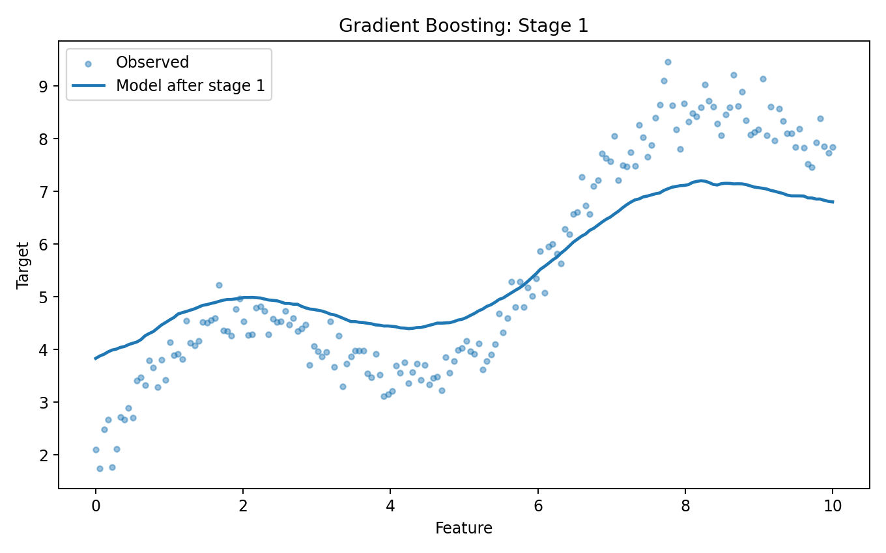
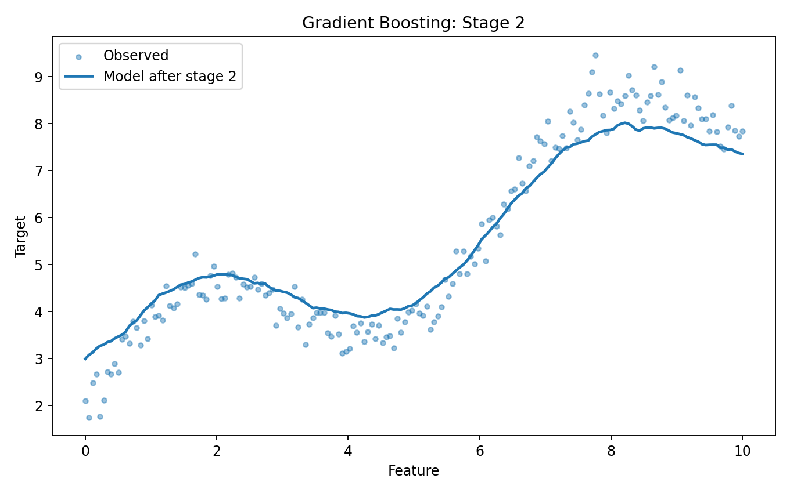
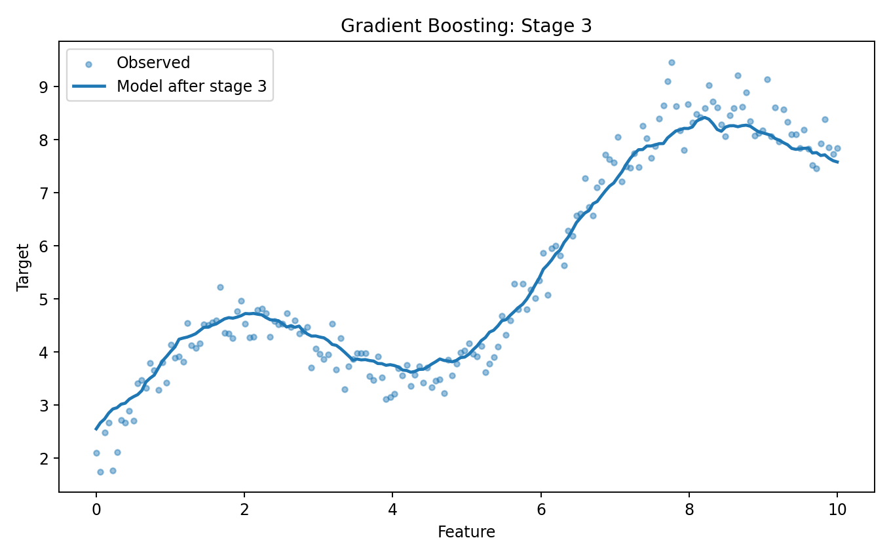
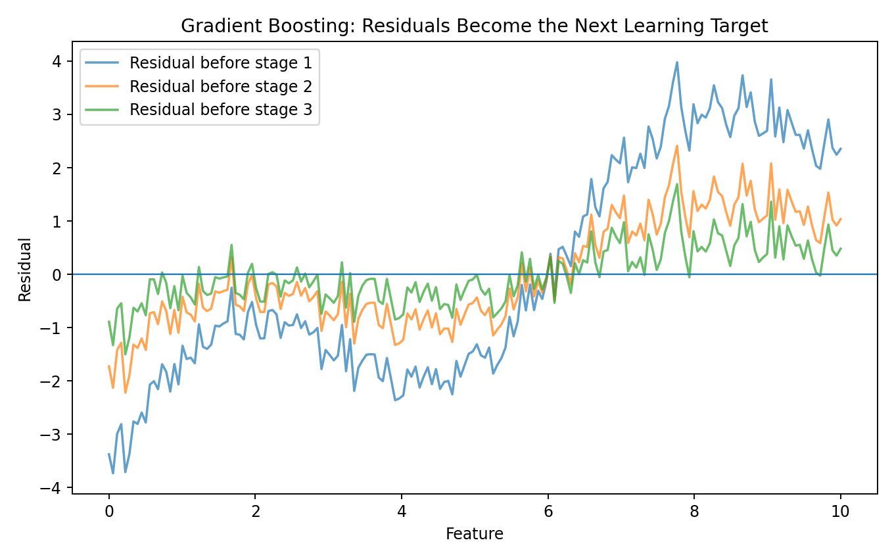
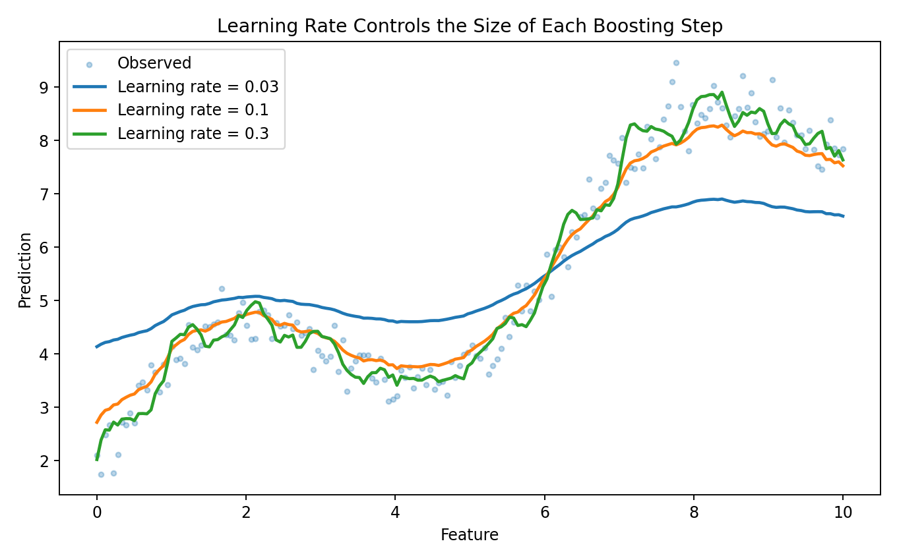
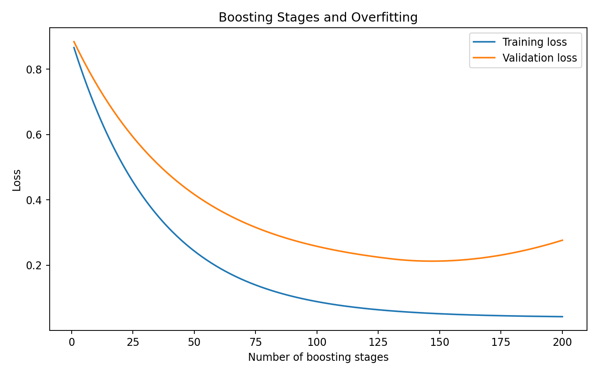
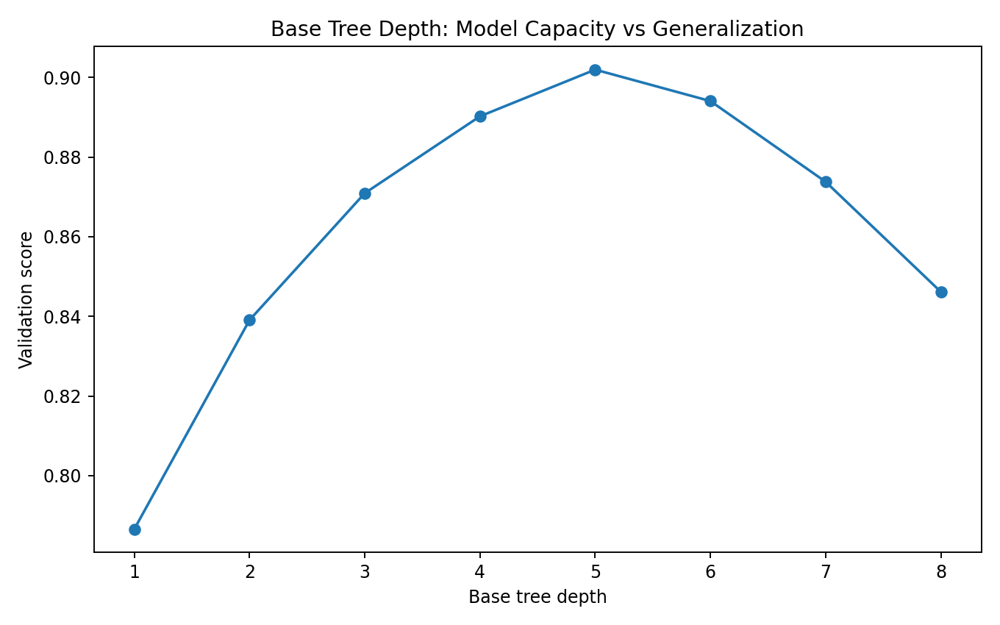
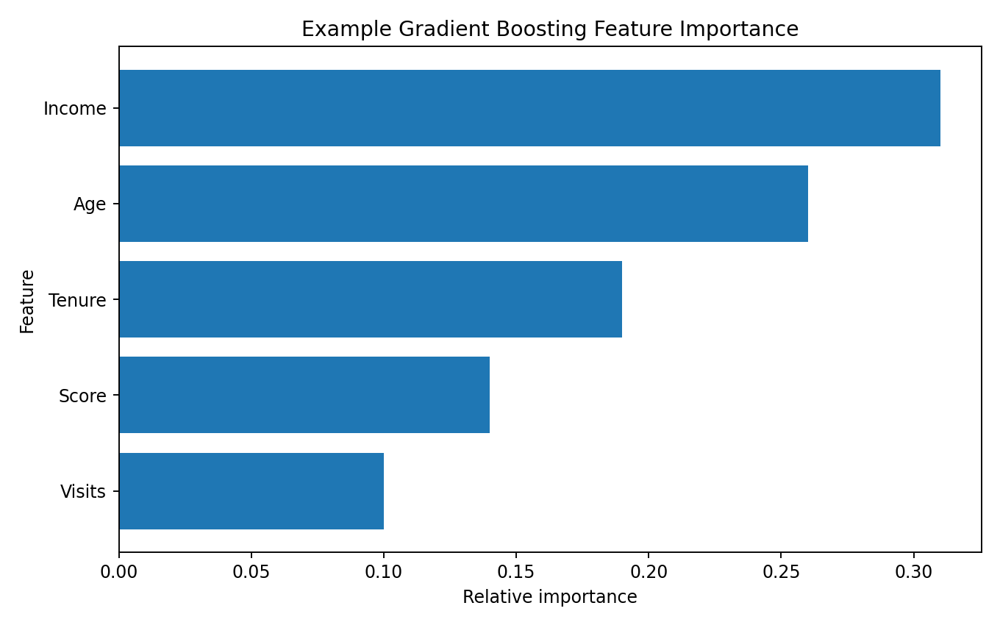
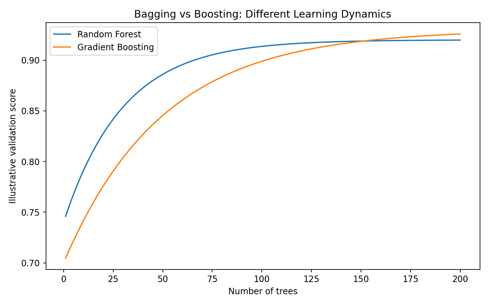

> **Gradient boosting builds a model sequentially, with each new tree trying to improve the errors made by the current ensemble.**

This is the key difference from Random Forest.

```text
RANDOM FOREST

Tree 1 ─┐
Tree 2 ─┤
Tree 3 ─┤
Tree 4 ─┤
         ↓
     Aggregate
```

versus:

```text
GRADIENT BOOSTING

Initial model
     ↓
Tree 1
     ↓
Correct errors
     ↓
Tree 2
     ↓
Correct remaining errors
     ↓
Tree 3
     ↓
...
     ↓
Final model
```

The model improves **step by step**.

---

# What Does Boosting Mean?

Boosting is an ensemble-learning strategy.

The basic idea is:

```text
Weak learner
     ↓
Improve model
     ↓
Another learner
     ↓
Improve again
     ↓
Repeat
```

Instead of relying on one extremely complex model, boosting builds a sequence of relatively simple models.

For tree-based gradient boosting, the base learners are usually shallow decision trees.

---

# Random Forest vs Gradient Boosting

This distinction is fundamental.

### Random Forest

Trees are primarily trained independently.

```text
Data
 ├── Bootstrap → Tree 1
 ├── Bootstrap → Tree 2
 ├── Bootstrap → Tree 3
 └── Bootstrap → Tree N

          ↓

      Aggregate
```

### Gradient Boosting

Trees are trained sequentially.

```text
Initial model
     ↓
Tree 1
     ↓
Errors
     ↓
Tree 2
     ↓
Remaining errors
     ↓
Tree 3
```

The next tree depends on what the previous ensemble has not learned well.

---

# The Core Idea

Suppose the target values are:

```text
Actual:
100
120
140
160
```

The first model predicts:

```text
Prediction:
110
110
110
110
```

The errors are:

```text
Actual - Prediction

-10
+10
+30
+50
```

The next learner is trained to improve these errors.

After adding the correction:

```text
New prediction
```

the residuals become smaller.

This process repeats.

---

# Stage-by-Stage Learning

The most important mental model is:

```text
MODEL 0
  ↓
Calculate errors
  ↓
TREE 1 learns useful correction
  ↓
MODEL 1
  ↓
Calculate remaining errors
  ↓
TREE 2 learns another correction
  ↓
MODEL 2
  ↓
...
```

## Visual Output



After the first boosting stage, the model has moved away from the simple initial prediction.



The second stage adds another correction.



The third stage further improves the fit.

### ML Meaning

Each stage does not start from scratch.

It builds on the current ensemble.

---

# Residuals

For regression with squared-error loss, a simple residual is:

```text
Residual =
Actual - Prediction
```

Example:

```text
Actual      Prediction      Residual

100         90              +10
120         130             -10
150         140             +10
```

The next learner tries to model the remaining error.

---

# Residual Correction



The residuals provide information about where the current model is underpredicting or overpredicting.

Conceptually:

```text
Current model
      ↓
Find errors
      ↓
Learn error pattern
      ↓
Add correction
```

This is one of the most important ideas to understand before learning XGBoost.

---

# Gradient Descent Connection

Why is it called **Gradient Boosting**?

Because the algorithm can be viewed as performing optimization in function space.

Instead of changing numerical parameters directly like ordinary gradient descent:

```text
weights
  ↓
gradient
  ↓
update weights
```

gradient boosting adds functions, commonly trees:

```text
Current function
      ↓
Calculate loss gradient
      ↓
Fit a tree to the negative gradient
      ↓
Add the tree
      ↓
Reduce loss
```

For squared-error regression, this connects closely to learning residuals.

---

# General Gradient Boosting Form

Conceptually:

```text
F₀(x)

F₁(x) = F₀(x) + η h₁(x)

F₂(x) = F₁(x) + η h₂(x)

F₃(x) = F₂(x) + η h₃(x)
```

where:

```text
F = current ensemble
h = newly learned tree
η = learning rate
```

The final model is the sum of many small corrections.

---

# Learning Rate

The learning rate controls how strongly each new tree changes the model.

```python
GradientBoostingRegressor(
    learning_rate=0.1
)
```

A smaller learning rate:

```text
Smaller updates
      ↓
Often requires more trees
      ↓
Can improve generalization
```

A larger learning rate:

```text
Larger updates
      ↓
Fewer trees may be required
      ↓
Can overfit more easily
```

---

# Learning Rate Visualization



The learning rate is therefore closely connected to:

```text
learning_rate
        +
n_estimators
```

These parameters should usually be considered together.

---

# Number of Estimators

`n_estimators` controls the number of boosting stages.

Example:

```python
GradientBoostingClassifier(
    n_estimators=200
)
```

or:

```python
GradientBoostingRegressor(
    n_estimators=300
)
```

More stages give the model more opportunities to improve.

But too many stages can eventually overfit.

---

# Number of Estimators and Overfitting



Typical pattern:

```text
Few trees
   ↓
Underfitting

More trees
   ↓
Better validation performance

Too many trees
   ↓
Potential overfitting
```

The optimal number depends on:

```text
Learning rate
Tree depth
Dataset
Noise
Regularization
```

---

# Tree Depth

Gradient boosting usually works well with relatively shallow trees.

Important parameter:

```python
max_depth
```

Example:

```python
GradientBoostingRegressor(
    max_depth=3
)
```

Shallow trees:

```text
Simple corrections
Lower complexity
```

Deep trees:

```text
More complex corrections
Higher overfitting risk
```

---

# Tree Depth and Generalization



The goal is not:

```text
Maximum tree depth
```

The goal is:

```text
Enough capacity
+
Good generalization
```

---

# Weak Learners

A weak learner is a model that performs only modestly better than a simple baseline.

In gradient boosting, shallow trees are commonly used as weak learners.

For example:

```text
max_depth = 1
```

creates a decision stump.

Or:

```text
max_depth = 2
3
```

creates a small tree.

Thousands of small corrections can combine into a powerful model.

---

# Why Shallow Trees?

Suppose each tree is extremely powerful.

Then:

```text
Tree 1
 ↓
Already fits training data very well
```

There may be little useful structure left for subsequent trees.

With weaker learners:

```text
Tree 1 → small correction
Tree 2 → another correction
Tree 3 → another correction
...
```

the ensemble can build complexity gradually.

---

# Gradient Boosting for Regression

Scikit-learn:

```python
from sklearn.ensemble import (
    GradientBoostingRegressor
)

model = GradientBoostingRegressor(
    n_estimators=200,
    learning_rate=0.05,
    max_depth=3,
    random_state=42
)

model.fit(
    X_train,
    y_train
)

y_pred = model.predict(
    X_test
)
```

Evaluate with:

```text
MAE
RMSE
R²
```

---

# Gradient Boosting for Classification

```python
from sklearn.ensemble import (
    GradientBoostingClassifier
)

model = GradientBoostingClassifier(
    n_estimators=200,
    learning_rate=0.05,
    max_depth=3,
    random_state=42
)

model.fit(
    X_train,
    y_train
)

y_pred = model.predict(
    X_test
)
```

Evaluate using appropriate metrics:

```text
Accuracy
Precision
Recall
F1
ROC-AUC
```

---

# Loss Functions

Gradient boosting works by minimizing a loss function.

Examples include:

```text
Squared Error
Absolute Error
Log Loss
```

The loss depends on the problem and implementation.

For classification, log loss is a common objective.

For regression, squared-error loss is a common starting point.

---

# Classification Intuition

For classification, the model is not simply learning:

```text
Correct / Incorrect
```

It is learning a function that improves the classification objective.

Conceptually:

```text
Initial prediction
      ↓
Calculate loss gradient
      ↓
Fit tree
      ↓
Update ensemble
      ↓
Repeat
```

The details become more sophisticated than the simple residual story used for squared-error regression.

---

# Learning Rate + Number of Trees

A common trade-off is:

```text
Higher learning rate
+
Fewer trees
```

versus:

```text
Lower learning rate
+
More trees
```

For example:

```text
0.1 × 100 trees
```

versus:

```text
0.03 × 300 trees
```

The second may provide smoother learning but requires more computation.

There is no universally optimal combination.

---

# Regularization

Gradient boosting has several ways to control complexity.

Examples:

```text
learning_rate
n_estimators
max_depth
min_samples_leaf
min_samples_split
max_features
subsample
```

The exact parameters depend on the boosting implementation.

---

# Subsampling

Scikit-learn's Gradient Boosting estimators can use:

```python
subsample < 1.0
```

Example:

```python
GradientBoostingClassifier(
    n_estimators=200,
    learning_rate=0.05,
    subsample=0.8,
    random_state=42
)
```

Instead of using all training observations at every stage, the learner can use a random subset.

This introduces stochasticity and can sometimes improve generalization.

---

# Early Stopping

Early stopping means:

> **Stop adding trees when additional boosting stages stop improving validation performance.**

This avoids unnecessary model complexity.

In modern boosting libraries, early stopping is often a standard tuning technique.

The exact implementation differs by library.

---

# Feature Importance

Gradient boosting can expose feature importance.

```python
importance = (
    model.feature_importances_
)
```

Example:



As with Random Forest:

> **Feature importance is model-specific evidence, not proof of causality.**

For deeper interpretation, consider permutation importance or SHAP.

---

# Gradient Boosting vs Random Forest



| Property | Random Forest | Gradient Boosting |
|---|---|---|
| Main strategy | Bagging | Boosting |
| Tree training | Mostly independent | Sequential |
| Main idea | Reduce variance | Correct errors |
| Tree diversity | Bootstrap + features | Sequential residual/gradient focus |
| Learning rate | No | Yes |
| Often needs careful tuning | Moderate | High |
| Training | Can be parallelized across trees | Sequential stages |
| Interpretability | Moderate | Moderate/low |

---

# Random Forest Mental Model

```text
Tree 1 ─┐
Tree 2 ─┤
Tree 3 ─┤
Tree 4 ─┤
        ↓
Vote / Average
```

Random Forest asks:

> **What does the collection of independent randomized trees predict?**

---

# Gradient Boosting Mental Model

```text
Initial Model
     ↓
Tree 1
     ↓
Remaining Error
     ↓
Tree 2
     ↓
Remaining Error
     ↓
Tree 3
     ↓
...
```

Gradient boosting asks:

> **What can the next tree learn that the current ensemble is still getting wrong?**

This distinction should become intuitive.

---

# Gradient Boosting vs Decision Tree

| Property | Decision Tree | Gradient Boosting |
|---|---|---|
| Trees | One | Many |
| Training | Single model | Sequential ensemble |
| Nonlinear | Yes | Yes |
| Interactions | Yes | Yes |
| Overfitting risk | High if unrestricted | High if poorly tuned |
| Learning rate | No | Yes |
| Complexity control | Depth/pruning | Multiple regularization parameters |

---

# Gradient Boosting vs Random Forest vs Decision Tree

```text
DECISION TREE
One model
High interpretability
High variance risk
       │
       ↓
RANDOM FOREST
Many randomized trees
Bagging
Variance reduction
       │
       ↓
GRADIENT BOOSTING
Sequential trees
Error correction
Strong predictive performance
Requires careful tuning
```

---

# Advanced Gradient Boosting Families

Once the basic algorithm is understood, several optimized implementations become important.

```text
XGBoost
LightGBM
CatBoost
```

These extend the basic boosting idea with additional optimization and regularization techniques.

---

# XGBoost

XGBoost is a highly optimized gradient-boosting implementation that became extremely popular for tabular machine learning.

Important concepts include:

```text
Regularization
Learning rate
Tree depth
Subsampling
Column sampling
Boosting rounds
```

---

# LightGBM

LightGBM is another gradient-boosting framework designed for efficient training, especially on larger datasets.

Important concepts include:

```text
Leaf-wise tree growth
Histogram-based learning
Feature / data sampling
Regularization
Efficient memory usage
```

---

# CatBoost

CatBoost is a gradient-boosting framework particularly known for strong handling of categorical features.

It is useful when datasets contain many categorical variables.

---

# Scikit-learn vs XGBoost vs LightGBM vs CatBoost

For our learning path:

```text
Scikit-learn Gradient Boosting
        ↓
Understand the fundamentals
        ↓
XGBoost / LightGBM / CatBoost
        ↓
Advanced boosting
```

Do not start by memorizing library-specific parameters.

First understand:

```text
Sequential learning
Loss
Gradient
Weak learners
Learning rate
Number of trees
Regularization
```

---

# Practical Experiment 1 — Learning Rate

Try:

```text
learning_rate = 0.01
learning_rate = 0.05
learning_rate = 0.10
learning_rate = 0.20
```

Compare validation performance.

Remember to adjust:

```text
n_estimators
```

as the learning rate changes.

---

# Practical Experiment 2 — Number of Trees

Try:

```text
50
100
200
400
800
```

Track:

```text
Training loss
Validation loss
Training time
```

Look for the point where additional stages stop helping.

---

# Practical Experiment 3 — Tree Depth

Try:

```text
max_depth = 1
2
3
5
```

Compare:

```text
Training score
Validation score
```

Question:

> How does base learner complexity affect the ensemble?

---

# Practical Experiment 4 — Random Forest vs Gradient Boosting

Use the same:

```text
Dataset
Train/test split
Features
Evaluation metrics
```

Train:

```text
Random Forest
Gradient Boosting
```

Compare:

```text
Accuracy / F1
or
MAE / RMSE / R²
```

This is an important practical experiment.

---

# Practical Experiment 5 — Feature Importance

Compare:

```text
Random Forest importance
Gradient Boosting importance
```

Question:

> Do the two ensemble methods identify the same important variables?

If not, investigate why.

---

# Practical Experiment 6 — Overfitting

Create progressively more complex models.

Track:

```text
Training score
Validation score
```

Plot both.

Look for:

```text
Training ↑
Validation ↑
Validation plateau
Validation ↓
```

This gives a practical understanding of overfitting.

---

# Practical Experiment 7 — Early Stopping

If using an implementation that supports early stopping:

```text
Set a large maximum number of trees
        ↓
Monitor validation performance
        ↓
Stop when improvement disappears
```

This can reduce unnecessary computation and model complexity.

---

# Gradient Boosting Workflow

```text
DATA
 ↓
EDA
 ↓
FEATURE ENGINEERING
 ↓
TRAIN / TEST SPLIT
 ↓
BASELINE MODEL
 ↓
INITIAL PREDICTION
 ↓
CALCULATE LOSS / GRADIENT
 ↓
FIT WEAK LEARNER
 ↓
ADD CORRECTION
 ↓
REPEAT
 ↓
VALIDATE
 ↓
TUNE
 ↓
EARLY STOP / REGULARIZE
 ↓
FINAL TEST
```

---

# Common Mistakes

### 1. Treating boosting like Random Forest

They both use trees, but their training strategy is fundamentally different.

### 2. Using a very high learning rate

Large updates can make optimization unstable or lead to poor generalization.

### 3. Using too many trees without validation

More boosting stages can eventually overfit.

### 4. Making base trees too deep

Very complex base learners can make the ensemble overfit.

### 5. Ignoring the learning-rate / estimator trade-off

These parameters should be considered together.

### 6. Tuning on the test set

Use validation or cross-validation.

### 7. Assuming feature importance is causality

It is not.

### 8. Starting with XGBoost parameters before understanding boosting

Understand the underlying algorithm first.

---

# Lab Checklist

```text
☐ Understand boosting
☐ Understand bagging vs boosting
☐ Understand sequential learning
☐ Understand weak learners
☐ Understand residual correction
☐ Understand gradient descent intuition
☐ Understand loss functions
☐ Understand learning rate
☐ Understand n_estimators
☐ Understand tree depth
☐ Understand regularization
☐ Understand subsampling
☐ Understand early stopping
☐ Train GradientBoostingClassifier
☐ Train GradientBoostingRegressor
☐ Compare Random Forest vs Gradient Boosting
☐ Analyze feature importance
☐ Detect overfitting
☐ Tune boosting parameters
☐ Understand XGBoost / LightGBM / CatBoost
```

---

# Key Takeaways

```text
GRADIENT BOOSTING
       │
       ├── Sequential Learning
       │
       ├── Weak Learners
       │
       ├── Residual / Gradient Correction
       │
       ├── Loss Function
       │
       ├── Learning Rate
       │
       ├── Number of Estimators
       │
       ├── Tree Depth
       │
       ├── Regularization
       │
       └── Early Stopping
```

The most important idea is:

> **Gradient boosting builds an ensemble by repeatedly adding models that improve the current model's remaining errors.**

Think:

```text
Current Model
     ↓
What is it getting wrong?
     ↓
Learn that error
     ↓
Add a correction
     ↓
Repeat
```

---

# The Tree Ensemble Progression

We can now see the evolution clearly:

```text
                 DECISION TREE
                       │
                 One set of rules
                       │
                       ↓
                 RANDOM FOREST
                       │
             Many randomized trees
                       │
                Bagging / Voting
                       │
                       ↓
               GRADIENT BOOSTING
                       │
               Sequential trees
                       │
                 Error correction
                       │
                       ↓
          XGBoost / LightGBM / CatBoost
```

This progression is much more important than memorizing individual algorithms.

---

## Lab Takeaway

The complete mental model is:

```text
INITIAL MODEL
     ↓
PREDICTION
     ↓
LOSS
     ↓
GRADIENT / ERROR
     ↓
WEAK TREE
     ↓
ADD CORRECTION
     ↓
NEW MODEL
     ↓
REPEAT
     ↓
FINAL ENSEMBLE
```

Gradient boosting is therefore best understood as **iterative error reduction using a sequence of weak learners**.

The next lab in our ML path is **Hyperparameter Tuning**, where we'll learn how to systematically find good values for parameters such as:

```text
learning_rate
n_estimators
max_depth
min_samples_leaf
subsample
```

rather than choosing them manually.
