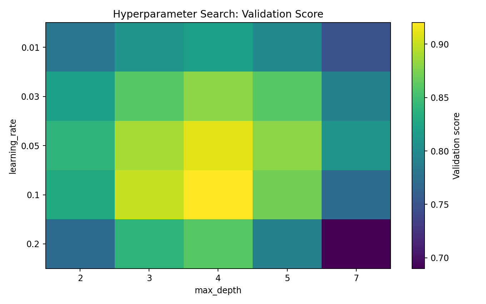
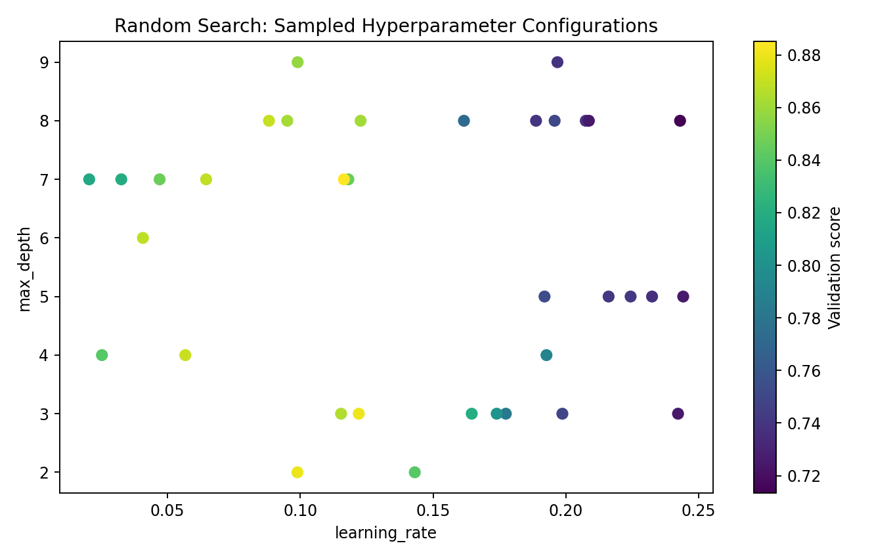
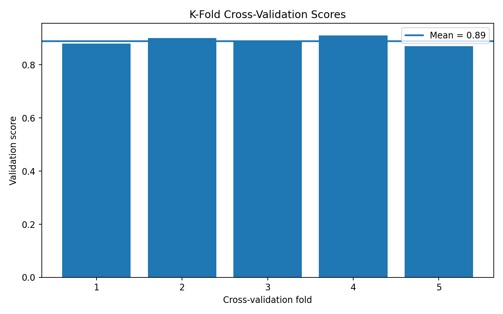
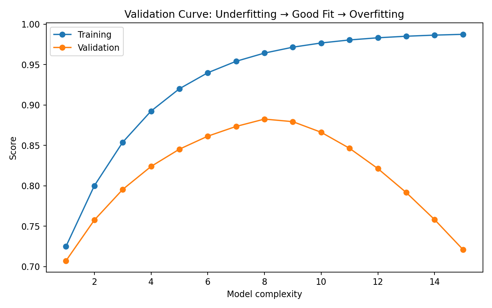
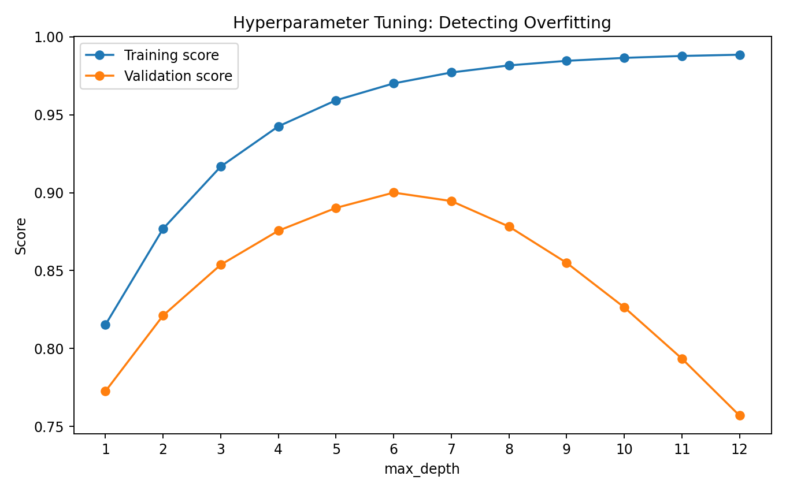
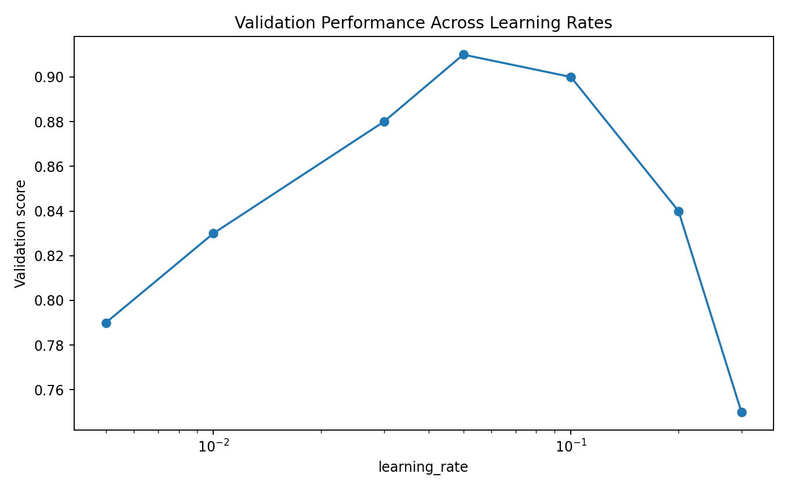
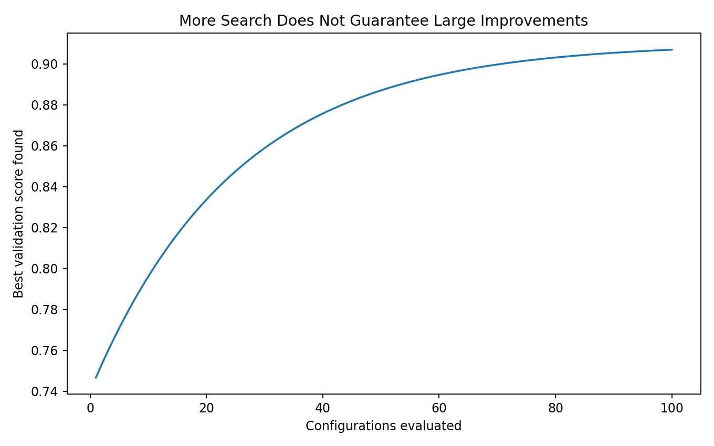
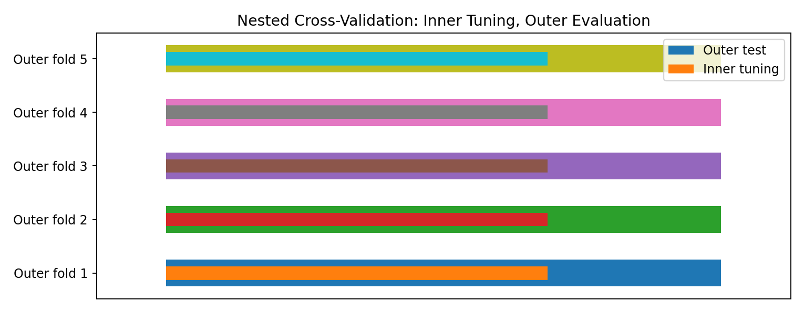

> **Hyperparameter tuning is the process of systematically finding model settings that improve generalization on unseen data.**

A machine learning model has two very different kinds of values:

```text
PARAMETERS
    ↓
Learned automatically from training data

HYPERPARAMETERS
    ↓
Set before / around the training process
```

Examples:

```text
Decision Tree
    max_depth
    min_samples_leaf

Random Forest
    n_estimators
    max_features

Gradient Boosting
    learning_rate
    n_estimators
    max_depth
```

The goal is not to find the model that performs best on the training data.

The goal is:

```text
Find settings
     ↓
that generalize
     ↓
to unseen data
```

---

# Why Hyperparameter Tuning?

Consider a Decision Tree.

```python
DecisionTreeClassifier(
    max_depth=2
)
```

might underfit.

```python
DecisionTreeClassifier(
    max_depth=50
)
```

might overfit.

The useful value may lie somewhere between them.

Hyperparameter tuning helps us search systematically instead of guessing.

---

# Parameters vs Hyperparameters

## Parameters

Parameters are learned during training.

Examples:

```text
Linear Regression
    coefficients

Neural Network
    weights

Decision Tree
    learned split thresholds
```

## Hyperparameters

Hyperparameters control how the learning algorithm behaves.

Examples:

```text
Tree depth
Learning rate
Number of trees
Regularization strength
Minimum samples per leaf
```

---

# The Core Tuning Workflow

```text
DATA
 ↓
TRAIN / VALIDATION STRATEGY
 ↓
DEFINE SEARCH SPACE
 ↓
CHOOSE SEARCH METHOD
 ↓
TRAIN MANY CONFIGURATIONS
 ↓
COMPARE VALIDATION PERFORMANCE
 ↓
SELECT BEST CONFIGURATION
 ↓
RETRAIN / REFIT
 ↓
FINAL TEST
```

The test set should remain untouched until the final evaluation whenever possible.

---

# Why Not Tune on the Test Set?

Suppose we try:

```text
Model A → Test score
Model B → Test score
Model C → Test score
Model D → Test score
...
```

and choose whichever gets the highest test score.

We have effectively used the test set to make decisions.

The test set is no longer a clean estimate of final generalization.

A better structure is:

```text
Training data
      ↓
Cross-validation / validation
      ↓
Hyperparameter selection
      ↓
Final model
      ↓
Untouched test set
```

---

# Search Space

Before tuning, define which values should be tested.

Example:

```python
param_grid = {
    "max_depth": [
        3,
        5,
        8,
        12
    ],
    "min_samples_leaf": [
        1,
        5,
        10
    ]
}
```

This creates a finite search space.

The quality of the search space matters.

If the correct region is not included, no search strategy can discover it.

---

# Grid Search

Grid Search evaluates combinations from a predefined grid.

Example:

```python
from sklearn.model_selection import (
    GridSearchCV
)

param_grid = {
    "max_depth": [3, 5, 8],
    "min_samples_leaf": [1, 5, 10]
}

search = GridSearchCV(
    estimator=model,
    param_grid=param_grid,
    cv=5,
    scoring="f1"
)

search.fit(
    X_train,
    y_train
)
```

The search evaluates combinations systematically.

---

# Grid Search Example

Suppose:

```text
max_depth:
3, 5, 8

min_samples_leaf:
1, 5, 10
```

Grid Search evaluates:

```text
3 × 3 = 9 configurations
```

With 5-fold cross-validation:

```text
9 × 5 = 45 model fits
```

This is why the search space can become expensive quickly.

---

# Grid Search Visualization



A heatmap makes it easier to see how different hyperparameter combinations affect validation performance.

For example:

```text
Rows    → learning_rate
Columns → max_depth
Cells   → validation score
```

### ML Meaning

We are not interested only in the single highest cell.

We also want to understand:

```text
Where is the good region?
How stable is performance?
Are neighboring configurations similar?
```

---

# Random Search

Random Search samples configurations from a defined distribution or set of possible values.

```python
from sklearn.model_selection import (
    RandomizedSearchCV
)

search = RandomizedSearchCV(
    estimator=model,
    param_distributions=params,
    n_iter=30,
    cv=5,
    scoring="f1",
    random_state=42
)

search.fit(
    X_train,
    y_train
)
```

Instead of evaluating every possible combination, it evaluates a selected number of configurations.

---

# Why Random Search Can Be Better

Suppose:

```text
Hyperparameter A
has a strong effect

Hyperparameter B
has a weak effect
```

Grid Search may spend many evaluations changing B.

Random Search can explore more distinct values of A.

Conceptually:

```text
Grid Search

● ● ● ● ●
● ● ● ● ●
● ● ● ● ●


Random Search

  ●     ●
●     ●
     ●    ●
  ●
       ●
```

---

# Random Search Visualization



Random Search is especially useful when:

```text
Many hyperparameters exist
Some parameters matter much more than others
The search budget is limited
```

---

# Grid Search vs Random Search

| Property | Grid Search | Random Search |
|---|---|---|
| Search strategy | Exhaustive grid | Random samples |
| Search coverage | Grid combinations | Distribution samples |
| Budget control | Indirect | Direct via `n_iter` |
| Good for small spaces | Yes | Yes |
| Good for large spaces | Can be expensive | Often preferable |
| Reproducibility | Yes | Yes with seed |

Neither method is universally superior.

---

# Cross-Validation

Hyperparameter tuning needs a reliable way to estimate validation performance.

K-Fold Cross-Validation divides the training data into K folds.

Example:

```text
Fold 1 → Validation
Fold 2 → Training
Fold 3 → Training
Fold 4 → Training
Fold 5 → Training
```

Then:

```text
Fold 2 → Validation
Others → Training

Fold 3 → Validation
Others → Training

...
```

---

# Five-Fold Cross-Validation



The model receives several validation estimates instead of relying on a single split.

The final CV score is commonly the mean across folds.

---

# Why Cross-Validation?

A single validation split can be lucky or unlucky.

For example:

```text
Validation score = 0.91
```

may not represent the model's typical performance.

Cross-validation gives:

```text
Fold 1 → 0.88
Fold 2 → 0.90
Fold 3 → 0.89
Fold 4 → 0.91
Fold 5 → 0.87

Mean → 0.89
```

This is generally more informative.

---

# Stratified Cross-Validation

For classification, especially with imbalanced classes, use stratification where appropriate.

```python
from sklearn.model_selection import (
    StratifiedKFold
)

cv = StratifiedKFold(
    n_splits=5,
    shuffle=True,
    random_state=42
)
```

Stratification attempts to preserve class proportions across folds.

---

# Regression Cross-Validation

For regression:

```python
from sklearn.model_selection import (
    KFold
)

cv = KFold(
    n_splits=5,
    shuffle=True,
    random_state=42
)
```

The appropriate splitting strategy depends on the data structure.

Time-series data, grouped observations, and other dependent samples may require specialized validation strategies.

---

# Time-Series Data

Do **not** randomly shuffle future observations into training when doing forecasting.

For time-dependent data, use a time-aware strategy such as:

```python
TimeSeriesSplit
```

Conceptually:

```text
Train → Past
Validation → Future

Train → More Past
Validation → Later Future
```

The validation process should respect the direction of time.

---

# Grouped Data

If multiple observations belong to the same entity, random splitting can create leakage.

Example:

```text
Patient A
 ├── Scan 1
 ├── Scan 2
 └── Scan 3
```

If some scans appear in training and others in validation, the model may effectively see the same patient in both.

Use an appropriate group-based split when required.

---

# Validation Curve

A validation curve shows how model performance changes as a hyperparameter changes.

Example:

```text
max_depth
```

can be plotted against:

```text
Training score
Validation score
```

## Visual Output



The typical pattern:

```text
UNDERFIT
   ↓
GOOD REGION
   ↓
OVERFIT
```

---

# Detecting Overfitting During Tuning

Suppose:

```text
max_depth = 2
Training = 0.78
Validation = 0.76

max_depth = 5
Training = 0.91
Validation = 0.89

max_depth = 15
Training = 0.99
Validation = 0.82
```

The last model has learned the training data extremely well.

But its validation performance has degraded.

This is a classic sign of overfitting.

---

# Training vs Validation Curve



The important point:

> **Choose hyperparameters based on validation performance, not training performance alone.**

---

# Learning Rate Tuning

For boosting models, `learning_rate` is particularly important.

Example:

```python
learning_rates = [
    0.01,
    0.03,
    0.05,
    0.1,
    0.2
]
```

## Visual Output



A very small learning rate may require many estimators.

A very large learning rate can make the model too aggressive.

---

# Learning Rate + Number of Estimators

These parameters are often coupled.

For example:

```text
learning_rate = 0.1
n_estimators = 100
```

versus:

```text
learning_rate = 0.03
n_estimators = 300
```

The second configuration makes smaller updates but allows more stages.

The right balance must be determined empirically.

---

# Hyperparameter Interactions

Hyperparameters do not always act independently.

For example:

```text
max_depth
```

interacts with:

```text
n_estimators
learning_rate
min_samples_leaf
```

A value that works well in one configuration may perform poorly in another.

This is why tuning combinations is important.

---

# Search Budget

Search is a computational resource.

Suppose:

```text
10 hyperparameters
```

and each has:

```text
5 possible values
```

A full grid would contain:

```text
5¹⁰
```

possible combinations.

That becomes enormous.

Therefore:

```text
Small search space
    → Grid Search

Large search space
    → Random Search
```

And for advanced optimization:

```text
Bayesian Optimization
```

may be considered.

---

# Search Budget Visualization



More configurations can improve the chance of finding a strong region, but returns eventually diminish.

The practical goal is:

```text
Good model
+
Reasonable compute
```

not:

```text
Search forever
```

---

# Pipelines and Hyperparameter Tuning

One of the most important best practices is tuning the **entire preprocessing + model pipeline**.

Example:

```python
pipeline = Pipeline([
    (
        "preprocessor",
        preprocessor
    ),
    (
        "model",
        RandomForestClassifier(
            random_state=42
        )
    )
])
```

Then:

```python
param_grid = {
    "model__n_estimators": [
        100,
        300
    ],
    "model__max_depth": [
        5,
        10,
        None
    ]
}
```

The `model__` prefix tells Scikit-learn which pipeline step the parameter belongs to.

---

# Why Pipelines Matter

Without a pipeline, preprocessing can accidentally happen before cross-validation.

Example:

```text
Entire dataset
     ↓
Scaling
     ↓
Cross-validation
```

This can leak information from validation folds into the training process.

With a pipeline:

```text
Fold
 ↓
Fit preprocessing on training portion
 ↓
Transform validation portion
 ↓
Train model
```

This prevents many common leakage problems.

---

# Data Leakage

Data leakage occurs when information that should not be available to the model becomes available during training.

Examples:

```text
Future information
Test-set statistics
Validation-set transformations
Target-derived features
Duplicate entities across splits
```

Hyperparameter tuning is especially vulnerable because the same validation data can influence many model choices.

---

# Nested Cross-Validation

For rigorous model-selection evaluation, nested cross-validation separates:

```text
INNER LOOP
Hyperparameter tuning

OUTER LOOP
Model evaluation
```

Conceptually:

```text
Outer Fold
 ├── Inner CV
 │    ├── Tune
 │    ├── Tune
 │    └── Select
 │
 └── Evaluate selected model
```

## Visual Output



Nested CV is particularly useful when you need an unbiased estimate of the full model-selection procedure.

---

# Scoring Metric

The tuning metric should reflect the actual objective.

For classification:

```text
Accuracy
Precision
Recall
F1
ROC-AUC
PR-AUC
```

For regression:

```text
MAE
MSE
RMSE
R²
```

Do not automatically tune for accuracy when the business problem actually requires high recall or low false-positive rates.

---

# Imbalanced Classification

Suppose:

```text
95% → Negative
5%  → Positive
```

A model predicting everything as negative can achieve:

```text
95% accuracy
```

but be useless.

During tuning, metrics such as:

```text
Recall
F1
ROC-AUC
PR-AUC
```

may be more appropriate depending on the problem.

---

# Selecting the Best Model

After search:

```python
print(
    search.best_params_
)
```

and:

```python
print(
    search.best_score_
)
```

The selected model can be accessed with:

```python
best_model = search.best_estimator_
```

Remember:

> The "best" model is best according to the chosen validation strategy and scoring metric.

---

# Inspecting Search Results

Scikit-learn stores detailed results in:

```python
search.cv_results_
```

Convert them to a DataFrame:

```python
import pandas as pd

results = pd.DataFrame(
    search.cv_results_
)

results.sort_values(
    "rank_test_score"
).head()
```

This is useful for understanding the search landscape rather than looking only at the winner.

---

# Practical Experiment 1 — Decision Tree

Tune:

```text
max_depth
min_samples_split
min_samples_leaf
criterion
```

Compare:

```text
Baseline tree
Grid Search
Random Search
```

---

# Practical Experiment 2 — Random Forest

Tune:

```text
n_estimators
max_depth
max_features
min_samples_leaf
```

Track:

```text
CV score
Training time
Model size
```

---

# Practical Experiment 3 — Gradient Boosting

Tune:

```text
learning_rate
n_estimators
max_depth
subsample
```

Remember:

```text
learning_rate
      ↕
n_estimators
```

are strongly related.

---

# Practical Experiment 4 — Grid vs Random Search

Use the same:

```text
Model
Dataset
Scoring metric
Search budget
```

Compare:

```text
GridSearchCV
RandomizedSearchCV
```

Question:

> Which method finds a good configuration more efficiently?

---

# Practical Experiment 5 — Cross-Validation Stability

Run 5-fold CV.

Record:

```text
Fold 1
Fold 2
Fold 3
Fold 4
Fold 5
Mean
Standard deviation
```

A model with:

```text
Mean = 0.90
Std = 0.02
```

may be more stable than:

```text
Mean = 0.91
Std = 0.10
```

depending on the application.

---

# Practical Experiment 6 — Validation Curve

Choose one hyperparameter:

```text
max_depth
```

Train across:

```text
1 → 15
```

Plot:

```text
Training score
Validation score
```

Identify:

```text
Underfitting region
Good region
Overfitting region
```

---

# Practical Experiment 7 — Search Results Analysis

Do not simply print:

```python
search.best_params_
```

Also inspect:

```python
cv_results_
```

Look for:

```text
Top 10 configurations
Mean CV score
Std CV score
Fit time
Score time
```

This helps you understand the model's behavior.

---

# Practical Experiment 8 — Pipeline Tuning

Create:

```text
Preprocessing
      ↓
Model
```

inside a Pipeline.

Then tune both:

```text
Preprocessing parameters
+
Model parameters
```

without leaking information across folds.

---

# Complete Grid Search Example

```python
from sklearn.model_selection import (
    GridSearchCV
)

from sklearn.ensemble import (
    RandomForestClassifier
)

model = RandomForestClassifier(
    random_state=42,
    n_jobs=-1
)

param_grid = {
    "n_estimators": [
        100,
        300
    ],
    "max_depth": [
        5,
        10,
        None
    ],
    "min_samples_leaf": [
        1,
        5,
        10
    ],
    "max_features": [
        "sqrt",
        "log2"
    ]
}

search = GridSearchCV(
    model,
    param_grid=param_grid,
    cv=5,
    scoring="f1",
    n_jobs=-1
)

search.fit(
    X_train,
    y_train
)

print(
    search.best_params_
)

print(
    search.best_score_
)
```

---

# Complete Random Search Example

```python
from sklearn.model_selection import (
    RandomizedSearchCV
)

param_distributions = {
    "n_estimators": [
        100,
        200,
        300,
        500
    ],
    "max_depth": [
        3,
        5,
        8,
        12,
        None
    ],
    "min_samples_leaf": [
        1,
        2,
        5,
        10
    ]
}

search = RandomizedSearchCV(
    model,
    param_distributions=param_distributions,
    n_iter=25,
    cv=5,
    scoring="f1",
    random_state=42,
    n_jobs=-1
)

search.fit(
    X_train,
    y_train
)
```

---

# Practical Tuning Strategy

A useful workflow is:

### Step 1

Build a baseline.

```text
Default parameters
```

### Step 2

Identify the important hyperparameters.

```text
Tree depth
Number of trees
Learning rate
Regularization
```

### Step 3

Perform a broad search.

```text
Random Search
```

### Step 4

Identify the promising region.

```text
Good parameter ranges
```

### Step 5

Perform a narrower search.

```text
Grid Search
```

### Step 6

Validate the selected configuration.

```text
Cross-validation
```

### Step 7

Evaluate once on the untouched test set.

---

# Hyperparameter Tuning Mental Model

```text
BASELINE
   ↓
DEFINE SEARCH SPACE
   ↓
CROSS-VALIDATION
   ↓
GRID / RANDOM SEARCH
   ↓
COMPARE CONFIGURATIONS
   ↓
SELECT PROMISING REGION
   ↓
REFINE SEARCH
   ↓
FINAL MODEL
   ↓
UNTOUCHED TEST
```

---

# Common Mistakes

### 1. Tuning on the test set

The test set should remain independent.

### 2. Using too large a search space

This can waste enormous compute.

### 3. Optimizing the wrong metric

Accuracy may not be appropriate for an imbalanced problem.

### 4. Ignoring cross-validation variance

A single score does not tell the whole story.

### 5. Preprocessing before CV

This can cause leakage.

### 6. Searching blindly

Understand what each hyperparameter controls.

### 7. Selecting only the highest score

Consider:

```text
Score
Variance
Training time
Inference cost
Model complexity
```

### 8. Over-tuning

Searching endlessly can make the workflow unnecessarily complex.

---

# Lab Checklist

```text
☐ Understand parameters vs hyperparameters
☐ Understand validation
☐ Understand cross-validation
☐ Understand Grid Search
☐ Understand Random Search
☐ Define search spaces
☐ Tune Decision Trees
☐ Tune Random Forests
☐ Tune Gradient Boosting
☐ Understand learning rate
☐ Understand estimator count
☐ Understand validation curves
☐ Detect overfitting
☐ Use Pipelines during tuning
☐ Prevent data leakage
☐ Choose appropriate scoring metrics
☐ Inspect cv_results_
☐ Compare search strategies
☐ Understand nested CV
☐ Evaluate the final model on untouched test data
```

---

# Key Takeaways

```text
HYPERPARAMETER TUNING
        │
        ├── Search Space
        │
        ├── Validation
        │
        ├── Cross-Validation
        │
        ├── Grid Search
        │
        ├── Random Search
        │
        ├── Validation Curves
        │
        ├── Pipelines
        │
        ├── Leakage Prevention
        │
        └── Final Evaluation
```

The most important lesson is:

> **Hyperparameter tuning is not about finding the model with the highest training score. It is about finding a configuration that generalizes well.**

The workflow is:

```text
TRAINING DATA
      ↓
SEARCH
      ↓
CROSS-VALIDATE
      ↓
SELECT
      ↓
REFIT
      ↓
FINAL TEST
```

---

# Complete ML Optimization Path

We can now connect everything we've built:

```text
DATA
 ↓
EDA
 ↓
FEATURE ENGINEERING
 ↓
MODEL
 ↓
DECISION TREE
 ↓
RANDOM FOREST
 ↓
GRADIENT BOOSTING
 ↓
HYPERPARAMETER TUNING
 ↓
MODEL EVALUATION
 ↓
DEPLOYMENT
```

Hyperparameter tuning sits between **model development** and **final evaluation**.

It is the bridge between:

```text
"I trained a model."
```

and:

```text
"I systematically optimized and validated this model."
```

---

## Lab Takeaway

The mental model is:

```text
QUESTION
   ↓
BASELINE
   ↓
HYPERPARAMETERS
   ↓
SEARCH SPACE
   ↓
CROSS-VALIDATION
   ↓
SEARCH
   ↓
BEST CONFIGURATION
   ↓
FINAL TRAINING
   ↓
UNTOUCHED TEST
```

A good practitioner doesn't simply ask:

> **"What parameters give me the highest score?"**

They ask:

> **"What configuration gives reliable generalization under a sound validation strategy?"**

That distinction is what turns hyperparameter tuning from trial-and-error into a proper machine learning experiment.
