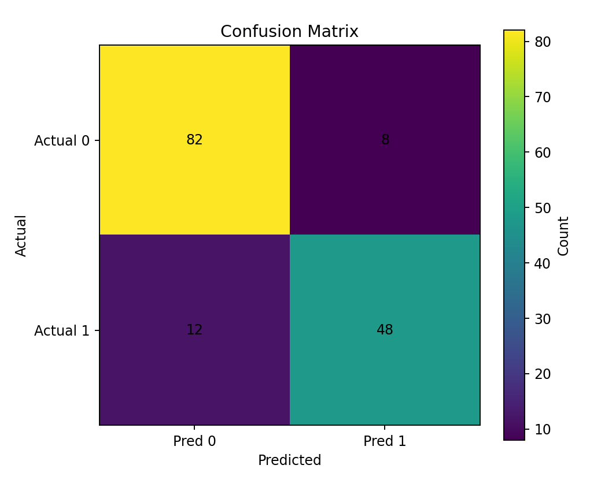
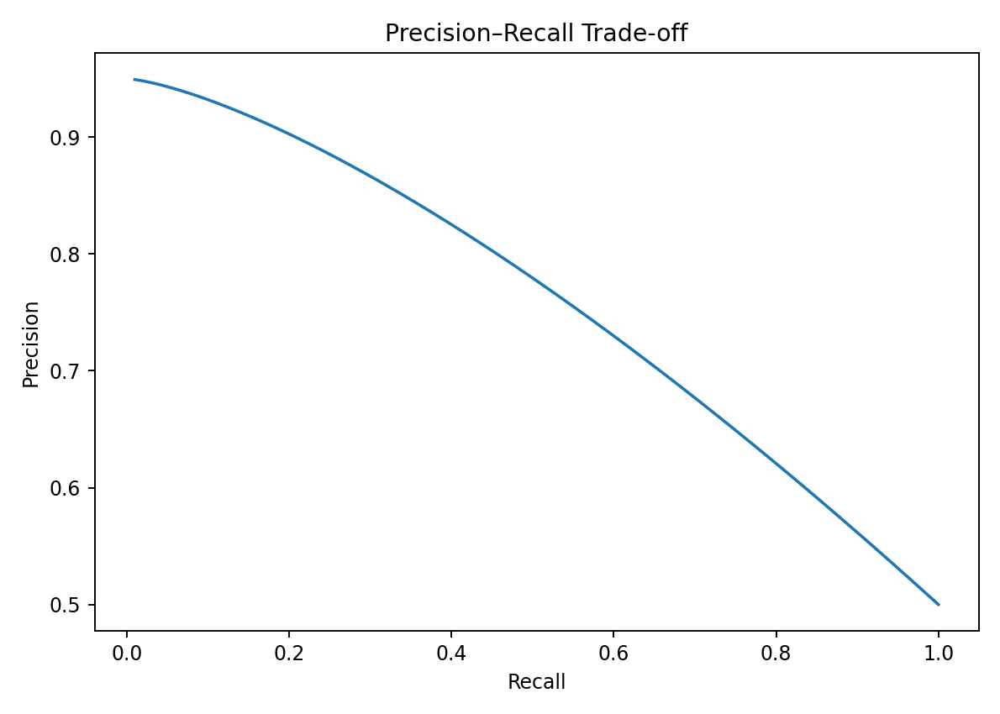
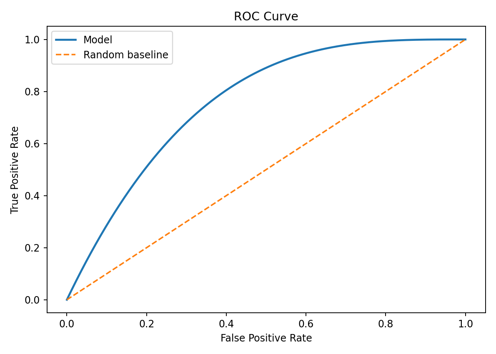
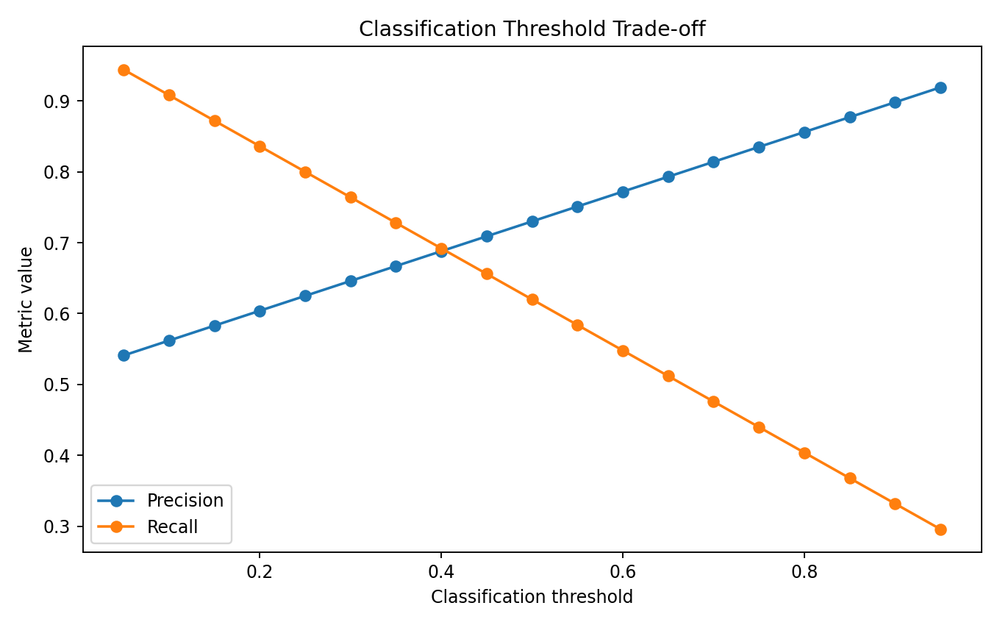
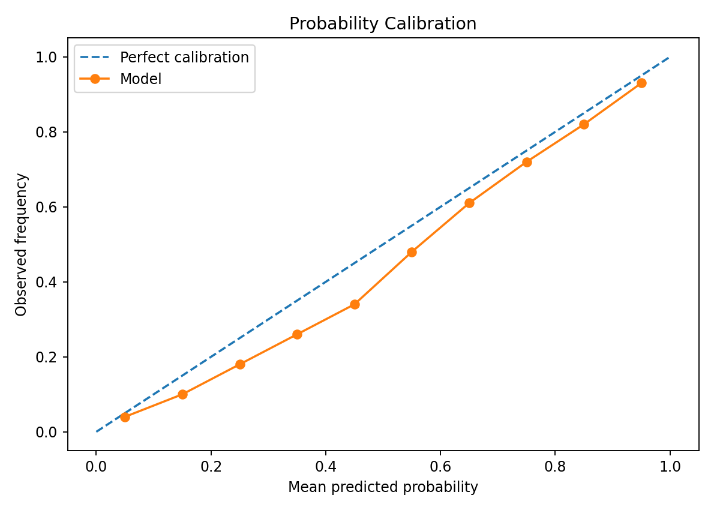
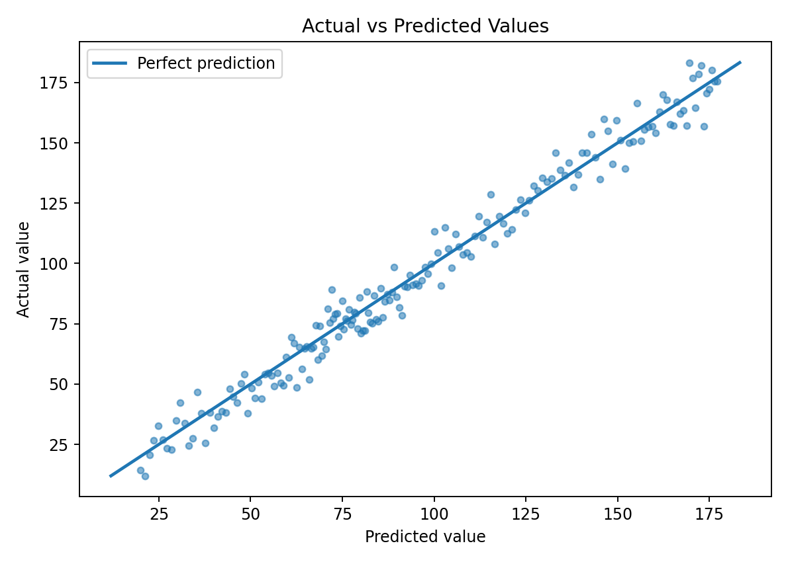
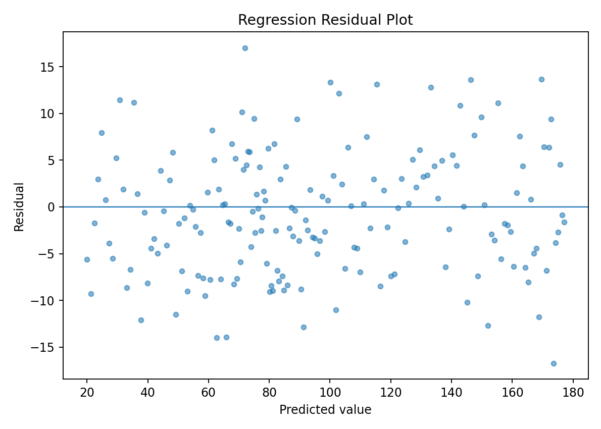
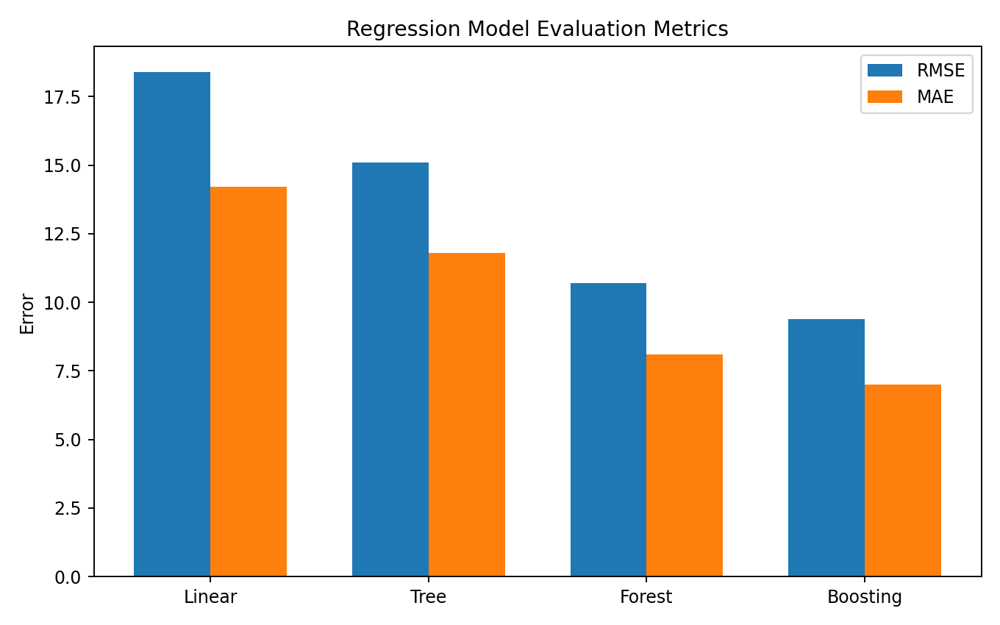
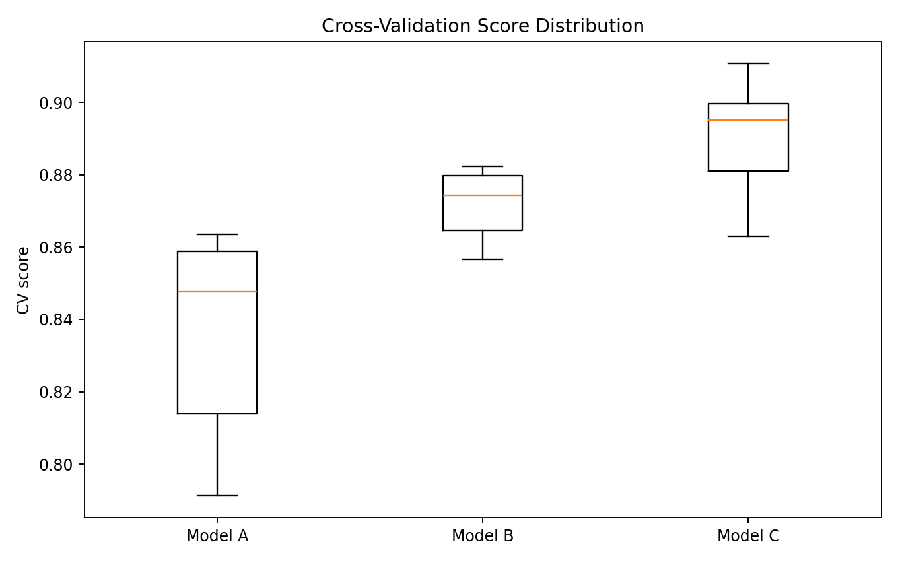
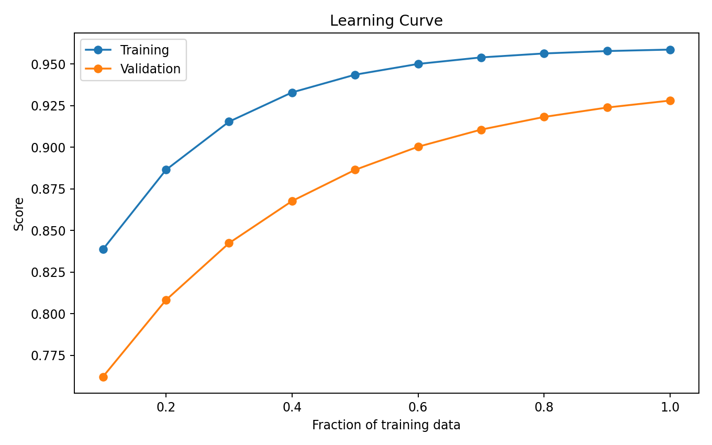

> **A model is not good because it performs well on training data. A model is good when its predictions generalize reliably to unseen data.**

Model evaluation answers several different questions:

```text
Does the model predict accurately?
        ↓
Where does it make mistakes?
        ↓
How serious are those mistakes?
        ↓
Does it generalize?
        ↓
Are its probabilities trustworthy?
        ↓
Does it perform well for the actual business / scientific objective?
```

There is no single metric that is best for every machine learning problem.

---

# The Evaluation Pipeline

```text
DATA
 ↓
TRAIN / VALIDATION / TEST
 ↓
TRAIN MODEL
 ↓
MAKE PREDICTIONS
 ↓
CALCULATE METRICS
 ↓
ANALYZE ERRORS
 ↓
COMPARE MODELS
 ↓
CHECK GENERALIZATION
 ↓
FINAL TEST
```

For a reliable experiment, the final test set should remain untouched during model development and hyperparameter tuning.

---

# Parameters vs Evaluation

Training asks:

> **Can the model learn patterns from the training data?**

Evaluation asks:

> **Do those learned patterns work on unseen data?**

This distinction is fundamental.

```text
Training performance
        ≠
Generalization performance
```

---

# Classification Evaluation

For classification, we often work with:

```text
True Positive
True Negative
False Positive
False Negative
```

These four values form the foundation of many classification metrics.

---

# Confusion Matrix

A confusion matrix compares:

```text
Actual class
        vs
Predicted class
```

Example:



For binary classification:

```text
                 Predicted
                0        1

Actual 0       TN       FP

Actual 1       FN       TP
```

---

# True Positive

A positive example correctly predicted as positive.

```text
Actual = 1
Predicted = 1
```

Example:

```text
Fraud
 ↓
Model predicts Fraud
```

Correct.

---

# True Negative

A negative example correctly predicted as negative.

```text
Actual = 0
Predicted = 0
```

Example:

```text
Normal transaction
 ↓
Model predicts Normal
```

Correct.

---

# False Positive

A negative example incorrectly predicted as positive.

```text
Actual = 0
Predicted = 1
```

Example:

```text
Normal transaction
 ↓
Model predicts Fraud
```

This is sometimes called a **false alarm**.

---

# False Negative

A positive example incorrectly predicted as negative.

```text
Actual = 1
Predicted = 0
```

Example:

```text
Fraud
 ↓
Model predicts Normal
```

This can be particularly serious in fraud detection, medical screening, and security applications.

---

# Accuracy

Accuracy measures the proportion of all predictions that are correct.

```text
Accuracy =
(TP + TN)
----------------
(TP + TN + FP + FN)
```

Example:

```text
100 predictions
90 correct

Accuracy = 90%
```

Accuracy is useful when classes are reasonably balanced and the costs of errors are comparable.

---

# Accuracy Can Be Misleading

Suppose:

```text
950 normal
50 fraud
```

A model predicts:

```text
Everything = Normal
```

Then:

```text
Accuracy = 95%
```

But:

```text
Fraud detected = 0
```

The model is practically useless for fraud detection.

This is why we need additional metrics.

---

# Precision

Precision answers:

> **When the model predicts positive, how often is it correct?**

```text
Precision =
TP
---------
TP + FP
```

High precision means:

```text
Few false positives
```

Example applications:

```text
Spam filtering
Fraud alerts
Automated moderation
```

where false alarms can be costly.

---

# Recall

Recall answers:

> **Of all actual positive cases, how many did the model find?**

```text
Recall =
TP
---------
TP + FN
```

High recall means:

```text
Few false negatives
```

Important in:

```text
Disease screening
Fraud detection
Security monitoring
Defect detection
```

---

# Precision vs Recall

These metrics often trade off against each other.



Increasing the classification threshold may:

```text
Increase precision
Decrease recall
```

while lowering the threshold may:

```text
Increase recall
Decrease precision
```

The correct balance depends on the application.

---

# F1 Score

F1 combines precision and recall using the harmonic mean.

```text
F1 =
2 × Precision × Recall
------------------------
Precision + Recall
```

F1 is useful when both precision and recall matter.

It is particularly common for:

```text
Imbalanced classification
Information retrieval
Binary classification
```

---

# When Should We Prefer Recall?

Suppose the model is detecting:

```text
Cancer
```

A false negative may be extremely costly.

Therefore:

```text
Recall
```

may be prioritized.

The threshold can then be chosen based on the acceptable false-negative rate.

---

# When Should We Prefer Precision?

Suppose the model automatically blocks:

```text
Customer transactions
```

False positives could block legitimate customers.

Then:

```text
Precision
```

may be more important.

Again, the threshold should reflect the actual cost of errors.

---

# ROC Curve

The ROC curve plots:

```text
True Positive Rate
        vs
False Positive Rate
```

where:

```text
TPR = Recall
```

and:

```text
FPR =
FP
---------
FP + TN
```

## Visual Output



The diagonal line represents approximately random ranking.

A stronger classifier generally has a curve closer to the upper-left region.

---

# ROC-AUC

AUC means:

```text
Area Under the Curve
```

ROC-AUC summarizes ranking performance across classification thresholds.

Conceptually:

```text
AUC ≈ 0.5
    ↓
Random ranking

AUC → 1.0
    ↓
Strong ranking
```

AUC should still be interpreted in the context of the dataset and problem.

---

# Precision-Recall Curve

The Precision-Recall curve is often especially useful when the positive class is rare.

It shows:

```text
Precision
    vs
Recall
```

across thresholds.

For heavily imbalanced problems, PR-AUC can sometimes provide more useful insight than ROC-AUC.

---

# Classification Threshold

Many classifiers output a score or probability.

Example:

```text
P(Fraud) = 0.72
```

With a threshold of:

```text
0.50
```

the prediction may be:

```text
Fraud
```

But with:

```text
threshold = 0.80
```

the same observation may become:

```text
Normal
```

---

# Threshold Trade-off



Changing the threshold changes:

```text
Precision
Recall
False Positive Rate
False Negative Rate
```

The threshold should therefore be selected based on the application's objective.

---

# Calibration

A probability prediction should ideally correspond to observed frequency.

If a model predicts:

```text
0.80 probability
```

for 100 similar observations, approximately 80 should be positive for a well-calibrated model.

---

# Calibration Curve



The ideal calibration line is:

```text
Predicted probability
=
Observed frequency
```

A model can have good classification accuracy but poorly calibrated probabilities.

This matters when probabilities are used for:

```text
Risk scoring
Medical decision support
Financial decisions
Resource allocation
```

---

# Calibration vs Discrimination

These are different concepts.

### Discrimination

Can the model rank positive examples above negative examples?

Metrics:

```text
ROC-AUC
PR-AUC
```

### Calibration

Do predicted probabilities correspond to actual frequencies?

Tools:

```text
Calibration curve
Brier score
```

A model can have:

```text
Good discrimination
+
Poor calibration
```

---

# Regression Evaluation

For regression, the target is continuous.

Example:

```text
Actual house price
        vs
Predicted house price
```

Common metrics:

```text
MAE
MSE
RMSE
R²
```

---

# Mean Absolute Error — MAE

```text
MAE =
mean(
    |actual - predicted|
)
```

MAE tells us the average absolute prediction error in the target's original units.

Example:

```text
MAE = ₹50,000
```

can be interpreted directly as an average absolute error of approximately ₹50,000.

---

# Mean Squared Error — MSE

```text
MSE =
mean(
    (actual - predicted)²
)
```

Because errors are squared:

```text
Large errors
    ↓
Receive more penalty
```

MSE is useful when large errors should be penalized strongly.

---

# Root Mean Squared Error — RMSE

```text
RMSE = √MSE
```

RMSE returns to the original target units.

Example:

```text
RMSE = ₹70,000
```

This is easier to interpret than an MSE expressed in squared currency units.

---

# R² Score

R² measures the proportion of variance explained relative to a baseline that predicts the training-target mean, under the standard definition.

Conceptually:

```text
R² = 1
    ↓
Perfect predictions

R² = 0
    ↓
Comparable to mean baseline

R² < 0
    ↓
Can be worse than the baseline
```

R² should not be interpreted as "percentage accuracy."

---

# Actual vs Predicted



For a strong regression model, points should generally lie close to:

```text
Actual = Predicted
```

which is represented by the diagonal line.

Large deviations indicate larger prediction errors.

---

# Residual Analysis

Residual:

```text
Residual =
Actual - Predicted
```

Residual analysis asks:

```text
Are errors random?
Are there patterns?
Does error increase with prediction size?
Are there outliers?
Is there systematic bias?
```

---

# Residual Plot



An ideal residual pattern is approximately:

```text
Random scatter
around zero
```

Patterns may indicate:

```text
Nonlinearity
Heteroscedasticity
Missing features
Outliers
Model misspecification
```

---

# Regression Metrics Comparison



When comparing models, do not automatically select the smallest number without understanding the metric.

For example:

```text
MAE
```

and:

```text
RMSE
```

emphasize errors differently.

---

# MAE vs RMSE

Consider two models.

```text
Model A
Errors:
2, 2, 2, 2, 2

Model B
Errors:
0, 0, 0, 0, 10
```

MAE and RMSE will respond differently.

RMSE penalizes the large error more strongly.

Therefore:

```text
Use MAE
```

when you want a more direct average absolute error.

Use:

```text
RMSE
```

when large errors should be penalized more heavily.

---

# Cross-Validation Evaluation

A single train/test split may not provide enough information.

Cross-validation gives multiple estimates.

Example:

```text
Fold 1 → 0.88
Fold 2 → 0.90
Fold 3 → 0.89
Fold 4 → 0.91
Fold 5 → 0.87
```

Mean:

```text
0.89
```

Standard deviation:

```text
measure of variation
```

---

# Comparing Models With Cross-Validation



When comparing models, examine:

```text
Mean score
Score variation
```

A slightly higher mean score may not always justify a substantially higher variance or computational cost.

---

# Learning Curves

Learning curves show model performance as the amount of training data changes.



They help diagnose:

```text
High bias
High variance
Insufficient data
```

---

# High Bias Pattern

Typical pattern:

```text
Training score → low
Validation score → low
```

and both curves converge.

This suggests the model may be too simple.

Possible actions:

```text
More expressive model
Better features
Reduce excessive regularization
```

---

# High Variance Pattern

Typical pattern:

```text
Training score → very high
Validation score → substantially lower
```

Possible actions:

```text
More training data
Regularization
Simpler model
Feature selection
Data augmentation
```

depending on the problem.

---

# Error Analysis

Metrics tell us **how much** the model is wrong.

Error analysis helps determine:

> **Why is the model wrong?**

For example:

```text
Model
 ↓
Incorrect predictions
 ↓
Group errors
 ↓
Find patterns
```

Possible groups:

```text
Age group
Region
Image quality
Class
Device
Data source
Time period
```

---

# Classification Error Analysis

Suppose a medical classifier has:

```text
High overall accuracy
```

but performs poorly on:

```text
Low-quality images
```

The aggregate metric hides this problem.

Break down performance by relevant subgroups.

---

# Regression Error Analysis

For regression, inspect:

```text
Largest absolute errors
Largest percentage errors
Residual patterns
Errors by target range
Errors by feature subgroup
```

This can reveal where the model needs improvement.

---

# Model Comparison

Suppose we have:

```text
Linear Regression
Decision Tree
Random Forest
Gradient Boosting
```

Do not compare them using training score alone.

Build a comparison table:

| Model | CV Score | Test Score | MAE / F1 | Training Cost |
|---|---:|---:|---:|---|
| Linear Regression | ... | ... | ... | Low |
| Decision Tree | ... | ... | ... | Low |
| Random Forest | ... | ... | ... | Medium |
| Gradient Boosting | ... | ... | ... | Higher |

The exact metric depends on the task.

---

# Choosing the Right Metric

A useful decision process:

```text
What is the target?
        ↓
Classification or Regression?
        ↓
Are classes imbalanced?
        ↓
What is the cost of FP vs FN?
        ↓
Are probabilities important?
        ↓
Which metric matches the objective?
```

---

# Metric Selection Examples

### Balanced classification

Possible starting metrics:

```text
Accuracy
F1
ROC-AUC
```

### Imbalanced classification

Consider:

```text
Precision
Recall
F1
PR-AUC
ROC-AUC
```

### Regression

Common choices:

```text
MAE
RMSE
R²
```

### Probability-sensitive applications

Consider:

```text
Calibration
Brier score
Log loss
```

The final metric should reflect the real objective.

---

# Multiple Metrics

You can evaluate using multiple metrics.

Example:

```python
from sklearn.metrics import (
    accuracy_score,
    precision_score,
    recall_score,
    f1_score
)

print(
    accuracy_score(
        y_test,
        y_pred
    )
)

print(
    precision_score(
        y_test,
        y_pred
    )
)

print(
    recall_score(
        y_test,
        y_pred
    )
)

print(
    f1_score(
        y_test,
        y_pred
    )
)
```

Do not let one metric hide an important weakness.

---

# Classification Report

Scikit-learn provides:

```python
from sklearn.metrics import (
    classification_report
)

print(
    classification_report(
        y_test,
        y_pred
    )
)
```

This provides per-class:

```text
Precision
Recall
F1-score
Support
```

---

# Confusion Matrix in Scikit-learn

```python
from sklearn.metrics import (
    confusion_matrix,
    ConfusionMatrixDisplay
)

cm = confusion_matrix(
    y_test,
    y_pred
)

ConfusionMatrixDisplay(
    confusion_matrix=cm
).plot()
```

Always inspect the matrix when classification errors have different meanings.

---

# ROC-AUC in Scikit-learn

For binary classification:

```python
from sklearn.metrics import (
    roc_auc_score
)

prob = model.predict_proba(
    X_test
)[:, 1]

score = roc_auc_score(
    y_test,
    prob
)
```

Use probabilities or decision scores rather than hard class labels.

---

# Regression Metrics in Scikit-learn

```python
from sklearn.metrics import (
    mean_absolute_error,
    mean_squared_error,
    r2_score
)

mae = mean_absolute_error(
    y_test,
    y_pred
)

mse = mean_squared_error(
    y_test,
    y_pred
)

rmse = np.sqrt(mse)

r2 = r2_score(
    y_test,
    y_pred
)
```

---

# Final Test Evaluation

After:

```text
EDA
 ↓
Feature Engineering
 ↓
Model Selection
 ↓
Hyperparameter Tuning
 ↓
Cross-Validation
```

the final model should be evaluated on the untouched test set.

```python
best_model.fit(
    X_train,
    y_train
)

final_predictions = (
    best_model.predict(
        X_test
    )
)
```

Then calculate the final metrics.

---

# Avoiding Evaluation Leakage

Never allow the test set to influence:

```text
Feature selection
Hyperparameter tuning
Threshold selection
Model selection
Preprocessing decisions
```

The test set should answer one final question:

> **How does the complete finalized workflow perform on previously unseen data?**

---

# Evaluation Report

A useful final report contains:

```text
Model
Dataset
Train / validation / test strategy
Features
Hyperparameters
Cross-validation score
Test score
Classification / regression metrics
Confusion matrix or residual analysis
Error analysis
Known limitations
```

This makes the experiment reproducible.

---

# Practical Experiment 1 — Classification Metrics

Train a classifier and calculate:

```text
Accuracy
Precision
Recall
F1
ROC-AUC
```

Then explain why each metric tells a different story.

---

# Practical Experiment 2 — Confusion Matrix

Inspect:

```text
TP
TN
FP
FN
```

Calculate:

```text
Precision
Recall
F1
```

manually once to understand the formulas.

---

# Practical Experiment 3 — Threshold Tuning

Generate probability predictions.

Test:

```text
0.30
0.40
0.50
0.60
0.70
```

Compare:

```text
Precision
Recall
F1
```

Choose a threshold based on the application.

---

# Practical Experiment 4 — ROC vs PR Curve

Plot:

```text
ROC curve
Precision-Recall curve
```

especially on an imbalanced dataset.

Ask:

> Which visualization communicates the positive-class performance more clearly?

---

# Practical Experiment 5 — Regression Metrics

Train a regression model.

Calculate:

```text
MAE
MSE
RMSE
R²
```

Then explain:

> Why can two models have similar R² but different RMSE?

---

# Practical Experiment 6 — Residual Analysis

Plot:

```text
Predicted
vs
Residual
```

Look for:

```text
Curves
Funnels
Clusters
Outliers
```

Do not stop at a single metric.

---

# Practical Experiment 7 — Cross-Validation

Compare:

```text
Decision Tree
Random Forest
Gradient Boosting
```

using the same CV strategy.

Record:

```text
Mean score
Standard deviation
Training time
```

---

# Practical Experiment 8 — Learning Curve

Plot:

```text
Training score
Validation score
```

as the training dataset grows.

Determine whether more data might help.

---

# Model Evaluation Workflow

```text
MODEL
 ↓
PREDICTIONS
 ↓
METRICS
 ↓
VISUALIZATION
 ↓
ERROR ANALYSIS
 ↓
CROSS-VALIDATION
 ↓
MODEL COMPARISON
 ↓
FINAL TEST
```

A strong evaluation is not one number.

It is a collection of evidence.

---

# Common Mistakes

### 1. Reporting only accuracy

Accuracy can hide severe class imbalance.

### 2. Looking only at training performance

Training performance does not measure generalization.

### 3. Using the test set repeatedly

This gradually turns the test set into a development set.

### 4. Ignoring false positives and false negatives

Different errors can have different costs.

### 5. Ignoring calibration

A probability of 0.9 should mean something meaningful if probabilities are being used operationally.

### 6. Ignoring residuals

Regression metrics can hide systematic error patterns.

### 7. Choosing metrics after seeing results

Define the evaluation objective before comparing models whenever possible.

### 8. Ignoring validation variance

A single CV mean does not tell the entire story.

---

# Lab Checklist

```text
☐ Understand generalization
☐ Understand train / validation / test
☐ Understand confusion matrix
☐ Understand TP / TN / FP / FN
☐ Calculate accuracy
☐ Calculate precision
☐ Calculate recall
☐ Calculate F1
☐ Understand ROC curve
☐ Understand ROC-AUC
☐ Understand Precision-Recall curve
☐ Understand threshold selection
☐ Understand calibration
☐ Calculate MAE
☐ Calculate MSE
☐ Calculate RMSE
☐ Calculate R²
☐ Analyze residuals
☐ Use cross-validation
☐ Compare models
☐ Analyze errors
☐ Build learning curves
☐ Keep the test set untouched
```

---

# Key Takeaways

```text
MODEL EVALUATION
       │
       ├── Classification
       │     ├── Accuracy
       │     ├── Precision
       │     ├── Recall
       │     ├── F1
       │     ├── ROC-AUC
       │     └── PR-AUC
       │
       ├── Regression
       │     ├── MAE
       │     ├── MSE
       │     ├── RMSE
       │     └── R²
       │
       ├── Probability Quality
       │     └── Calibration
       │
       ├── Generalization
       │     └── Cross-Validation
       │
       └── Diagnosis
             ├── Confusion Matrix
             ├── Residuals
             ├── Learning Curves
             └── Error Analysis
```

The most important lesson is:

> **Evaluation is not about finding one impressive metric. It is about understanding whether the model generalizes, where it fails, and whether those failures matter.**

---

# Complete ML Path

We have now reached the final analytical stage before deployment:

```text
Fundamentals
 ↓
Data Preparation
 ↓
Regression
 ↓
Classification
 ↓
Clustering
 ↓
EDA
 ↓
Feature Engineering
 ↓
Dimensionality Reduction
 ↓
Decision Trees
 ↓
Random Forest
 ↓
Gradient Boosting
 ↓
Hyperparameter Tuning
 ↓
Model Evaluation          ← DONE
 ↓
Deployment
```

The next stage is therefore:

```text
MODEL
  ↓
EVALUATE
  ↓
PACKAGE
  ↓
API
  ↓
APPLICATION
  ↓
CONTAINER
  ↓
DEPLOY
  ↓
MONITOR
```

That is where the ML Lab moves from **building models** to **building real machine-learning systems**.

---

## Lab Takeaway

The complete evaluation mental model is:

```text
QUESTION
   ↓
CHOOSE METRIC
   ↓
VALIDATION STRATEGY
   ↓
TRAIN
   ↓
PREDICT
   ↓
MEASURE
   ↓
VISUALIZE
   ↓
ANALYZE ERRORS
   ↓
COMPARE
   ↓
FINAL TEST
```

A model should never be judged by:

```text
"How high is the score?"
```

alone.

The better question is:

> **"Does this model perform reliably for the actual problem, on data it has never seen, and do we understand where it succeeds and fails?"**
