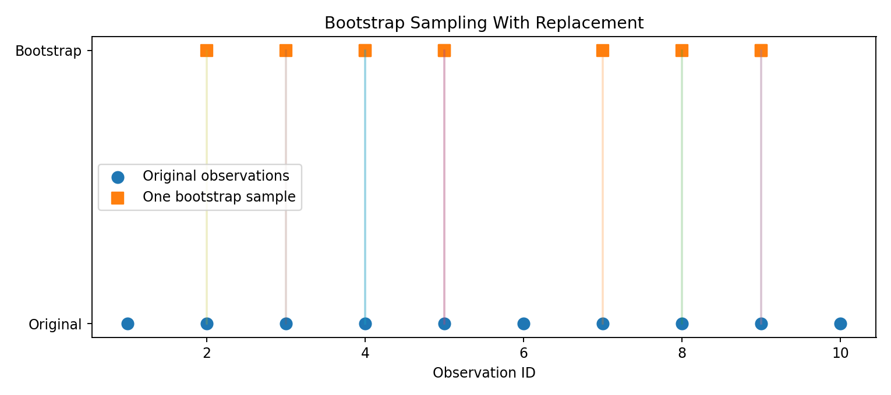
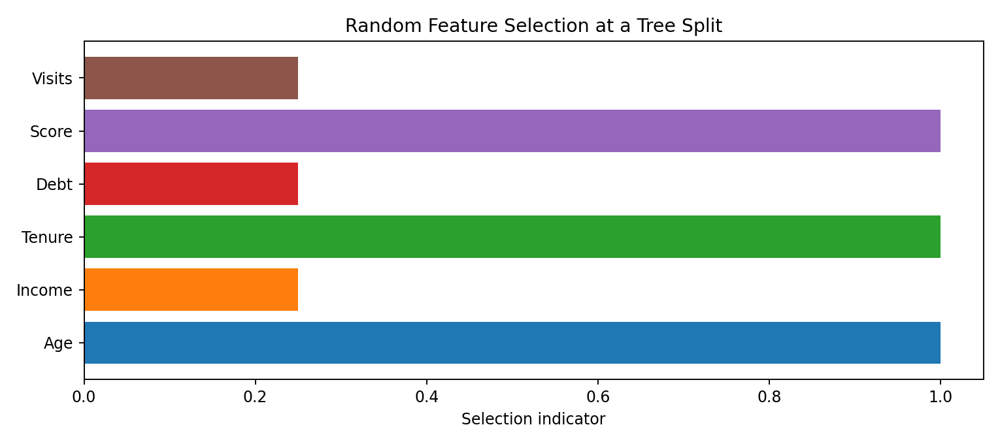
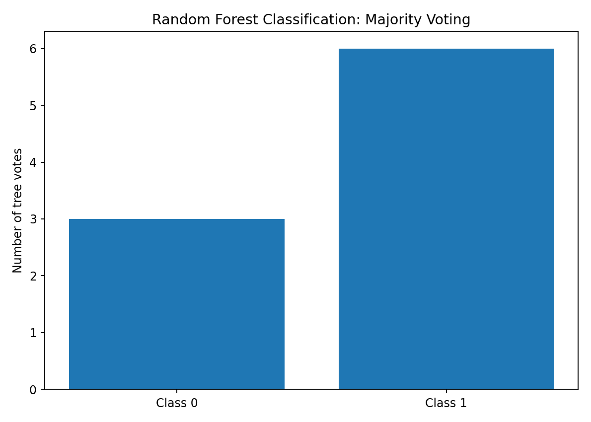
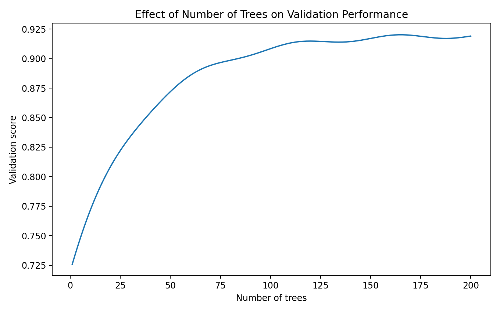
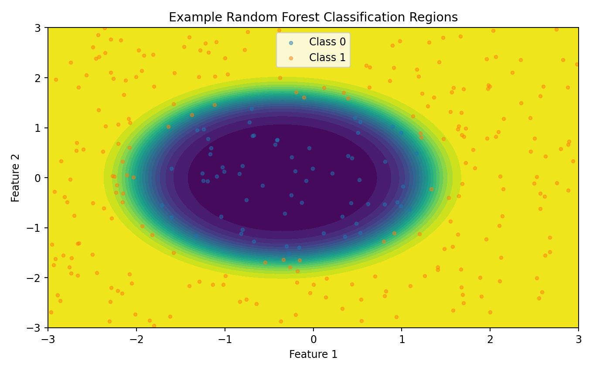
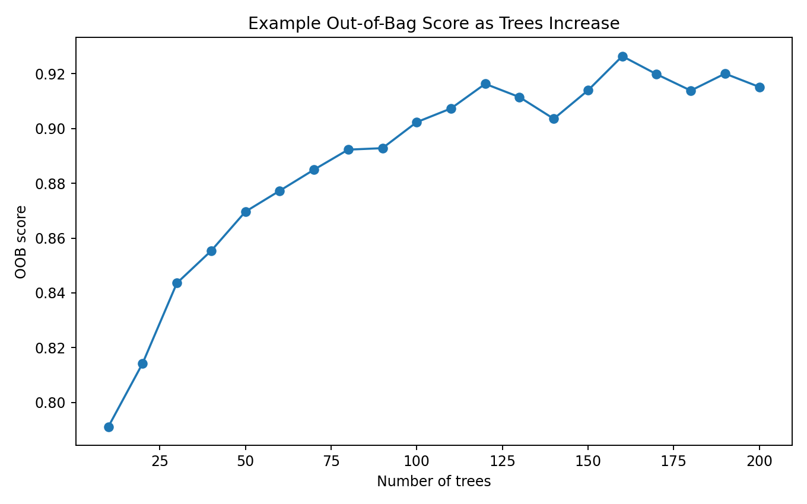
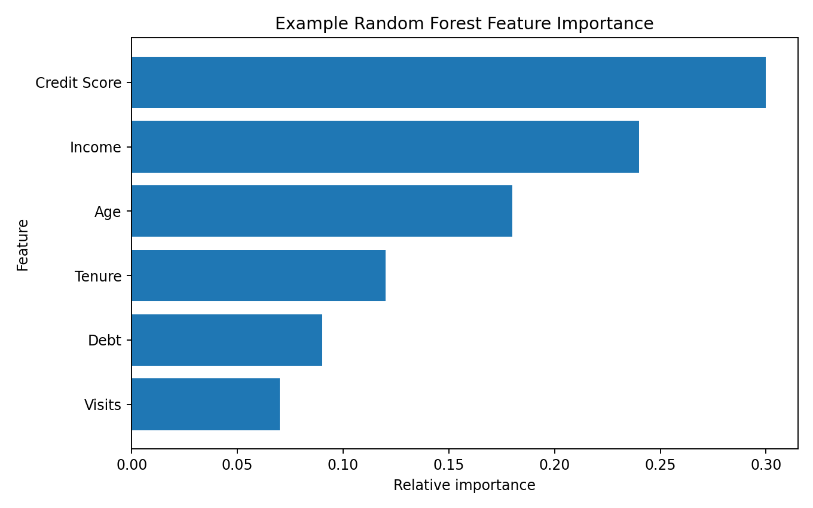

> **Random Forest combines many decision trees to produce a more stable and usually more robust model than a single decision tree.**

A single decision tree can be powerful, but it can also have high variance.

Random Forest addresses this by building many different trees and combining their predictions.

```text
DECISION TREE
      ↓
MANY DIFFERENT TREES
      ↓
COMBINE PREDICTIONS
      ↓
RANDOM FOREST
```

The two central ideas are:

```text
1. Bootstrap sampling
2. Random feature selection
```

---

# Why Random Forest?

A single tree may learn:

```text
Training data
     ↓
Very specific rules
     ↓
Overfitting
```

Random Forest instead builds:

```text
Tree 1 ─┐
Tree 2 ─┤
Tree 3 ─┤
Tree 4 ─┤
...     ├──→ Combined prediction
Tree N ─┘
```

The individual trees are intentionally made different.

The ensemble then reduces the effect of any one tree's mistakes.

---

# Ensemble Learning

An ensemble combines multiple models.

Examples:

```text
Bagging
Boosting
Stacking
Voting
```

Random Forest is primarily a **bagging-based tree ensemble**.

The basic principle is:

> **Many imperfect models can produce a stronger and more stable ensemble when their errors are not perfectly correlated.**

---

# Random Forest Architecture

Conceptually:

```text
                    TRAINING DATA
                         │
          ┌──────────────┼──────────────┐
          ↓              ↓              ↓
     Bootstrap 1    Bootstrap 2    Bootstrap N
          ↓              ↓              ↓
       Tree 1          Tree 2        Tree N
          │              │              │
          └──────────────┼──────────────┘
                         ↓
                  COMBINE PREDICTIONS
                         ↓
                   FINAL OUTPUT
```

Each tree sees a different bootstrap sample and uses randomized feature selection.

---

# Bootstrap Sampling

Bootstrap sampling means sampling observations **with replacement**.

Suppose the training data contains:

```text
1 2 3 4 5 6 7 8 9 10
```

One bootstrap sample might be:

```text
2 2 5 7 7 8 1 9 4 4
```

Some observations appear more than once.

Some observations are not selected.

## Visual Output



This creates slightly different training datasets for different trees.

---

# Why Sample With Replacement?

If every tree saw exactly the same data and learned exactly the same way, the trees could become highly correlated.

Bootstrap sampling creates variation.

```text
Same original dataset
        ↓
Different samples
        ↓
Different trees
```

This diversity is important for the ensemble.

---

# Random Feature Selection

Random Forest also introduces randomness in the features considered when making splits.

Suppose we have:

```text
Age
Income
Debt
Credit Score
Tenure
Visits
```

A tree may consider only a random subset at a particular split.

## Visual Output



This prevents the strongest feature from dominating every tree in exactly the same way.

---

# The Two Sources of Randomness

Random Forest gets its name from the combination of randomized trees.

### Randomness 1

```text
Bootstrap observations
```

### Randomness 2

```text
Random feature subsets
```

Together:

```text
Different data
+
Different candidate features
=
Diverse trees
```

---

# Classification

For classification, each tree produces a class prediction.

Example:

```text
Tree 1 → Class 1
Tree 2 → Class 0
Tree 3 → Class 1
Tree 4 → Class 1
Tree 5 → Class 0
Tree 6 → Class 1
Tree 7 → Class 1
```

The forest uses majority voting.

```text
Class 0 → 2 votes
Class 1 → 5 votes

Final prediction → Class 1
```

---

# Forest Voting



### ML Meaning

The forest is effectively asking:

> **What does the majority of the trees predict?**

This can make the final prediction less sensitive to an individual tree.

---

# Classification Probability

Random Forest can also provide probabilities.

```python
probabilities = (
    model.predict_proba(
        X_test
    )
)
```

Conceptually:

```text
Class 0 → 0.25
Class 1 → 0.75
```

The exact probability interpretation should be treated carefully because ensemble probabilities are not automatically perfectly calibrated.

---

# Regression

Random Forest also supports regression.

Instead of voting for a class, trees produce numerical predictions.

Example:

```text
Tree 1 → 510000
Tree 2 → 525000
Tree 3 → 495000
Tree 4 → 515000
Tree 5 → 505000
```

The forest can combine these predictions, commonly by averaging them.

```text
Final prediction ≈ 510000
```

Scikit-learn:

```python
from sklearn.ensemble import RandomForestRegressor

model = RandomForestRegressor(
    n_estimators=200,
    random_state=42
)
```

---

# Random Forest Classification in Scikit-learn

```python
from sklearn.ensemble import (
    RandomForestClassifier
)

model = RandomForestClassifier(
    n_estimators=200,
    random_state=42,
    n_jobs=-1
)

model.fit(
    X_train,
    y_train
)

y_pred = model.predict(
    X_test
)
```

---

# Random Forest Regression in Scikit-learn

```python
from sklearn.ensemble import (
    RandomForestRegressor
)

model = RandomForestRegressor(
    n_estimators=200,
    random_state=42,
    n_jobs=-1
)

model.fit(
    X_train,
    y_train
)

predictions = model.predict(
    X_test
)
```

---

# Important Hyperparameters

The most important Random Forest parameters include:

```text
n_estimators
max_depth
max_features
min_samples_split
min_samples_leaf
max_samples
bootstrap
criterion
class_weight
```

---

# `n_estimators`

Controls the number of trees.

Example:

```python
RandomForestClassifier(
    n_estimators=100
)
```

or:

```python
RandomForestClassifier(
    n_estimators=500
)
```

More trees generally improve stability, but they also increase:

```text
Training cost
Memory usage
Inference cost
```

---

# Number of Trees



Typically:

```text
Few trees
   ↓
Higher variance

More trees
   ↓
More stable ensemble
```

After a certain point, adding more trees may provide diminishing returns.

---

# `max_depth`

Controls the maximum depth of each tree.

```python
RandomForestClassifier(
    n_estimators=300,
    max_depth=10,
    random_state=42
)
```

Smaller values:

```text
Simpler trees
Lower variance
Potentially higher bias
```

Larger values:

```text
More complex trees
Lower training error
Potentially more variance
```

---

# `max_features`

Controls how many features are considered when looking for a split.

This parameter is especially important because feature randomness helps decorrelate the trees.

Conceptually:

```text
All features
     ↓
Random subset
     ↓
Find best split
```

Example:

```python
RandomForestClassifier(
    max_features="sqrt"
)
```

The appropriate choice depends on the dataset and task.

---

# `min_samples_leaf`

Controls the minimum number of observations allowed in a leaf.

Example:

```python
RandomForestClassifier(
    min_samples_leaf=5
)
```

Increasing it can prevent extremely specific leaves.

This can improve generalization but may also underfit if made too large.

---

# `min_samples_split`

Controls the minimum number of samples required to split an internal node.

Example:

```python
RandomForestClassifier(
    min_samples_split=10
)
```

Larger values generally encourage simpler trees.

---

# Random Forest Decision Regions



The ensemble creates a nonlinear decision function by combining many tree-based partitions.

This allows Random Forest to model complex relationships without requiring the user to manually define a linear decision boundary.

---

# Why Random Forest Is More Stable

Consider two different training samples.

A single tree might produce:

```text
Tree A
Decision boundary 1
```

and after a small data change:

```text
Tree B
Decision boundary 2
```

The tree is sensitive to the data.

A forest averages or votes across many trees:

```text
Tree 1
Tree 2
Tree 3
...
Tree 200
       ↓
Aggregated prediction
```

The ensemble can therefore reduce variance.

---

# Bias and Variance

A single deep decision tree often has:

```text
Low bias
High variance
```

Random Forest attempts to reduce variance by averaging many randomized trees.

Conceptually:

```text
Decision Tree
     ↓
High variance

Randomized Trees
     ↓
Aggregation
     ↓
Lower variance
```

The forest does not magically eliminate bias; its behavior depends on tree depth, feature sampling, dataset size, and other settings.

---

# Out-of-Bag Samples

Because bootstrap sampling uses replacement, not every training observation appears in every tree's bootstrap sample.

The observations not selected for a particular tree are called its **out-of-bag (OOB)** observations.

Conceptually:

```text
Training data
     ↓
Bootstrap sample
     ├── Used by tree
     │
     └── Not selected
             ↓
           OOB data
```

These OOB observations can be used to estimate performance without creating a separate validation prediction for every tree in the same way.

---

# OOB Score

Scikit-learn can calculate an OOB score.

```python
model = RandomForestClassifier(
    n_estimators=300,
    oob_score=True,
    bootstrap=True,
    random_state=42
)

model.fit(
    X_train,
    y_train
)

print(
    model.oob_score_
)
```

## Visual Output



### Important

OOB evaluation is useful, but it should be understood as an internal validation estimate rather than a replacement for careful final evaluation on an untouched test set.

---

# Feature Importance

Random Forest can estimate feature importance.

```python
importance = (
    model.feature_importances_
)
```

## Visual Output



This can help identify which variables contributed strongly to the fitted ensemble according to the chosen importance measure.

---

# Permutation Importance

Permutation importance provides another approach.

The idea:

```text
1. Evaluate model
2. Shuffle one feature
3. Evaluate again
4. Measure performance drop
```

If shuffling a feature significantly reduces performance, that feature was useful to the model.

```python
from sklearn.inspection import (
    permutation_importance
)

result = permutation_importance(
    model,
    X_test,
    y_test,
    random_state=42
)
```

This is often more informative than relying only on impurity-based importance.

---

# Random Forest vs Decision Tree

| Property | Decision Tree | Random Forest |
|---|---|---|
| Number of trees | One | Many |
| Variance | Often high | Usually lower |
| Interpretability | High | Lower |
| Nonlinear relationships | Yes | Yes |
| Feature interactions | Yes | Yes |
| Scaling required | Usually no | Usually no |
| Overfitting risk | High if unrestricted | Generally reduced |
| Computation | Lower | Higher |

The key difference:

```text
ONE TREE
vs
ENSEMBLE OF TREES
```

---

# Random Forest vs Gradient Boosting

Both use trees, but their training strategy is different.

### Random Forest

```text
Tree 1 ─┐
Tree 2 ─┤
Tree 3 ─┤
Tree 4 ─┤
        ↓
Combine
```

Trees are primarily trained independently.

### Gradient Boosting

```text
Tree 1
 ↓
Correct errors
 ↓
Tree 2
 ↓
Correct remaining errors
 ↓
Tree 3
```

Trees are built sequentially.

This distinction is fundamental.

---

# When Random Forest Works Well

Random Forest is often strong for:

```text
Tabular datasets
Nonlinear relationships
Mixed feature effects
Feature interactions
Classification
Regression
Moderate-sized datasets
```

It is particularly useful as a strong baseline for structured/tabular ML.

---

# When Random Forest May Not Be Ideal

Potential limitations include:

```text
Large memory usage
Many trees → higher inference cost
Less interpretable than one tree
Large sparse high-dimensional data may need special handling
Not naturally designed for sequential/time-series structure
```

For some problems, other algorithms may be more appropriate.

---

# Feature Scaling

Like standard decision trees, Random Forest generally does not require standardization for its split-based decisions.

For example:

```text
Age = 42
Income = 750000
```

can be handled without transforming both into the same scale.

However, scaling may still be needed for:

```text
Other models in the same pipeline
Distance-based preprocessing
Dimensionality reduction
Mixed-model workflows
```

---

# Categorical Features

Scikit-learn's standard Random Forest estimators generally expect numerical inputs.

Categorical features can therefore be encoded using:

```python
OneHotEncoder(
    handle_unknown="ignore"
)
```

within a `ColumnTransformer` and `Pipeline`.

Some other tree libraries support native categorical features.

---

# Missing Values

Always verify the missing-value behavior of the specific implementation and version being used.

A robust general workflow is:

```text
Numerical
 ↓
Imputation

Categorical
 ↓
Imputation / category handling

Encoded data
 ↓
Random Forest
```

A `Pipeline` keeps these transformations reproducible.

---

# Complete Pipeline Example

```python
from sklearn.compose import (
    ColumnTransformer
)

from sklearn.pipeline import Pipeline

from sklearn.impute import (
    SimpleImputer
)

from sklearn.preprocessing import (
    OneHotEncoder
)

from sklearn.ensemble import (
    RandomForestClassifier
)

numeric_features = [
    "age",
    "income",
    "credit_score"
]

categorical_features = [
    "city",
    "contract_type"
]

numeric_pipeline = Pipeline([
    (
        "imputer",
        SimpleImputer(
            strategy="median"
        )
    )
])

categorical_pipeline = Pipeline([
    (
        "imputer",
        SimpleImputer(
            strategy="most_frequent"
        )
    ),
    (
        "encoder",
        OneHotEncoder(
            handle_unknown="ignore"
        )
    )
])

preprocessor = ColumnTransformer([
    (
        "numeric",
        numeric_pipeline,
        numeric_features
    ),
    (
        "categorical",
        categorical_pipeline,
        categorical_features
    )
])

model = Pipeline([
    (
        "preprocessor",
        preprocessor
    ),
    (
        "forest",
        RandomForestClassifier(
            n_estimators=300,
            random_state=42,
            n_jobs=-1
        )
    )
])
```

---

# Practical Experiment 1 — One Tree vs Forest

Train:

```text
Decision Tree
```

and:

```text
Random Forest
```

using the same dataset.

Compare:

```text
Training score
Validation score
Test score
```

Question:

> Does the forest generalize better than the individual tree?

---

# Practical Experiment 2 — Number of Trees

Try:

```text
10
50
100
200
500
```

trees.

Record:

```text
Validation score
Training time
Prediction time
```

Question:

> When do additional trees stop providing meaningful improvement?

---

# Practical Experiment 3 — Tree Depth

Try:

```text
max_depth = 3
5
10
None
```

Compare performance and model complexity.

---

# Practical Experiment 4 — Feature Sampling

Try different:

```python
max_features
```

settings.

Compare:

```text
sqrt
log2
small fractions
larger fractions
```

Observe how feature randomness affects the ensemble.

---

# Practical Experiment 5 — OOB Evaluation

Train:

```python
RandomForestClassifier(
    oob_score=True,
    bootstrap=True
)
```

Compare:

```text
OOB score
Validation score
Final test score
```

Question:

> How close is the OOB estimate to your independent evaluation?

---

# Practical Experiment 6 — Feature Importance

Compare:

```text
Impurity-based importance
```

against:

```text
Permutation importance
```

Ask:

> Are the important features consistent?

Investigate cases where they disagree.

---

# Practical Experiment 7 — Classification

Build a Random Forest classifier.

Evaluate using:

```text
Accuracy
Precision
Recall
F1
ROC-AUC
Confusion Matrix
```

Choose metrics based on the problem rather than automatically using accuracy.

---

# Practical Experiment 8 — Regression

Build a Random Forest regressor.

Evaluate using:

```text
MAE
MSE
RMSE
R²
```

Then compare against:

```text
Linear Regression
Decision Tree Regressor
Random Forest Regressor
```

---

# Random Forest Workflow

```text
DATA
 ↓
EDA
 ↓
FEATURE ENGINEERING
 ↓
TRAIN / TEST SPLIT
 ↓
BASELINE TREE
 ↓
RANDOMIZED TREES
 ↓
BOOTSTRAP SAMPLING
 ↓
RANDOM FEATURE SELECTION
 ↓
AGGREGATE PREDICTIONS
 ↓
VALIDATE
 ↓
TUNE
 ↓
FINAL TEST
 ↓
INTERPRET
```

---

# Common Mistakes

### 1. Assuming more trees always means better performance

Additional trees eventually provide diminishing returns.

### 2. Ignoring model size

Hundreds or thousands of trees can consume substantial memory.

### 3. Using the test set for tuning

Use validation or cross-validation.

### 4. Treating feature importance as causality

Importance describes model behavior.

### 5. Assuming OOB is the final test

Keep an independent test set when rigorous evaluation is required.

### 6. Ignoring class imbalance

Consider:

```python
class_weight="balanced"
```

when appropriate, and evaluate with suitable metrics.

### 7. Using an unnecessarily huge forest

Start with a reasonable baseline and measure whether additional trees help.

---

# Lab Checklist

```text
☐ Understand ensemble learning
☐ Understand bagging
☐ Understand bootstrap sampling
☐ Understand random feature selection
☐ Understand tree diversity
☐ Understand majority voting
☐ Understand regression averaging
☐ Train RandomForestClassifier
☐ Train RandomForestRegressor
☐ Tune n_estimators
☐ Tune max_depth
☐ Tune max_features
☐ Tune min_samples_leaf
☐ Understand OOB evaluation
☐ Analyze feature importance
☐ Analyze permutation importance
☐ Compare Tree vs Forest
☐ Evaluate classification properly
☐ Evaluate regression properly
☐ Prevent data leakage
```

---

# Key Takeaways

```text
RANDOM FOREST
       │
       ├── Ensemble Learning
       │
       ├── Bagging
       │
       ├── Bootstrap Sampling
       │
       ├── Random Features
       │
       ├── Multiple Trees
       │
       ├── Voting / Averaging
       │
       ├── OOB Evaluation
       │
       └── Feature Importance
```

The most important idea is:

> **Random Forest reduces the instability of a single decision tree by combining many diverse trees.**

The diversity comes mainly from:

```text
Bootstrap samples
+
Random feature subsets
```

and the final prediction comes from aggregating the trees.

---

# Decision Tree → Random Forest → Gradient Boosting

Our tree-based learning progression is now:

```text
DECISION TREE
     │
     │  One tree
     │  High interpretability
     │
     ↓
RANDOM FOREST
     │
     │  Many independent/randomized trees
     │  Bagging + aggregation
     │
     ↓
GRADIENT BOOSTING
     │
     │  Sequential trees
     │  Correct previous errors
     │
     ↓
ADVANCED BOOSTING
     │
     ├── XGBoost
     ├── LightGBM
     └── CatBoost
```

Understanding this progression is much more valuable than memorizing individual algorithms.

---

## Lab Takeaway

The mental model is:

```text
TRAINING DATA
     ↓
BOOTSTRAP SAMPLES
     ↓
RANDOM FEATURE SUBSETS
     ↓
MANY DECISION TREES
     ↓
VOTE / AVERAGE
     ↓
FINAL PREDICTION
```

A Random Forest is therefore not simply:

> **"A lot of decision trees."**

It is an ensemble designed to make those trees **different enough that their errors can partially cancel each other out**.

The natural next step is **Gradient Boosting**, where instead of training trees independently, we build them sequentially to improve the model's remaining errors.
