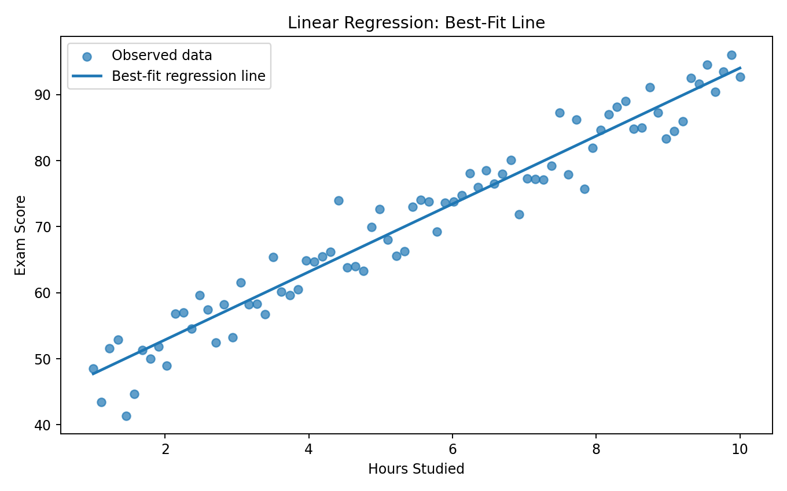
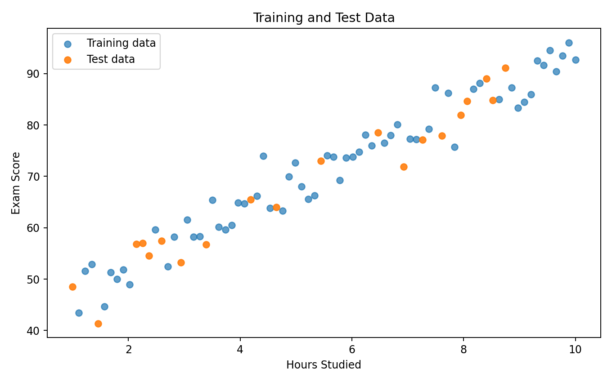
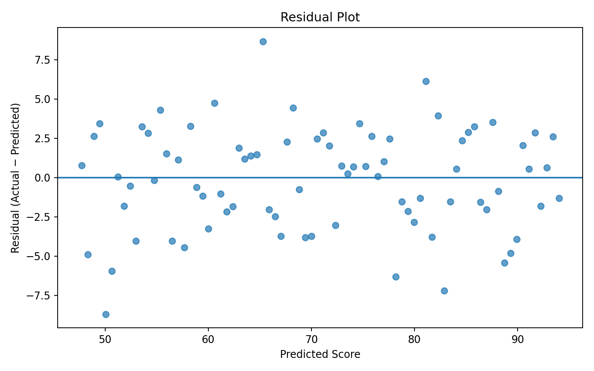
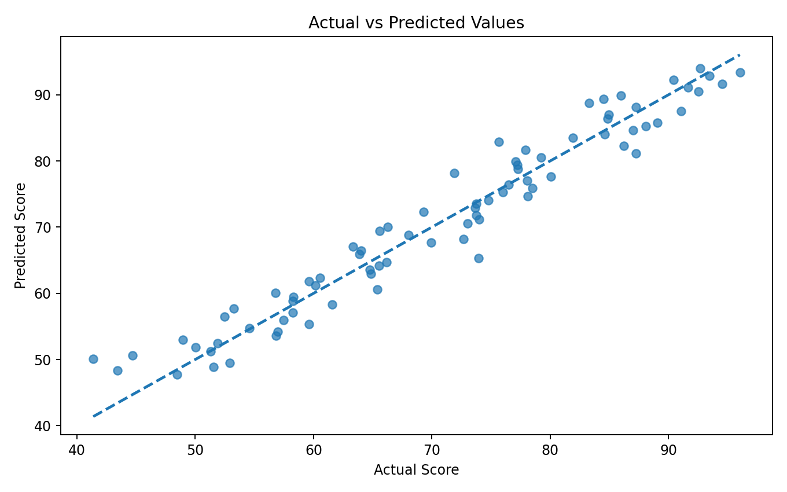
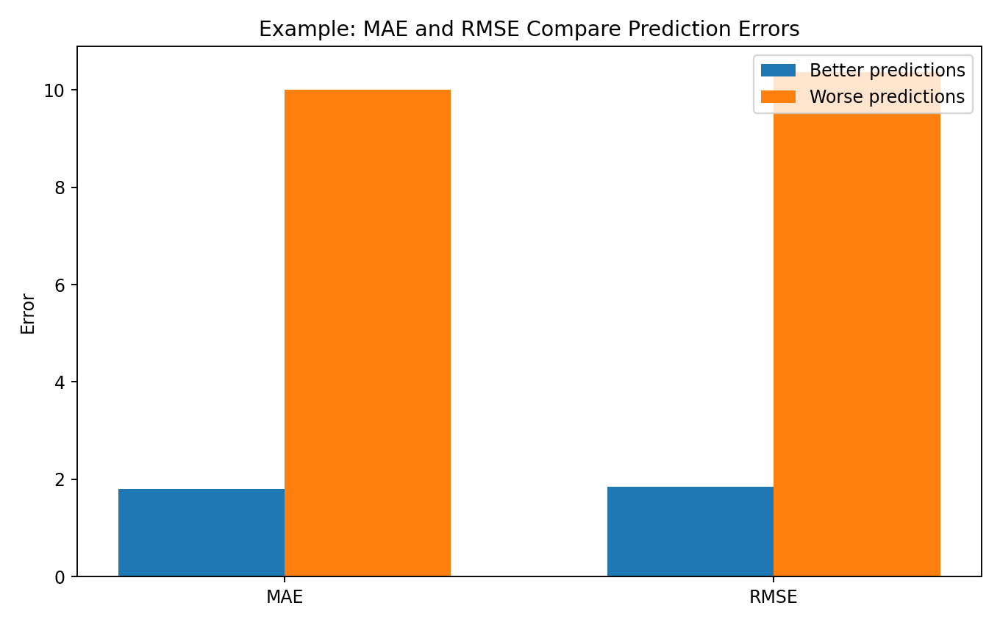
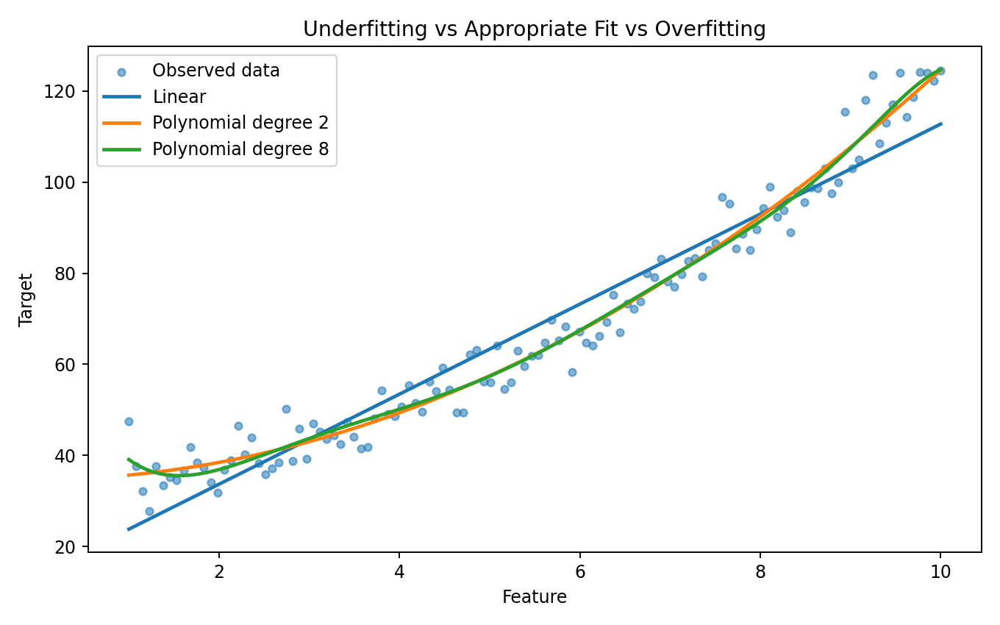

> **Regression predicts a continuous value from one or more input features.**

Regression is one of the fundamental supervised learning problems.

Examples include:

```text
House features
      ↓
Predicted house price

Customer information
      ↓
Predicted lifetime value

Hours studied
      ↓
Predicted exam score

Historical demand
      ↓
Predicted future demand
```

The goal is not simply to draw a line through data.

A useful regression system must:

```text
Understand the data
        ↓
Learn a relationship
        ↓
Generate predictions
        ↓
Measure prediction error
        ↓
Generalize to unseen data
```

---

## What is Regression?

In supervised learning, regression learns a mapping between input features `X` and a continuous target `y`.

A simple linear regression model is:

```text
y = b₀ + b₁x
```

where:

| Symbol | Meaning |
|---|---|
| `y` | Predicted target |
| `x` | Input feature |
| `b₀` | Intercept |
| `b₁` | Coefficient / slope |

For multiple features:

```text
y = b₀ + b₁x₁ + b₂x₂ + ... + bₙxₙ
```

---

# Regression vs Classification

The first question is:

> **What type of target are we predicting?**

### Regression

Predicts a continuous numerical value.

```text
Price
Salary
Temperature
Demand
Age
Revenue
```

### Classification

Predicts a category or class.

```text
Spam / Not Spam
Disease / No Disease
Cat / Dog
Approved / Rejected
```

A useful rule:

```text
Continuous number
      ↓
Regression

Discrete class
      ↓
Classification
```

---

# A Practical Example

Consider a dataset containing:

```text
Hours_Studied
Attendance
Previous_Score
Sleep_Hours
Exam_Score
```

The target is:

```text
Exam_Score
```

Because exam score is continuous, this is a regression problem.

Example:

```python
X = df[
    [
        "Hours_Studied",
        "Attendance",
        "Previous_Score",
        "Sleep_Hours"
    ]
]

y = df["Exam_Score"]
```

---

# Step 1: Understand the Relationship

Before training a model, visualize the relationship between a feature and the target.

For example:

```python
import matplotlib.pyplot as plt

plt.scatter(
    df["Hours_Studied"],
    df["Exam_Score"]
)

plt.xlabel("Hours Studied")
plt.ylabel("Exam Score")
plt.title("Hours Studied vs Exam Score")
plt.show()
```

If the points show an approximately linear trend, linear regression may be a reasonable starting point.

---

# Linear Regression

Linear regression attempts to find the line that best represents the relationship between the feature and target.

```text
y = b₀ + b₁x
```

The model chooses coefficients that minimize prediction error according to its training objective.

---

## Visual Output



The dots represent observed values.

The line represents the model's predicted relationship.

### How to Read It

If the line slopes upward:

```text
x increases
   ↓
predicted y increases
```

If the line slopes downward:

```text
x increases
   ↓
predicted y decreases
```

The vertical distance between an observed point and the regression line represents prediction error for that observation.

### ML Meaning

The regression line summarizes the average linear relationship learned from the training data.

It is a **model**, not a statement that every observation must lie exactly on the line.

---

# Training a Linear Regression Model

Using Scikit-learn:

```python
from sklearn.model_selection import train_test_split
from sklearn.linear_model import LinearRegression

X = df[["Hours_Studied"]]
y = df["Exam_Score"]

X_train, X_test, y_train, y_test = train_test_split(
    X,
    y,
    test_size=0.2,
    random_state=42
)

model = LinearRegression()

model.fit(
    X_train,
    y_train
)
```

Generate predictions:

```python
y_pred = model.predict(X_test)
```

Inspect the coefficients:

```python
print("Intercept:", model.intercept_)
print("Coefficient:", model.coef_)
```

---

# Interpreting the Coefficient

Suppose:

```text
Exam Score = 42 + 5.2 × Hours Studied
```

The coefficient is:

```text
5.2
```

This means that, according to this fitted model, a one-unit increase in hours studied is associated with an estimated increase of about 5.2 score units, assuming the model specification and other conditions are appropriate.

This is one reason linear regression is useful for interpretability.

---

# Multiple Linear Regression

Real problems rarely depend on only one feature.

Example:

```text
Exam Score
    ↑
    ├── Hours Studied
    ├── Attendance
    ├── Previous Score
    └── Sleep Hours
```

The model becomes:

```text
y = b₀
  + b₁x₁
  + b₂x₂
  + b₃x₃
  + b₄x₄
```

Python:

```python
X = df[
    [
        "Hours_Studied",
        "Attendance",
        "Previous_Score",
        "Sleep_Hours"
    ]
]

model = LinearRegression()

model.fit(
    X_train,
    y_train
)
```

---

# Train/Test Split

A regression model should be evaluated on data it did not use for fitting.

```python
X_train, X_test, y_train, y_test = train_test_split(
    X,
    y,
    test_size=0.2,
    random_state=42
)
```

Typical idea:

```text
DATASET
   │
   ├───────────────┐
   │               │
TRAINING          TEST
DATA              DATA
   │               │
   ↓               ↓
Fit model       Final evaluation
```

---

## Visual Output



The important principle is:

> **The test set represents unseen data.**

Do not repeatedly tune the model against the final test set.

---

# Residuals

A residual is the difference between the actual value and the predicted value.

```text
Residual = Actual − Predicted
```

In Python:

```python
residuals = y_test - y_pred
```

---

## Visual Output



A residual plot helps answer:

```text
Are errors randomly distributed?
Is there a pattern?
Does error increase with prediction size?
Are there unusual observations?
```

### A Good Residual Pattern

Ideally, residuals should be reasonably scattered around zero without a strong systematic pattern.

### A Problematic Pattern

If residuals form a curve:

```text
   •
     •
       •
     •
   •
```

the relationship may not be adequately modeled by a simple linear form.

### ML Meaning

Residual analysis helps diagnose whether the model structure is missing an important pattern.

---

# Actual vs Predicted

Another useful diagnostic is comparing actual and predicted values.

```python
plt.scatter(
    y_test,
    y_pred
)

plt.xlabel("Actual")
plt.ylabel("Predicted")
plt.title("Actual vs Predicted")
plt.show()
```

## Visual Output



The dashed diagonal represents:

```text
Predicted = Actual
```

The closer the points are to this line, the more accurate the predictions tend to be.

---

# Regression Evaluation Metrics

A regression model needs appropriate evaluation metrics.

Common metrics include:

```text
MAE
MSE
RMSE
R²
```

---

# Mean Absolute Error — MAE

MAE measures the average absolute prediction error.

```text
MAE = average(|actual − predicted|)
```

Python:

```python
from sklearn.metrics import mean_absolute_error

mae = mean_absolute_error(
    y_test,
    y_pred
)

print(mae)
```

### Interpretation

If:

```text
MAE = 4.2
```

the model's predictions are off by about 4.2 target units on average, in absolute terms.

MAE is easy to communicate because it uses the same units as the target.

---

# Mean Squared Error — MSE

MSE squares each error before averaging.

```text
MSE = average((actual − predicted)²)
```

Python:

```python
from sklearn.metrics import mean_squared_error

mse = mean_squared_error(
    y_test,
    y_pred
)

print(mse)
```

Because errors are squared, larger errors receive more weight.

---

# Root Mean Squared Error — RMSE

RMSE is the square root of MSE.

```text
RMSE = √MSE
```

Python:

```python
rmse = mean_squared_error(
    y_test,
    y_pred,
    squared=False
)

print(rmse)
```

RMSE is expressed in the same units as the target.

---

## MAE vs RMSE

```text
MAE
 ↓
Treats absolute errors proportionally

RMSE
 ↓
Penalizes large errors more strongly
```

For example, if a model occasionally makes very large mistakes, RMSE can increase significantly.

## Visual Output



### ML Meaning

Choose metrics based on the problem.

If large errors are particularly costly, RMSE may be informative.

If straightforward average error is easier to communicate, MAE can be useful.

---

# R² — Coefficient of Determination

R² is commonly used to describe how much variation in the target is explained by the fitted model relative to a baseline formulation.

```python
from sklearn.metrics import r2_score

r2 = r2_score(
    y_test,
    y_pred
)

print(r2)
```

An R² closer to 1 can indicate a stronger fit under the metric's assumptions and evaluation setup.

But:

> **A high R² does not automatically mean the model is useful in production.**

Always examine:

- Test-set performance
- Residuals
- Domain relevance
- Error magnitude
- Data leakage
- Generalization

---

# Polynomial Regression

Not every relationship is linear.

Suppose the data follows a curved pattern:

```text
       •
     •
   •
 •
   •
     •
       •
```

Polynomial regression can model nonlinear relationships using polynomial features.

For example:

```text
y = b₀ + b₁x + b₂x²
```

Using Scikit-learn:

```python
from sklearn.preprocessing import PolynomialFeatures
from sklearn.pipeline import make_pipeline
from sklearn.linear_model import LinearRegression

model = make_pipeline(
    PolynomialFeatures(degree=2),
    LinearRegression()
)

model.fit(
    X_train,
    y_train
)
```

---

## Model Complexity

Increasing polynomial degree increases model flexibility.

```text
Degree 1
    ↓
Simple line

Degree 2
    ↓
Curve

Degree 8+
    ↓
Very flexible model
```

## Visual Output



The important lesson is:

```text
Too simple
    ↓
Underfitting

Appropriate complexity
    ↓
Good generalization

Too complex
    ↓
Overfitting
```

---

# Underfitting

Underfitting occurs when a model is too simple to capture important patterns.

Typical signs:

```text
Training error → high
Test error     → high
```

Possible causes:

- Too few useful features
- Model too simple
- Important nonlinear relationship ignored
- Excessive regularization

---

# Overfitting

Overfitting occurs when the model learns training-specific patterns that do not generalize well.

Typical pattern:

```text
Training error → very low
Test error     → much higher
```

Possible causes:

- Excessive model complexity
- Too many features
- Small dataset
- Noise memorization
- Insufficient regularization

---

# Regularization

Regularization discourages overly complex models.

Two common linear-model approaches are:

```text
Ridge
Lasso
```

### Ridge Regression

Ridge adds an L2 penalty.

```python
from sklearn.linear_model import Ridge

model = Ridge(
    alpha=1.0
)
```

### Lasso Regression

Lasso adds an L1 penalty.

```python
from sklearn.linear_model import Lasso

model = Lasso(
    alpha=0.1
)
```

Conceptually:

```text
Complex model
      ↓
Regularization
      ↓
Penalize large coefficients
      ↓
Potentially better generalization
```

---

# Why Scaling Matters

Regularization methods depend on coefficient magnitudes, so feature scaling can be important when features are on very different scales.

Example:

```text
Age        → 20–70
Income     → 20,000–200,000
Experience → 0–40
```

A common workflow is:

```python
from sklearn.pipeline import Pipeline
from sklearn.preprocessing import StandardScaler
from sklearn.linear_model import Ridge

model = Pipeline([
    ("scaler", StandardScaler()),
    ("regressor", Ridge(alpha=1.0))
])
```

Using a pipeline helps keep preprocessing and model fitting together.

---

# Regression Assumptions

Classical linear regression is associated with assumptions that should be considered when interpretation or statistical inference matters.

Important considerations include:

### 1. Linearity

The relationship should be reasonably represented by the model form.

### 2. Independence

Observations/errors should satisfy the independence assumptions relevant to the problem.

### 3. Homoscedasticity

Residual variance should be reasonably stable across fitted values when this assumption is required.

### 4. Residual behavior

Residual diagnostics can reveal systematic patterns.

### 5. Multicollinearity

Highly correlated predictors can make coefficient interpretation unstable in linear models.

These assumptions should be evaluated in context rather than treated as a checklist detached from the data-generating process.

---

# Multicollinearity

Suppose:

```text
Annual Salary
Monthly Salary
Annual Income
```

contain almost the same information.

The predictors may be highly correlated.

This can make individual coefficient estimates difficult to interpret.

A common diagnostic is VIF:

```python
from statsmodels.stats.outliers_influence import variance_inflation_factor
```

The appropriate response may involve:

- Removing redundant features
- Combining features
- Regularization
- Better feature design

---

# Feature Engineering for Regression

Regression performance often depends more on useful features than on changing algorithms endlessly.

Examples:

### Log transformation

```python
df["income_log"] = np.log1p(
    df["Income"]
)
```

### Ratios

```python
df["income_per_person"] = (
    df["Income"] /
    df["Household_Size"]
)
```

### Interaction features

```python
df["experience_age"] = (
    df["Experience"] *
    df["Age"]
)
```

### Date features

```text
Date
 ↓
Year
Month
Day
Day of week
Quarter
```

Feature engineering should be driven by the problem and validated without leakage.

---

# A Complete Scikit-learn Regression Pipeline

```python
import pandas as pd

from sklearn.model_selection import train_test_split
from sklearn.pipeline import Pipeline
from sklearn.preprocessing import StandardScaler
from sklearn.linear_model import Ridge
from sklearn.metrics import (
    mean_absolute_error,
    mean_squared_error,
    r2_score
)

df = pd.read_csv("dataset.csv")

X = df[
    [
        "Hours_Studied",
        "Attendance",
        "Previous_Score",
        "Sleep_Hours"
    ]
]

y = df["Exam_Score"]

X_train, X_test, y_train, y_test = train_test_split(
    X,
    y,
    test_size=0.2,
    random_state=42
)

model = Pipeline([
    ("scaler", StandardScaler()),
    ("regressor", Ridge(alpha=1.0))
])

model.fit(
    X_train,
    y_train
)

y_pred = model.predict(
    X_test
)

mae = mean_absolute_error(
    y_test,
    y_pred
)

mse = mean_squared_error(
    y_test,
    y_pred
)

rmse = mean_squared_error(
    y_test,
    y_pred,
    squared=False
)

r2 = r2_score(
    y_test,
    y_pred
)

print("MAE :", mae)
print("MSE :", mse)
print("RMSE:", rmse)
print("R²  :", r2)
```

---

# Regression Workflow

A practical regression workflow looks like:

```text
DATA
 ↓
EDA
 ↓
TARGET DEFINITION
 ↓
TRAIN / VALIDATION / TEST STRATEGY
 ↓
FEATURE ENGINEERING
 ↓
BASELINE MODEL
 ↓
LINEAR REGRESSION
 ↓
REGULARIZATION / ALTERNATIVE MODELS
 ↓
EVALUATION
 ↓
RESIDUAL ANALYSIS
 ↓
HYPERPARAMETER TUNING
 ↓
FINAL TEST
 ↓
DEPLOYMENT
```

---

# What a Good Regression Analysis Should Answer

After training the model, you should be able to answer:

```text
What are we predicting?
        ↓
Which features are used?
        ↓
Why were these features selected?
        ↓
What model was chosen?
        ↓
How was it trained?
        ↓
How was it evaluated?
        ↓
How large are the prediction errors?
        ↓
Does it generalize?
        ↓
Where does it fail?
```

---

# Common Regression Mistakes

### 1. Evaluating only on training data

A model can perform extremely well on training data and still fail on unseen data.

### 2. Using the wrong metric

A business problem may care about absolute error rather than squared error.

### 3. Ignoring residuals

Metrics alone can hide systematic prediction problems.

### 4. Automatically removing outliers

An outlier may be a legitimate and important observation.

### 5. Using a high-degree polynomial without validation

More flexibility can increase overfitting.

### 6. Scaling before splitting

Fit preprocessing transformations using training data only.

Using a Scikit-learn pipeline is a good way to avoid accidental leakage.

### 7. Interpreting coefficients without checking feature relationships

Multicollinearity can make coefficient interpretation unstable.

---

# Practical Experiment

Try the following experiment.

### Experiment 1 — Simple Linear Regression

Use:

```text
Hours_Studied
        ↓
Exam_Score
```

Train a linear regression model.

Then measure:

```text
MAE
RMSE
R²
```

---

### Experiment 2 — Add More Features

Add:

```text
Attendance
Previous_Score
Sleep_Hours
```

Compare the test-set metrics.

Question:

> Did the additional features improve generalization?

---

### Experiment 3 — Polynomial Regression

Try:

```text
degree = 1
degree = 2
degree = 3
degree = 5
```

Compare training and validation/test performance.

Question:

> At what point does increasing complexity stop helping?

---

### Experiment 4 — Ridge Regression

Try several `alpha` values:

```python
alphas = [
    0.01,
    0.1,
    1,
    10,
    100
]
```

Compare validation performance.

Question:

> How does regularization affect generalization?

---

# Lab Checklist

```text
☐ Identify continuous target
☐ Inspect feature/target relationships
☐ Split the dataset correctly
☐ Build a baseline
☐ Train linear regression
☐ Evaluate MAE
☐ Evaluate RMSE
☐ Evaluate R²
☐ Inspect residuals
☐ Compare actual vs predicted
☐ Check underfitting / overfitting
☐ Try feature engineering
☐ Consider regularization
☐ Validate model choices
☐ Perform final test evaluation
```

---

# Key Takeaways

```text
REGRESSION
    │
    ├── Predicts continuous values
    │
    ├── Linear Regression
    │
    ├── Multiple Regression
    │
    ├── Polynomial Regression
    │
    ├── MAE / MSE / RMSE
    │
    ├── R²
    │
    ├── Residual Analysis
    │
    ├── Regularization
    │
    └── Generalization
```

The most important lesson is:

> **A regression model is not good because it fits the training data well. It is good when it makes useful predictions on unseen data.**

---

## Lab Takeaway

A strong regression workflow connects mathematics, code, visualization, and practical reasoning:

```text
DATA
 ↓
RELATIONSHIP
 ↓
MODEL
 ↓
PREDICTION
 ↓
ERROR
 ↓
DIAGNOSTICS
 ↓
GENERALIZATION
```

The next lab topic is **Classification**, where the target changes from a continuous value to a discrete class.
